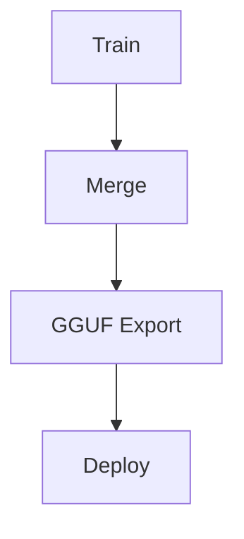

# 🔄 Mascarade Fine-Tuning Flux — Guide Complet

Ce document détaille les flux de fine-tuning disponibles dans Mascarade, leurs étapes, options, et cas d'usage.

---

## 📚 Sommaire
- [Flux Principal](#-flux-principal)
- [Étapes Détaillées](#-étapes-détaillées)
- [Options de Configuration](#-options-de-configuration)
- [Domaines Supportés](#-domaines-supportés)
- [Modèles de Base](#-modèles-de-base)
- [Exemples d'Utilisation](#-exemples-dutilisation)
- [Optimisations Mémoire](#-optimisations-mémoire)
- [Bonnes Pratiques](#-bonnes-pratiques)

---

## 🎯 Flux Principal

Le flux complet suit 4 étapes séquentielles :



### 1. Train (Fine-Tuning QLoRA)
- **Objectif** : Adapter un modèle de base à un domaine spécifique.
- **Technologie** : QLoRA (Quantized Low-Rank Adaptation) en 4-bit.
- **Cible Matérielle** : GPU Quadro P2000 (5GB VRAM).
- **Sortie** : Adapter LoRA sauvegardé dans `finetune/models_local/{domain}/adapter`.

### 2. Merge (Fusion)
- **Objectif** : Fusionner l'adapter LoRA avec le modèle de base.
- **Format** : FP16 sur CPU (nécessite ~14GB RAM pour 7B paramètres).
- **Sortie** : Modèle fusionné dans `finetune/models_local/{domain}/merged`.

### 3. GGUF Export (Quantification)
- **Objectif** : Convertir le modèle fusionné au format GGUF avec quantification.
- **Outils** : `llama.cpp` pour conversion et quantification.
- **Options** : Q4_K_M (défaut), Q4_K_S, Q5_K_M, Q8_0.
- **Sortie** : Fichier `.gguf` prêt pour inférence locale.

### 4. Deploy (Déploiement Ollama)
- **Objectif** : Déployer le modèle dans Ollama pour inférence locale.
- **Cible** : Conteneur Docker `mascarade-ollama`.
- **Sortie** : Modèle disponible via `ollama run mascarade-{domain}`.

---

## 🔍 Étapes Détaillées

### Étape 1 : Train

#### Configuration LoRA
- **Rank (r)** : 16 (compromis qualité/mémoire).
- **Alpha** : 32.
- **Dropout** : 0.05.
- **Modules Cibles** :
  ```python
  ["q_proj", "k_proj", "v_proj", "o_proj", "gate_proj", "up_proj", "down_proj"]
  ```

#### Hyperparamètres
- **Batch Size** : 1 (limité par VRAM).
- **Gradient Accumulation** : 16 (compense le petit batch).
- **Learning Rate** : 2e-4.
- **Optimiseur** : `paged_adamw_8bit`.
- **Scheduler** : Cosine avec warmup (3%).
- **Mixed Precision** : FP16 activé.
- **Gradient Checkpointing** : Activé (`use_reentrant=False`).

#### Gestion Mémoire
- **Quantization** : NF4 (NormalFloat 4-bit).
- **Double Quantization** : Activée.
- **Offloading** : États de l'optimiseur sur CPU RAM.
- **VRAM Typique** : ~3.5GB pour 7B paramètres.

### Étape 2 : Merge

#### Processus
1. Charger le modèle de base en FP16 sur CPU.
2. Charger l'adapter LoRA.
3. Fusionner les poids (`merge_and_unload`).
4. Sauvegarder en format HuggingFace safetensors.

#### Ressources
- **RAM Requise** : ~14GB pour 7B paramètres.
- **Espace Disque** : ~13GB pour modèle fusionné.

### Étape 3 : GGUF Export

#### Conversion
1. Convertir le modèle fusionné en GGUF FP16.
2. Appliquer la quantification (ex: Q4_K_M).
3. Nettoyer les fichiers intermédiaires.

#### Formats de Quantification
| Format | Taille Relative | Précision | Usage Recommandé |
|--------|-----------------|-----------|-------------------|
| Q4_K_M | ~0.5x | Moyenne | Défaut, bon compromis |
| Q4_K_S | ~0.5x | Basse | Tests rapides |
| Q5_K_M | ~0.6x | Haute | Production |
| Q8_0 | ~1.0x | Très Haute | Critique |

### Étape 4 : Deploy

#### Déploiement Ollama
1. Copier le fichier GGUF dans le conteneur Ollama.
2. Générer un `Modelfile` avec paramètres par défaut.
3. Créer le modèle Ollama via `ollama create`.
4. Tester avec une requête domaine-spécifique.

#### Modelfile Généré
```text
FROM ./mascarade-{domain}-q4_k_m.gguf
PARAMETER temperature 0.3
PARAMETER top_p 0.9
PARAMETER num_ctx 2048
SYSTEM "You are an expert {domain} engineer. Provide detailed, production-ready technical answers with code examples."
```

---

## ⚙️ Options de Configuration

### Arguments CLI

| Argument | Description | Défaut |
|----------|-------------|---------|
| `--base` | Modèle de base HuggingFace | `Qwen/Qwen2.5-Coder-7B-Instruct` |
| `--step` | Étape unique à exécuter | Toutes |
| `--epochs` | Nombre d'époques | 3 |
| `--seq-len` | Longueur séquence | 512 |
| `--max-samples` | Limite échantillons | Tous |
| `--quant` | Format GGUF | `q4_k_m` |

### Variables d'Environnement

```bash
# Réduire fragmentation mémoire CUDA
export PYTORCH_CUDA_ALLOC_CONF=expandable_segments:True

# Activer TF32 pour accélération
export NVIDIA_TF32_OVERRIDE=1
```

---

## 📦 Domaines Supportés

| Domaine | Description | Exemple de Dataset |
|---------|-------------|---------------------|
| `stm32` | Microcontrôleurs STM32 | Code HAL/LL, exemples CubeMX |
| `kicad` | Conception PCB | Schémas, footprints, règles DRC |
| `spice` | Simulation Circuit | Netlists SPICE, analyses |
| `iot` | IoT/Embedded | Code ESP32, MQTT, LoRa |
| `power` | Électronique de Puissance | Buck/Boost converters, calculs |
| `dsp` | Traitement du Signal | Filtres, FFT, implémentations |
| `emc` | Compatibilité Électromagnétique | Règles de design, découplage |
| `embedded` | Systèmes Embarqués | Bare-metal, RTOS, drivers |
| `platformio` | Développement PlatformIO | Projets, configurations |
| `freecad` | CAO Mécanique | Scripts Python, designs |

---

## 🤖 Modèles de Base

### Modèles Recommandés (Quadro P2000)

| Modèle | Taille | VRAM Requise | Cas d'Usage |
|--------|-------|--------------|-------------|
| Qwen2.5-Coder-7B | 14GB | 5GB | **Défaut**, meilleur pour code |
| Qwen3-8B | 16GB | 5-6GB | Polyvalent, récent |
| Qwen3-1.7B | 3.4GB | 3GB | Rapide, moins précis |
| TinyLlama-1.1B | 2.1GB | 3GB | Très léger |

### Sélection Automatique
Le script tente les modèles dans l'ordre de qualité décroissante et utilise le premier qui rentré en VRAM.

---

## 🚀 Exemples d'Utilisation

### 1. Full Pipeline pour STM32
```bash
python finetune/pipeline.py stm32
```

### 2. Entraînement Seulement (KiCad)
```bash
python finetune/pipeline.py kicad --step train --epochs 5
```

### 3. Utiliser Qwen3-8B pour IoT
```bash
python finetune/pipeline.py iot --base Qwen/Qwen3-8B --quant q5_k_m
```

### 4. Tous les Domaines (Batch)
```bash
python finetune/pipeline.py all --max-samples 512
```

### 5. Conversion GGUF Seulement
```bash
python finetune/pipeline.py stm32 --step gguf --quant q4_k_s
```

### 6. Déploiement Ollama
```bash
python finetune/pipeline.py stm32 --step deploy
```

---

## 💡 Optimisations Mémoire

### Pour Quadro P2000 (5GB VRAM)

1. **QLoRA 4-bit** : Réduit la taille du modèle de 75%.
2. **Gradient Checkpointing** : Économise ~30% VRAM.
3. **Batch Size = 1** : Minimise l'utilisation mémoire.
4. **Gradient Accumulation** : Compense le petit batch.
5. **Mixed Precision FP16** : Réduit la précision des calculs.
6. **Offloading Optimizer** : Déplace les états sur CPU RAM.

### Commandes de Monitoring

```bash
# Surveiller VRAM
watch -n 1 nvidia-smi

# Surveiller RAM/CPU
htop

# Nettoyer cache PyTorch
python -c "import torch; torch.cuda.empty_cache()"
```

---

## ✅ Bonnes Pratiques

### Préparation des Données
- **Format** : JSONL avec conversations structurées.
- **Nettoyage** : Supprimer duplications et données bruyantes.
- **Balance** : 80% train, 10% validation, 10% test.

### Entraînement
- **Époques** : 3 suffisent pour spécialisation.
- **Séquences** : 512 pour équilibre vitesse/qualité.
- **Samples** : 500-1000 échantillons par domaine.

### Évaluation
- **Métriques** : Loss et perplexité sur jeu de test.
- **Tests Manuels** : Valider réponses sur prompts réels.
- **Benchmark** : Comparer avec modèle de base.

### Déploiement
- **Quantification** : Q4_K_M pour usage général.
- **Context Size** : 2048 tokens pour tâches techniques.
- **Temperature** : 0.3 pour réponses déterministes.

---

## 🔗 Références

- **QLoRA Paper** : https://arxiv.org/abs/2305.14314
- **HuggingFace PEFT** : https://huggingface.co/docs/peft/
- **llama.cpp** : https://github.com/ggml-org/llama.cpp
- **Ollama** : https://ollama.com/

---

## 📝 Notes Techniques

### Gestion des Erreurs
- **CUDA OOM** : Réduire `seq-len` ou utiliser un modèle plus petit.
- **Échec Merge** : Vérifier espace disque (>15GB libre).
- **GGUF Failed** : Installer `llama.cpp` manuellement.

### Debugging
```bash
# Logs détaillés
python finetune/pipeline.py stm32 --step train 2>&1 | tee train.log

# Tester modèle avant merge
python -c "
from transformers import AutoModelForCausalLM, AutoTokenizer
from peft import PeftModel
model = AutoModelForCausalLM.from_pretrained('Qwen/Qwen2.5-Coder-7B-Instruct', device_map='auto')
model = PeftModel.from_pretrained(model, 'finetune/models_local/stm32/adapter')
tokenizer = AutoTokenizer.from_pretrained('finetune/models_local/stm32/adapter')
print(tokenizer.decode(model.generate(**tokenizer('STM32 GPIO', return_tensors='pt'))[0]))
"
```

---

*Dernière mise à jour : 2026-03-06*
*Mainteneur : Mistral Vibe 🤖*
