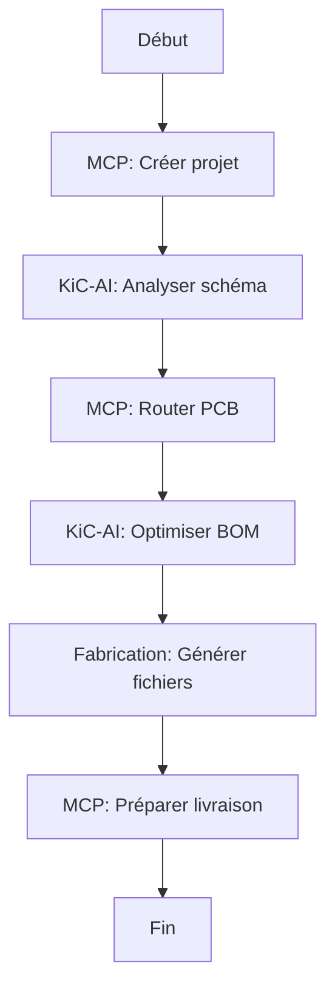

# 🛠️ KiCad AI Integration — Guide d'Installation Unifié

**Version**: 1.0 | **Date**: 2026-03-06
**Auteurs**: Mistral Vibe 🤖 + Community

---

## 📋 Overview

Ce guide unifié couvre l'installation et la configuration de trois outils clés pour transformer KiCad en une plateforme PCB moderne augmentée par l'IA :

1. **MCP Server** → Contrôle naturel via LLM (Claude, Llama3)
2. **KiC-AI** → Assistant interactif avec pricing en temps réel
3. **Fabrication Toolkit** → Génération de fichiers pour JLCPCB

---

## 📦 Prérequis

### Matériel
- **CPU**: 4 cœurs minimum (8+ recommandé pour LLM local)
- **RAM**: 16GB+ (32GB pour modèles LLM >7B)
- **Stockage**: 20GB+ (pour modèles LLM et caches)
- **GPU**: Optionnel (accélère Ollama si disponible)

### Logiciels
- **KiCad**: Version **9.0+** (obligatoire)
- **Python**: 3.7+ (déjà installé via `venv_tuning`)
- **Ollama**: Pour exécution locale de LLM (recommandé)
- **Node.js**: 20.x (pour MCP Server)
- **Git**: Pour cloner les dépôts

---

## 🚀 Installation Step-by-Step

### Étape 1: MCP Server (Contrôle LLM)

**Fonction**: Permet à Claude/Llama de contrôler KiCad via commandes naturelles.

#### Installation
```bash
# Cloner le dépôt
cd mascarade/finetune
git clone https://github.com/mixelpixx/KiCAD-MCP-Server.git kicad_mcp_server
cd kicad_mcp_server

# Installer dépendances
npm install
python3 -m venv venv
source venv/bin/activate
pip install --break-system-packages -r requirements.txt

# Rendre exécutable
chmod +x launch_mcp.sh
```

#### Lancement
```bash
# Démarrer le serveur (port 38123 par défaut)
./launch_mcp.sh

# Avec port personnalisé
./launch_mcp.sh 42424
```

#### Configuration LLM
Ajoutez ce contexte à votre LLM (Claude/Ollama):
```text
You have access to these KiCad tools via MCP:
- create_project: Crée un nouveau projet PCB
- add_schematic_component: Ajoute un composant au schéma
- route_pcb: Route les pistes automatiquement
- export_gerbers: Génère les fichiers Gerber

Utilisez `list_tools` pour voir toutes les commandes disponibles.
```

#### Exemples de Prompts
```text
"Crée un projet nommé 'STM32-Breakout' avec un microcontrôleur STM32F401 et un régulateur 3.3V"
"Ajoute un connecteur USB-C avec protection ESD sur la couche supérieure"
"Route les pistes d'alimentation avec largeurs de 20mil et espacement de 10mil"
"Exporte les Gerbers pour fabrication chez JLCPCB"
```

---

### Étape 2: KiC-AI (Assistant Interactif)

**Fonction**: Assistant PCB avec pricing en temps réel et analyse de design.

#### Installation
```bash
cd mascarade/finetune
git clone https://github.com/jochemkroon/KiC-AI.git kicad_kic_ai
cd kicad_kic_ai

# Extraire le plugin
unzip -q kicad-ai-assistant-v2.3.0-with-config.zip -d plugin

# Installer
chmod +x install_kic_ai.sh
./install_kic_ai.sh
```

#### Configuration
1. **Lancer KiCad 9.0+**
2. **Ouvrir Plugin Manager**: `Tools → Plugin and Content Manager`
3. **Activer** `KIC-AI Assistant`
4. **Configurer**:
   - **Ollama URL**: `http://localhost:11434`
   - **Model**: `llama3.2:3b` (recommandé)
   - **Nexar API Key**: (optionnel pour pricing réel)

#### Configuration Ollama
```bash
# Installer Ollama
curl -fsSL https://ollama.com/install.sh | sh

# Télécharger le modèle
ollama pull llama3.2:3b

# Lancer le serveur
ollama serve
```

#### Modes d'Interaction
| Mode | Description | Exemple |
|------|-------------|---------|
| **Analysis** | Analyse technique | "Vérifie les règles DRC pour ce PCB" |
| **Advisory** | Conseils de design | "Comment améliorer l'intégrité du signal ?" |
| **Assistant** | Aide complète | "Génère un placement optimisé pour ce schéma" |

#### Exemples de Prompts
```text
"Analyse ce schéma et identifie les problèmes potentiels de compatibilité électromagnétique"
"Quelle valeur de condensateur de découplage recommandes-tu pour ce microcontrôleur STM32 ?"
"Génère une liste de matériaux (BOM) optimisée pour JLCPCB avec prix actuels"
"Comment puis-je réduire les émissions RF dans cette section du PCB ?"
```

---

### Étape 3: Fabrication Toolkit (JLCPCB)

**Fonction**: Génération automatique des fichiers de production pour JLCPCB.

#### Installation
```bash
cd mascarade/finetune
git clone https://github.com/bennymeg/Fabrication-Toolkit.git kicad_fabrication_toolkit
cd kicad_fabrication_toolkit

# Installer
chmod +x install_fabrication.sh
./install_fabrication.sh
```

#### Utilisation
1. **Ouvrir PCB Editor** dans KiCad
2. **Cliquer sur l'icône Fabrication Toolkit** (barre d'outils)
3. **Configurer les options**:
   - Nom de l'archive: `${TITLE}_${REVISION}`
   - Couches supplémentaires: `User.1,User.2`
   - Exclure les composants DNP: ✅
   - Générer des backups: ✅
4. **Générer** les fichiers

#### Fichiers Générés
```
production/
├── gerbers/              # Fichiers Gerber (JLCPCB format)
├── bom/                  # BOM avec numéros LCSC
├── pick_and_place/       # Fichiers CPL
├── ipc_netlist/          # Netlist IPC-D-356
└── backups/             # Archives de sauvegarde
```

#### Attributs LCSC
Ajoutez ces champs aux symboles pour le BOM automatique:

| Champ Principal | Champ Secondaire |
|-----------------|------------------|
| `LCSC Part #` | `LCSC` |
| `JLCPCB Part #` | `JLC` |
| `MPN` | `Mpn` |

**Exemple**:
```
LCSC Part #: C123456
JLCPCB Part #: C123456
MPN: 100nF_0603_10V
```

---

## 🤖 Workflow Combiné: MCP + KiC-AI + Fabrication

### Exemple 1: Design Complet avec AI
```text
1. **MCP Server**: "Crée un projet 'ESP32-IoT' avec ESP32-WROOM-32"
2. **KiC-AI**: "Analyse ce schéma et optimise les condensateurs de découplage"
3. **MCP Server**: "Route les pistes d'alimentation avec 20mil de largeur"
4. **KiC-AI**: "Génère une BOM optimisée pour JLCPCB"
5. **Fabrication Toolkit**: Génère les fichiers Gerber/CPL/BOM
6. **MCP Server**: "Compresse les fichiers et prépare pour fabrication"
```

### Exemple 2: Debugging Assisté
```text
1. **KiC-AI (Analysis)**: "Pourquoi ce circuit oscille-t-il ?"
2. **KiC-AI (Advisory)**: "Recommande des modifications pour stabiliser l'alimentation"
3. **MCP Server**: "Applique les modifications suggérées au schéma"
4. **KiC-AI**: "Vérifie les nouvelles valeurs de composants"
5. **Fabrication Toolkit**: Régénère les fichiers après modifications
```

### Exemple 3: Optimisation Coût
```text
1. **KiC-AI**: "Trouve des alternatives moins chères pour U1 (ESP32)"
2. **KiC-AI**: "Compare les prix chez Digi-Key, Mouser, LCSC"
3. **MCP Server**: "Remplace U1 par le composant sélectionné"
4. **Fabrication Toolkit**: Met à jour le BOM avec le nouveau LCSC Part #
5. **KiC-AI**: "Estime le coût total pour 100 unités"
```

---

## ⚠️ Dépannage

### MCP Server
**Problème**: `ModuleNotFoundError: pcbnew`
**Solution**:
```bash
# Vérifier la version KiCad
python3 -c "import pcbnew; print(pcbnew.GetBuildVersion())"
# Doit afficher 9.0.x ou supérieur
```

### KiC-AI
**Problème**: "Ollama not responding"
**Solution**:
```bash
# Vérifier Ollama
curl http://localhost:11434/api/tags
# Doit retourner la liste des modèles

# Redémarrer Ollama
ollama serve
```

### Fabrication Toolkit
**Problème**: "LCSC Part # not found"
**Solution**:
- Vérifier que le champ `LCSC Part #` est présent dans les symboles
- Utiliser le **JLCPCB-KiCad-Library**: [github.com/CDFER/JLCPCB-KiCad-Library](https://github.com/CDFER/JLCPCB-KiCad-Library)

---

## 📚 Ressources

### Documentation Officielle
- [KiCad 9.0 Docs](https://docs.kicad.org/9.0/en/)
- [MCP Server](https://github.com/mixelpixx/KiCAD-MCP-Server)
- [KiC-AI](https://github.com/jochemkroon/KiC-AI)
- [Fabrication Toolkit](https://github.com/bennymeg/Fabrication-Toolkit)

### Modèles LLM Recommandés
- **llama3.2:3b** (équilibre parfait)
- **mistral:7b** (meilleure compréhension)
- **phi3:3.8b** (léger et rapide)

### Bibliothèques JLCPCB
- [JLCPCB-KiCad-Library](https://github.com/CDFER/JLCPCB-KiCad-Library)
- [JLCPCB Tools](https://github.com/Bouni/kicad-jlcpcb-tools)

---

## 🎯 Best Practices

### 1. Workflow Recommandé


### 2. Sécurité
- **Modèles locaux**: Préférez Ollama pour la confidentialité
- **Sauvegardes**: Toujours sauvegarder avant les modifications AI
- **Validation**: Vérifier manuellement les changements critiques

### 3. Performance
- **GPU**: Activez l'accélération GPU pour Ollama si disponible
- **Quantification**: Utilisez `Q4_K_M` pour les modèles LLM
- **Cache**: Configurez le cache Ollama pour éviter les re-téléchargements

---

## ✅ Checklist Post-Installation

- [ ] MCP Server lancé et accessible
- [ ] KiC-AI installé et configuré dans KiCad
- [ ] Fabrication Toolkit installé
- [ ] Ollama configuré avec `llama3.2:3b`
- [ ] Bibliothèque JLCPCB importée
- [ ] Premier projet test créé
- [ ] Workflow documenté pour l'équipe

---

*Guide généré par Mistral Vibe 🤖 | 2026-03-06*
*KiCad + AI = ❤️ pour les makers et ingénieurs*
