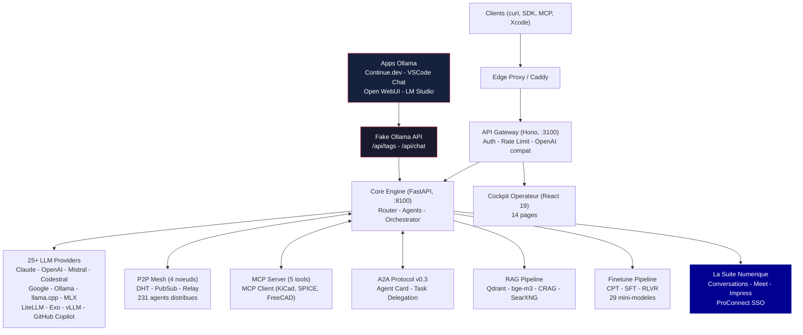

# Mascarade v0.3.0 -- Orchestrateur IA Multi-Agents pour l'Electronique


Moteur d'orchestration IA open-source specialise en conception electronique (KiCad, SPICE, PCB, embarque). Routage multi-provider, reseau P2P mesh, fine-tuning specifique domaine, et Node Engine universel pour workflows en graphe. Auto-heberge, async-first, construit pour les vrais workflows hardware.

*Derniere mise a jour : 2026-03-27*

Le seul orchestrateur multi-agents LLM concu pour l'ingenierie electronique. Les fine-tunes Mascarade battent le modele #1 EE de HuggingFace de +162%.

---

## Fonctionnalites

| Categorie | Details |
| --------- | ------- |
| **Providers LLM** | 25+ providers -- Claude, OpenAI, Mistral, Codestral, Google, HuggingFace, Bedrock, Ollama, llama.cpp, CoreML, MLX, LiteLLM, Exo, vLLM, GitHub Copilot |
| **Agents** | 231 agents repartis sur 4 noeuds P2P -- 16 core, 4 domaine (KiCad, SPICE, FreeCAD, composants), 3 CLI (Vibe/Codex/Claude Code), 4 Mistral Studio, 8 pipeline finetune, agents La Suite |
| **Node Engine** | Execution en graphe universel pour workflows composables (AI, CAD, Electronique, MIDI, Hardware). MVP Gate 5/7 criteres valides. Phase 0: 95%, Phase 1: 75%, Phase 2: 55%, Phase 3: 80%, Phase 4: 60%, Phase 5: 50% |
| **MCP** | Server (5 tools) + Client (KiCad x5, SPICEBridge 28 tools, FreeCAD, n8n, ERPNext, data.gouv.fr) |
| **A2A** | Protocole Agent-to-Agent (spec v0.3), delegation de taches et cycle de vie |
| **RAG** | Pipeline Agentic RAG -- Qdrant hybride (dense+BM25+RRF), reranking LLM, fallback CRAG, recherche SearXNG, embeddings bge-m3 |
| **Routeur ML** | Classificateur softmax (17 features), selection automatique du meilleur modele par prompt |
| **Fine-tuning** | Pipeline 3 etapes : CPT -> SFT -> RLVR. LoRA/QLoRA, DPO, SimPO, KTO, GRPO. 29 mini-modeles domaine |
| **Qualite donnees** | Pipeline SOTA 2026 : SemDeDup, IFD scoring, multi-juge (3 LLMs), scoring par capacite |
| **P2P Mesh** | DHT, PubSub, relay avec traversal NAT et file de taches distribuee, 4 noeuds actifs |
| **prima.cpp** | Inference distribuee multi-machine (ring topology, QwQ-32B 32B sur 4 noeuds, NAT relay via Photon) |
| **Scheduler** | Selection de workers GPU-aware avec equilibrage de charge predictif |
| **Compat API** | OpenAI `/v1/chat/completions` + Ollama `/api/chat` + Xcode Intelligence |
| **Orchestrateur** | Plan-and-Execute avec decomposition de taches et gestion de dependances |
| **La Suite Numerique** | Integration DINUM : Conversations (Albert), Meet (LiveKit), Impress (docs), ProConnect (SSO) |
| **Observabilite** | Grafana, Prometheus, Loki, Tempo, OTEL, Langfuse, ClickHouse, Argilla |

---

## Architecture



**Python Core** (FastAPI, port 8100) -- agents, routeur, orchestrateur, Node Engine, P2P mesh, RAG, pipeline finetune.
**TypeScript API** (Hono, port 3100) -- auth, rate limiting, passerelle OpenAI-compatible, Fake Ollama API.
**React Web** (14 pages) -- cockpit operateur avec dashboard, agents, playground, orchestration, training, knowledge, MCP, pipeline, calendrier, mail, Kill_LIFE workflows, administration.

---

## Mini-modeles (29)

Publies sur HuggingFace ([clemsail](https://huggingface.co/clemsail)) :

| Modele | Domaine | Examples | Base | Statut |
| ------ | ------- | -------- | ---- | ------ |
| mascarade-spice-v3 | Simulation SPICE | 13 723 | qwen2.5-3b | OK |
| mascarade-verilog-v1 | Verilog/RTL | 26 532 | qwen2.5-3b | OK |
| mascarade-emc-v2 | Conformite EMC/EMI | 3 016 | qwen2.5-3b | OK |
| mascarade-ipc-v2 | Standards IPC/JLCPCB | 2 251 | qwen2.5-3b | OK |
| mascarade-dsp-v2 | DSP (ARM CMSIS) | 2 015 | qwen2.5-3b | OK |
| mascarade-power-v2 | Electronique de puissance | 1 967 | qwen2.5-3b | OK |
| mascarade-kicad-v4 | KiCad 10 design | 1 931 | qwen2.5-3b | OK |
| mascarade-embedded-v3 | Systemes embarques | 1 669 | qwen2.5-3b | OK |
| mascarade-analog-v2 | Analogique/audio | 1 249 | qwen2.5-3b | OK |
| mascarade-freecad-v1 | FreeCAD/3D CAD | 3 974 | qwen2.5-3b | OK |
| mascarade-platformio-v1 | PlatformIO/Arduino | 763 | qwen2.5-3b | OK |
| mascarade-missing-v2 | RF, securite, batterie | 891 | qwen2.5-3b | OK |
| mascarade-iot-v2 | IoT (ESP-IDF) | 385 | qwen2.5-3b | OK |
| mascarade-stm32-v1 | STM32 HAL | 313 | qwen2.5-3b | OK |
| mascarade-stackexchange-ee | Electronics StackExchange | 95 000 | qwen2.5-3b | OK |
| mascarade-leetcode-asm | LeetCode Assembly | 14 000 | qwen2.5-3b | OK |
| mascarade-real-code | Code reel (ESP-IDF, CMSIS, etc.) | 3 600 | qwen2.5-3b | OK |
| mascarade-cpt-verilog | Pre-training Verilog | 390 000 | qwen2.5-3b | CPT |
| mascarade-cpt-kicad | Pre-training KiCad | 43 000 | qwen2.5-3b | CPT |
| mascarade-cpt-semi | Pre-training semiconducteurs | 59 000 | qwen2.5-3b | CPT |

*Les 9 modeles restants sont en retraining sur donnees enrichies (Q2 2026).*

---

## Datasets

**184K+ examples** verifies, pipeline qualite SOTA 2026 :

| Etape | Examples | Contenu |
| ----- | -------- | ------- |
| **CPT** (pre-training continu) | 492K | Verilog (390K), schemas KiCad (43K), semiconducteurs (59K) |
| **SFT** (fine-tuning supervise) | 61K | 14 domaines : SPICE, Verilog, KiCad, EMC, IPC, DSP, puissance, embarque, analogique, FreeCAD, PlatformIO, IoT, RF, securite |
| **StackExchange EE** | 95K | Questions/reponses electronique depuis StackExchange |
| **LeetCode Assembly** | 14K | Exercices de programmation en assembleur |
| **Code reel** | 3.6K | ESP-IDF, CMSIS-DSP, liquid-dsp, Pico SDK, ngspice, ch32fun RISC-V, spice-datasets |
| **Benchmark** | 130 | 100 standard + 30 adversarial prompts electronique |

### Pipeline qualite (SOTA 2026)

```text
Sources (700K+) -> Audit format -> Cross-Dedup (10K supprimes)
    -> Nettoyage hallucinations -> Verification LLM (devstral juge)
    -> Dedup semantique (bge-m3) -> Scoring IFD -> Multi-Juge (3 LLMs)
    -> Scoring par capacite -> Dataset curate (184K verifie)
```

Base : SemDeDup (arXiv 2303.09540), Cherry LLM IFD (arXiv 2308.12032), AlpaGasus (arXiv 2307.08701), SkillRater (arXiv 2602.11615).

---

## Benchmarks

Juge Codestral API, 130 prompts (100 standard + 30 adversarial) :

| Modele | Taille | Score /10 | Latence | vs phi2-EE |
| ------ | ------ | --------- | ------- | ---------- |
| **mascarade-emc** | 2.5 GB | **7.14** | 2.3s | **+162%** |
| **mascarade-power** | 2.5 GB | **7.10** | 2.3s | +161% |
| **mascarade-dsp** | 2.5 GB | **7.07** | 2.3s | +160% |
| **mascarade-spice-v1** | 2.5 GB | **6.89** | 2.3s | +153% |
| **mascarade-kicad-v1** | 2.5 GB | **6.82** | 2.3s | +151% |
| qwen2.5-7b (base) | 4.7 GB | 6.89 | 9.5s | +153% |
| phi2-ee (HF #1 EE) | 1.7 GB | 2.72 | 1.5s | baseline |

Les fine-tunes Mascarade surpassent le meilleur modele electronique HuggingFace de **+162%** avec **4x moins de latence** que le modele de base.

---

## Services deployes

| Service | URL / Port | Description |
| ------- | ---------- | ----------- |
| **Mascarade Core** | `:8100` | Moteur Python (FastAPI), agents, routeur, P2P |
| **Mascarade API** | `:3100` | Passerelle Node.js (Hono), auth, OpenAI compat |
| **mascarade.saillant.cc** | HTTPS | Point d'entree public |
| **Grafana** | `:3000` | Tableaux de bord, metriques, logs |
| **Langfuse** | `:3001` | Observabilite LLM, traces, couts |
| **Argilla** | `:6900` | Labeling de donnees pour fine-tuning |
| **Qdrant** | `:6333` | Base vectorielle (RAG + embeddings) |
| **SearXNG** | `:4000` | Meta-moteur de recherche (fallback CRAG) |
| **Docling** | `:5010` | Extraction et traitement de documents |
| **Browser-Use** | `:8910` | Automatisation navigateur par agents |
| **n8n** | `:5678` | Automatisation de workflows |
| **Nextcloud** | `:8080` | Stockage et collaboration |
| **Neo4j + Graphiti** | `:7474` | Graphe de connaissances |
| **Ollama** | `:11434` | Inference locale (40+ modeles) |
| **LiteLLM** | `:4000` | Proxy multi-provider |
| **train.saillant.cc** | HTTPS | Interface d'entrainement |

---

## La Suite Numerique (DINUM)

Integration avec l'ecosysteme souverain francais :

| Service | Description | Port |
| ------- | ----------- | ---- |
| **Conversations** (Albert) | Messagerie IA souveraine, base Mistral | `:8082` |
| **Meet** | Visioconference (LiveKit) | `:8084` |
| **Impress** | Documents collaboratifs (Y.js) | `:8073` |
| **ProConnect** | SSO unifie + Keycloak | `:8085` |
| **data.gouv.fr MCP** | 74 000+ datasets publics via MCP | -- |

Repos de reference : [numerique-gouv](https://github.com/orgs/numerique-gouv), [suitenumerique](https://github.com/orgs/suitenumerique)

---

## Flotte (5 machines)

| Machine | Role | GPU | Containers | Agents | prima.cpp |
| ------- | ---- | --- | ---------- | ------ | --------- |
| **Tower** | Serveur principal (core + API + observabilite + La Suite) | Quadro P2000 5GB | 76 | -- | ring node |
| **Photon** | Secondaire mesh (core mirror + Keycloak + CF tunnel + NAT relay) | -- | 52 | -- | relay |
| **KXKM-AI** | Fine-tuning, benchmarks, FreeCAD, KiCad | RTX 4090 24GB | -- | 18 | ring node |
| **GrosMac** | Developpement (Apple M5) | -- | -- | 158 | ring node |
| **Cils** | Noeud macOS Intel (MBP 2016) | -- | -- | -- | ring node |

Reseau P2P mesh connecte les 5 machines avec authentification HMAC et heartbeat 30s. **231 agents** distribues au total. prima.cpp permet l'inference distribuee de QwQ-32B (32B params) en ring topology sur 4 noeuds avec NAT relay via Photon.

---

## Demarrage rapide

```bash
git clone https://github.com/electron-rare/mascarade.git
cd mascarade
cp .env.example .env   # ajouter vos cles API

# Services core
docker compose --profile core up -d

# Avec stack observabilite
docker compose --profile core --profile observability up -d

# Verification sante
./scripts/mascarade-health.sh
```

Ports par defaut :

- Core API : `8100`
- Hono API (expose par Docker Compose) : `3100`
- Hono API (interieur container) : `3000`

Toute application compatible Ollama (Continue.dev, Open WebUI, LM Studio) peut se connecter directement -- Mascarade expose une Fake Ollama API qui route vers les 25+ providers.

---

## API (compatible OpenAI)

```bash
# Chat completion
curl -X POST https://mascarade.saillant.cc/v1/chat/completions \
  -H "Authorization: Bearer $MASCARADE_TOKEN" \
  -H "Content-Type: application/json" \
  -d '{
    "model": "mascarade-spice-v3",
    "messages": [{"role": "user", "content": "Design a 5V buck converter with LM2596"}]
  }'

# Liste des modeles
curl https://mascarade.saillant.cc/v1/models \
  -H "Authorization: Bearer $MASCARADE_TOKEN"

# Sante du cluster
curl https://mascarade.saillant.cc/v1/cluster/peers \
  -H "Authorization: Bearer $MASCARADE_TOKEN"
```

Endpoints disponibles :

| Endpoint | Description |
| -------- | ----------- |
| `POST /v1/chat/completions` | Chat completion (format OpenAI) |
| `GET /v1/models` | Liste des modeles disponibles |
| `POST /api/chat` | Chat (format Ollama) |
| `GET /api/tags` | Liste modeles (format Ollama) |
| `GET /v1/cluster/peers` | Pairs du mesh P2P |
| `GET /v1/cluster/identity` | Identite du noeud |
| `GET /health` | Etat de sante |

---

## Structure du projet

```text
mascarade/
  core/        Python FastAPI (routage, agents, P2P, finetune, RAG, node_engine)
  api/         API gateway Node.js (Hono, auth, rate limiting)
  web/         Cockpit operateur React 19 (14 pages)
  clients/     Clients natifs (app macOS Swift, bridge Docker)
  finetune/    Datasets, scripts d'entrainement, configs pipeline
  deploy/      Docker, observabilite, Dockerfiles
  scripts/     Scripts ops (monitor, sante, deploiement)
  docs/        Documentation architecture, recherche SOTA
  e2e/         Tests end-to-end
  tools/       Outils utilitaires
  vendors/     Dependances vendored
```

---

## Ecosysteme

| Repo | Role |
| ---- | ---- |
| [mascarade](https://github.com/electron-rare/mascarade) | Moteur d'orchestration core |
| [mascarade-datasets](https://github.com/electron-rare/mascarade-datasets) | Datasets fine-tuning (14 domaines) |
| [crazy_life](https://github.com/electron-rare/crazy_life) | Frontend (Vite + React) -- cockpit, editeur de workflows |
| [Kill_LIFE](https://github.com/electron-rare/Kill_LIFE) | Plan de controle IA-natif pour embarque (ESP32/STM32) |

---

## Contribuer

```bash
# Installation developpement
pip install -e ".[dev]"    # Python core
cd api && npm install       # API Node.js
cd web && npm install       # Frontend React

# Tests (2056 pass, 0 fail as of 2026-03-27)
pytest core/ -x             # 2070+ tests Python
cd api && npm test           # 598 tests Vitest
cd e2e && npm test           # Tests E2E
```

Conventions :

- Python : ruff (linting + format), pytest
- TypeScript : vitest, eslint, prettier
- Commits : conventionnel (`feat:`, `fix:`, `chore:`)
- PRs : branche feature -> main, review requise

---

## Licence

[MIT](LICENSE.md) -- Copyright (c) 2026 electron-rare contributors

---

<iframe src="https://github.com/sponsors/electron-rare/card" title="Sponsor electron-rare" height="225" width="600" style="border: 0;"></iframe>
