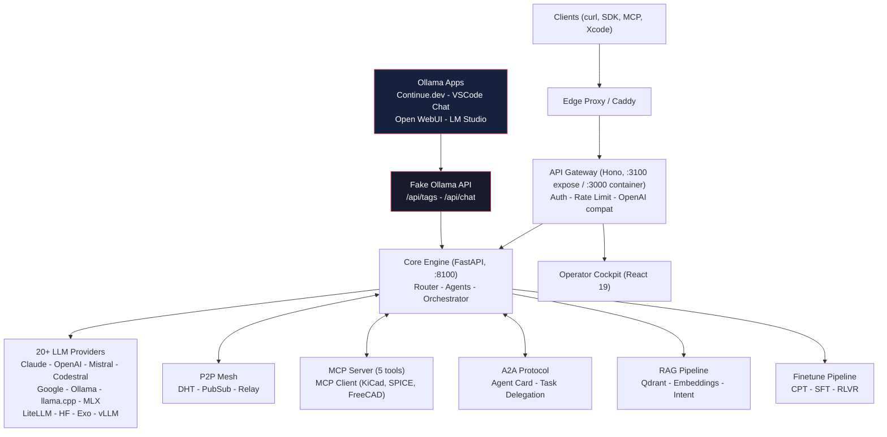

# Mascarade -- Multi-Agent LLM Orchestration for Electronics


Open-source AI orchestration engine specialized in electronics design (KiCad, SPICE, PCB, embedded systems). Multi-provider LLM routing, P2P mesh networking, domain-specific fine-tuning. Self-hosted, async-first, built for real hardware workflows.

**The only multi-agent LLM orchestrator purpose-built for electronics engineering.** Mascarade fine-tunes beat the HuggingFace #1 EE model by +125%.

## Architecture



## Key Features

| Category | Details |
| -------- | ------- |
| **LLM Providers** | 20+ providers -- Claude, OpenAI, Mistral, Codestral, Google, HuggingFace, Bedrock, Ollama, llama.cpp, CoreML, MLX, LiteLLM, Exo, vLLM |
| **Agents** | 16 pre-built -- coder, analyst, kicad-designer, spice-expert, pcb-routing, Mistral Studio (4 real agent IDs), CLI (Vibe/Codex/Claude Code) |
| **MCP** | Server (5 tools) + Client (KiCad x5, SPICEBridge 28 tools, FreeCAD, n8n, ERPNext) |
| **A2A** | Agent-to-Agent protocol (spec v0.3) with task delegation and lifecycle states |
| **RAG** | Qdrant hybrid search (dense+BM25+RRF), LLM reranking, CRAG fallback, SearXNG web search, bge-m3 embeddings |
| **ML Router** | Softmax classifier (17 features) auto-selects best model per prompt |
| **Fine-tuning** | 3-stage pipeline: CPT -> SFT -> RLVR. LoRA/QLoRA, DPO, SimPO, KTO, GRPO. 14 domain mini-models |
| **Data Quality** | SOTA 2026 pipeline: SemDeDup, IFD scoring, multi-judge (3 LLMs), per-capability scoring |
| **P2P Mesh** | DHT, PubSub, relay with NAT traversal and distributed task queue |
| **Scheduler** | GPU-aware worker selection with predictive load balancing |
| **API Compat** | OpenAI `/v1/chat/completions` + Ollama `/api/chat` + Xcode Intelligence |
| **Observability** | Grafana, Prometheus, Loki, Tempo, OTEL, Langfuse, ClickHouse |

## Quick Start

```bash
git clone https://github.com/electron-rare/mascarade.git
cd mascarade
cp .env.example .env   # add your API keys

# Core services
docker compose --profile core up -d

# With observability stack
docker compose --profile core --profile observability up -d

# Health check
./scripts/mascarade-health.sh
```

Default ports in this repository:

- Core API: `8100`
- Hono API exposed by Docker Compose: `3100` (`API_PORT` in `.env`)
- Hono API process inside the container: `3000`

For local API development outside Docker, `api/src/index.ts` defaults to `API_PORT=3100`.
If you run legacy scripts that target `3000`, start API with `API_PORT=3000 npm run dev`.

Any Ollama-compatible app (Continue.dev, Open WebUI, LM Studio) can connect directly -- Mascarade exposes a Fake Ollama API that routes to all 20+ providers.

## Benchmark Results

Codestral API judge, 130 prompts (100 standard + 30 adversarial):

| Model | Size | Score /10 | Latency |
| ----- | ---- | --------- | ------- |
| **mascarade-emc** | 2.5 GB | **7.14** | 2.3s |
| **mascarade-power** | 2.5 GB | **7.10** | 2.3s |
| **mascarade-dsp** | 2.5 GB | **7.07** | 2.3s |
| **mascarade-spice-v1** | 2.5 GB | **6.89** | 2.3s |
| **mascarade-kicad-v1** | 2.5 GB | **6.82** | 2.3s |
| qwen2.5-7b (base) | 4.7 GB | 6.89 | 9.5s |
| phi2-ee (HF #1 EE model) | 1.7 GB | 2.72 | 1.5s |

Mascarade fine-tunes outperform the top HuggingFace electronics model by **+125%** with **4x less latency** than the base model.

## Fine-tuned Models

Published on HuggingFace:

- [clemsail/mascarade-kicad-v2-lora](https://huggingface.co/clemsail/mascarade-kicad-v2-lora) -- KiCad schematic and PCB design
- [clemsail/mascarade-spice-v1-lora](https://huggingface.co/clemsail/mascarade-spice-v1-lora) -- SPICE circuit simulation
- [clemsail/mascarade-kicad-dataset](https://huggingface.co/datasets/clemsail/mascarade-kicad-dataset) -- Training dataset

14 domain mini-models trained (9 complete, 5 retraining on enriched data):

| Model | Domain | Examples | Data Sources |
| ----- | ------ | -------- | ------------ |
| mascarade-spice-v3 | SPICE simulation | 13,723 | mascarade + symbench/spice-datasets + ngspice |
| mascarade-verilog-v1 | Verilog/RTL | 26,532 | RTLCoder + VeriReason (GRPO) |
| mascarade-emc-v2 | EMC/EMI compliance | 3,016 | mascarade original |
| mascarade-ipc-v2 | IPC/JLCPCB standards | 2,251 | Codestral generated |
| mascarade-dsp-v2 | DSP (ARM CMSIS) | 2,015 | mascarade + CMSIS-DSP + liquid-dsp |
| mascarade-power-v2 | Power electronics | 1,967 | mascarade original |
| mascarade-kicad-v4 | KiCad 10 design | 1,931 | Multi-provider grounded |
| mascarade-embedded-v3 | Embedded systems | 1,669 | mascarade + Pico SDK + ch32fun RISC-V |
| mascarade-analog-v2 | Analog/audio | 1,249 | Codestral generated |
| mascarade-freecad-v1 | FreeCAD/3D CAD | 3,974 | mascarade original |
| mascarade-platformio-v1 | PlatformIO/Arduino | 763 | mascarade original |
| mascarade-missing-v2 | RF, safety, battery | 891 | Codestral generated |
| mascarade-iot-v2 | IoT (ESP-IDF) | 385 | ESP-IDF examples (Apache 2.0) |
| mascarade-stm32-v1 | STM32 HAL | 313 | mascarade original |

## Datasets

| Stage | Examples | Content |
| ----- | -------- | ------- |
| **CPT** (continual pre-training) | 492K | Verilog (390K), KiCad schematics (43K), semiconductor (59K) |
| **SFT** (supervised fine-tuning) | 61K | 14 domains: SPICE, Verilog, KiCad, EMC, IPC, DSP, power, embedded, analog, FreeCAD, PlatformIO, IoT, RF, safety |
| **Quality Sources** | 8.2K | Real code from ESP-IDF, CMSIS-DSP, liquid-dsp, Pico SDK, ngspice, ch32fun RISC-V, spice-datasets |
| **Benchmark** | 130 | 100 standard + 30 adversarial electronics prompts |

### Data Quality Pipeline (SOTA 2026)
```text
Sources (700K+) -> Format Audit -> Cross-Dedup (10K removed)
    -> Hallucination Cleaning -> LLM Verification (devstral judge)
    -> Semantic Dedup (bge-m3) -> IFD Scoring -> Multi-Judge (3 LLMs)
    -> Per-Capability Scoring -> Curated Dataset (61K verified)
```

Based on: SemDeDup (arXiv 2303.09540), Cherry LLM IFD (arXiv 2308.12032), AlpaGasus (arXiv 2307.08701), SkillRater (arXiv 2602.11615).

Data enriched from 8 verified open-source repos (MIT/Apache/BSD): espressif/esp-idf, ARM-software/CMSIS-DSP, jgaeddert/liquid-dsp, raspberrypi/pico-examples, cnlohr/ch32fun, symbench/spice-datasets, ngspice.

## Fleet

| Machine | Role | GPU |
| ------- | ---- | --- |
| **photon** | Production (core + API), 18 agents live | -- |
| **KXKM-AI** | Fine-tuning, benchmarks, 15+ Ollama models | RTX 4090 24GB |
| **Tower** | General compute, code sync | Quadro P2000 5GB |
| **grosmac** | Development (Apple Silicon) | -- |
| **Cils** | macOS Intel node | -- |

P2P mesh connects all machines with HMAC-authenticated cluster communication.

## Project Structure

```raw
mascarade/
  core/        Python FastAPI core (routing, agents, P2P, finetune, RAG)
  api/         Node.js API gateway (Hono, auth, rate limiting)
  web/         React 19 operator cockpit
  clients/     Native clients (macOS Swift app, Docker bridge)
  finetune/    Datasets, training scripts, pipeline configs
  deploy/      Docker, observability, Dockerfiles
  scripts/     Ops scripts (monitor, health, deploy)
  docs/        Architecture docs, SOTA research
```

## Ecosystem

| Repo | Role |
| ---- | ---- |
| [mascarade](https://github.com/electron-rare/mascarade) | Core orchestration engine |
| [mascarade-datasets](https://github.com/electron-rare/mascarade-datasets) | Fine-tuning datasets (13 domains) |
| [mascarade-cockpit](https://github.com/electron-rare/mascarade-cockpit) | SvelteKit ops console |

## License

MIT
