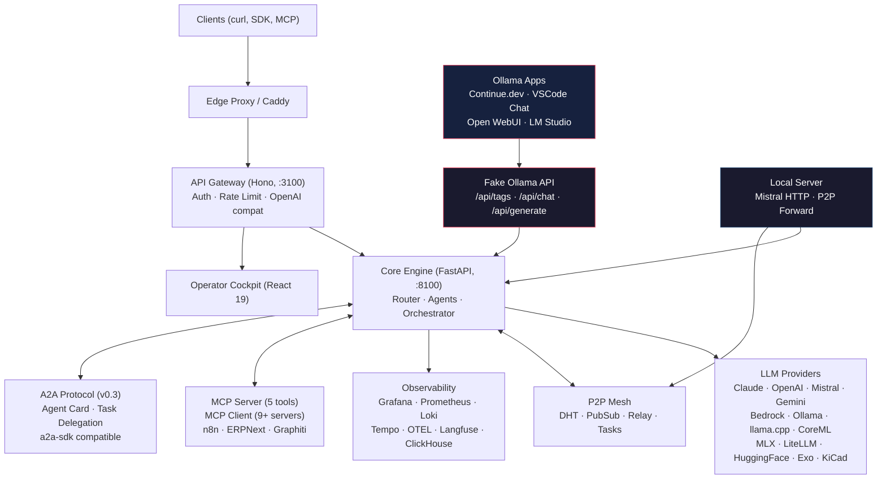

# Mascarade

> Multi-agent LLM orchestration engine with P2P mesh, distributed scheduling, and domain-specialized fine-tuning.

## Architecture

Mascarade is a two-tier system: a **Node.js API gateway** (Hono) handles auth, rate limiting, and OpenAI-compatible routing, while the **Python core** (FastAPI) runs LLM routing, agent orchestration, P2P mesh, and fine-tuning pipelines. An operator cockpit (React 19) provides real-time monitoring.



## Features

| Category | Details |
|----------|---------|
| **LLM Providers** | 13 providers — Claude, OpenAI, Mistral, Google, HuggingFace, Bedrock, Ollama, llama.cpp, CoreML, MLX, LiteLLM, Exo, KiCad Router |
| **Agents** | 12 built-in + 4 domain agents (FreeCAD, KiCad, Spice, Components) |
| **CLI Coding Agents** | Vibe, Codex, Claude Code exposed in the core and API gateway |
| **Skills** | 10 composable skills — chain-of-thought, structured-output, electronics-domain, etc. |
| **Routing** | ML routing classifier + rule-based fallback with BERT-based domain classification |
| **P2P Mesh** | DHT, PubSub, Relay, distributed task queue with NAT traversal |
| **Scheduler** | Distributed scheduler with resource-aware scoring and predictive load balancing |
| **Fine-tuning** | 8-phase pipeline (DPO, SimPO, KTO, RLVR) with LoRA/QLoRA optimization |
| **Agent Gates** | Pre/post execution gates with evidence tracking for audit and compliance |
| **MCP** | Server (5 tools) + Client (9+ servers: industrial, n8n, ERPNext, Graphiti) |
| **A2A** | Agent Card (spec v0.3) + task delegation, 6 lifecycle states, optional `a2a-sdk` |
| **Real-time** | WebSocket event streams with backpressure handling |
| **API Compat** | OpenAI-compatible `/v1/chat/completions` + Ollama-compatible `/api/chat` endpoints with streaming |
| **Fake Ollama** | Ollama-compatible API backed by the LLM router — any app speaking ollama:// accesses all providers |
| **Local Server** | Lightweight Mistral HTTP + P2P forwarding server for dev machines (no heavy deps) |
| **Observability** | Grafana, Prometheus, Loki, Tempo, OTEL, Langfuse, ClickHouse with distributed tracing |

## Quick Start

```bash
# Clone
git clone https://github.com/electron-rare/mascarade.git
cd mascarade

# Configure
cp .env.example .env
# Edit .env with your API keys

# Start core services
docker compose --profile core up -d

# Start with observability
docker compose --profile core --profile observability up -d

# Health check
./scripts/mascarade-health.sh

# TUI monitoring
./scripts/mascarade-monitor.sh
```

## Project Structure

```
mascarade/
├── core/           # Python FastAPI core (LLM routing, agents, P2P, finetune)
├── api/            # Node.js API gateway (Hono, auth, rate limiting)
├── web/            # React 19 operator cockpit
├── deploy/         # Docker, observability configs, Dockerfiles
├── finetune/       # Fine-tuning datasets, scripts, pipeline
├── scripts/        # Ops scripts (monitor, health, deploy)
├── skills/         # Skill documentation
└── docs/           # Architecture docs, SOTA research, analysis
```

## API

| Method | Endpoint | Description |
|--------|----------|-------------|
| `GET`  | `/api/v1/models` | OpenAI-compatible model catalog |
| `POST` | `/v1/chat/completions` | OpenAI-compatible chat completions |
| `GET`  | `/ollama/api/tags` | Ollama-compatible model list |
| `POST` | `/ollama/api/chat` | Ollama-compatible chat (stream + sync) |
| `POST` | `/ollama/api/generate` | Ollama-compatible text generation |
| `POST` | `/api/agents` | Agent CRUD (with gate validation) |
| `GET/POST` | `/api/cli-agents/*` | Status and execution for Vibe, Codex, Claude Code |
| `POST` | `/api/orchestrate` | Multi-agent orchestration |
| `GET`  | `/.well-known/agent.json` | A2A Agent Card |
| `POST` | `/a2a/tasks` | A2A task submission (authenticated) |
| `GET`  | `/a2a/tasks/{id}` | A2A task status and result |
| `WS`   | `/ws/traces` | Real-time trace stream |

## Configuration

Key environment variables (see `.env.example` for full list):

```bash
# Provider API keys
ANTHROPIC_API_KEY=
OPENAI_API_KEY=
GOOGLE_API_KEY=
MISTRAL_API_KEY=

# Defaults
DEFAULT_PROVIDER=anthropic
DEFAULT_MODEL=claude-sonnet-4-20250514

# Features
P2P_ENABLED=true
CLUSTER_ENABLED=true
A2A_ENABLED=true

# MCP integrations (auto-registered when set)
N8N_BASE_URL=http://n8n.example.com:5678
N8N_API_KEY=
FRAPPE_URL=https://erp.example.com
FRAPPE_API_KEY=
FRAPPE_API_SECRET=

# Fake Ollama API
FAKE_OLLAMA_ENABLED=true
P2P_PROVIDER_ENABLED=true
```

### Fake Ollama (use any Ollama app with Mascarade)

Any app that speaks the Ollama protocol can connect to Mascarade:

```bash
# List all available models (Mistral, Claude, OpenAI, etc.)
curl http://localhost:8100/ollama/api/tags

# Chat via Ollama-compatible API
curl http://localhost:8100/ollama/api/chat -d '{
  "model": "mistral:mistral-large-latest",
  "messages": [{"role": "user", "content": "Hello"}],
  "stream": false
}'
```

**VSCode integration:**
- **VSCode Chat**: Add Ollama provider pointing to `http://localhost:8100/ollama`
- **Continue.dev**: Set `apiBase: http://localhost:8100/ollama` in `~/.continue/config.yaml`
- **Cline**: Use OpenAI-compatible provider with base URL `http://localhost:8100/v1`

### Local lightweight server (no Docker)

For dev machines without Docker, use the standalone server:

```bash
PYTHONPATH=/path/to/mascarade/core \
  MISTRAL_API_KEY=your-key \
  P2P_PEERS=http://192.168.0.119:8100,http://192.168.0.120:8100 \
  python3 -m uvicorn mascarade.local_server:app --host 0.0.0.0 --port 8100
```

Only requires `fastapi`, `httpx`, `uvicorn` (no heavy deps). Routes to Mistral via HTTP, forwards unknown models to P2P peers.

## Documentation

- [Architecture Analysis (2026-03-21)](docs/ANALYSIS_2026-03-21.md)
- [SOTA Research (2026-03-21)](docs/RESEARCH_SOTA_2026-03-21.md)
- [Feature Map](docs/MASCARADE_FEATURE_MAP_2026-03-11.md)
- [Cluster & P2P Sequences](docs/CLUSTER_P2P_REMOTE_SEND_SEQUENCE_2026-03-11.md)
- [API-Core-Provider Sequence](docs/API_CORE_PROVIDER_SEQUENCE_2026-03-11.md)
- [Specifications Techniques](docs/SPECIFICATIONS_TECHNIQUES.md)
- [Optimization Roadmap](docs/OPTIMIZATION_ROADMAP_2026.md)
- [Agent Architecture](docs/AGENT_ARCHITECTURE_ADVANCED.md)
- [VS Code Assistants Guide](docs/VSCODE_ASSISTANTS_2026-03-22.md)
- [VS Code Cline + Cody MCP Guide](docs/VSCODE_CLINE_CODY_MCP_2026-03-22.md)

## Ecosystem

| Repo | Role |
|------|------|
| **[mascarade](https://github.com/electron-rare/mascarade)** | Core orchestration engine, runtime, fine-tuning |
| **[mascarade-datasets](https://github.com/electron-rare/mascarade-datasets)** | Fine-tuning datasets (13 domains, ~74k examples) |
| **[mascarade-cockpit](https://github.com/electron-rare/mascarade-cockpit)** | SvelteKit ops console (Docker monitoring, metrics, energy) |

## License

MIT
