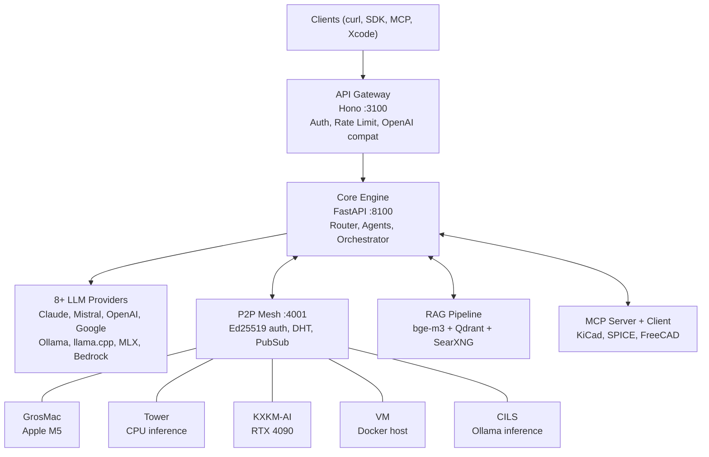

# Mascarade


> *"The machine is us, our processes, an aspect of our embodiment."* — Donna Haraway

**Multi-machine agentic LLM orchestration platform.** Mascarade routes prompts across 8+ providers (Claude, Mistral, OpenAI, Ollama, llama.cpp, MLX, Bedrock, and more), runs a decentralized P2P mesh across 5 physical nodes, fine-tunes domain-specific mini-models that beat HuggingFace baselines by +162%, and exposes MCP tools for hardware engineering workflows. Not a framework — a distributed organism running in production.

[Documentation](docs/index.md)

---

## Architecture



---

## Key Features

**Routing**
- 8+ LLM providers with strategy-based selection (BEST / CHEAPEST / FASTEST)
- Fallback chains, ML router (softmax classifier, 17 features), Ollama multi-machine routing

**P2P Mesh**
- Ed25519 authentication, DHT discovery, PubSub messaging
- Capability-based task routing, NAT relay traversal, 5 active nodes

**Agents**
- 10+ builtin agents, domain agents (KiCad, SPICE, FreeCAD, component search)
- Plan-and-execute orchestrator with task decomposition and dependency management

**Fine-tuning**
- Teacher-to-student distillation pipeline: CPT, SFT, RLVR
- Unsloth + SimPO + LoRA/QLoRA, 29 domain-specific models on [HuggingFace](https://huggingface.co/clemsail)
- +162% vs HuggingFace #1 electronics model on 130-prompt benchmark

**RAG**
- bge-m3 embeddings, Qdrant hybrid search (dense + BM25 + RRF)
- LLM reranking, CRAG fallback, SearXNG web search

**MCP**
- Server: 5 tools exposed via Model Context Protocol
- Client: KiCad (5 tools), SPICE (28 tools), FreeCAD, n8n, ERPNext

**Observability**
- Langfuse (LLM traces), Prometheus + Grafana (metrics), OpenTelemetry (distributed tracing)

**API Compatibility**
- OpenAI `/v1/chat/completions`, Ollama `/api/chat`, Xcode Intelligence
- Drop-in replacement for Continue.dev, Open WebUI, LM Studio

---

## Quickstart

```bash
git clone https://github.com/electron-rare/mascarade.git
cd mascarade
cp .env.example .env          # add your API keys
docker compose --profile core up -d
curl http://localhost:3100/v1/models
```

---

## Fine-tuned Models

29 domain-specific models published on [HuggingFace (clemsail)](https://huggingface.co/clemsail), trained on 498K+ curated examples across electronics engineering domains.

| Model | Domain | Examples | Base |
|-------|--------|----------|------|
| mascarade-spice-v3 | SPICE simulation | 13,723 | Qwen2.5-3B |
| mascarade-verilog-v1 | Verilog / RTL | 26,532 | Qwen2.5-3B |
| mascarade-emc-v2 | EMC/EMI compliance | 3,016 | Qwen2.5-3B |
| mascarade-kicad-v4 | KiCad 10 PCB design | 1,931 | Qwen2.5-3B |
| mascarade-embedded-v3 | Embedded systems | 1,669 | Qwen2.5-3B |
| mascarade-dsp-v2 | DSP (ARM CMSIS) | 2,015 | Qwen2.5-3B |

Data quality pipeline: SemDeDup, IFD scoring, multi-judge (3 LLMs), capability scoring. [Full list on HuggingFace.](https://huggingface.co/clemsail)

---

## Benchmarks

Evaluated by Codestral judge on 130 prompts (100 standard + 30 adversarial), electronics engineering domain:

| Model | Size | Score /10 | vs phi2-EE (HF #1) |
|-------|------|-----------|---------------------|
| **mascarade-emc** | 2.5 GB | **7.14** | **+162%** |
| **mascarade-power** | 2.5 GB | **7.10** | +161% |
| **mascarade-dsp** | 2.5 GB | **7.07** | +160% |
| **mascarade-spice-v1** | 2.5 GB | **6.89** | +153% |
| qwen2.5-7b (base) | 4.7 GB | 6.89 | +153% |
| phi2-ee (HF #1 EE) | 1.7 GB | 2.72 | baseline |

Mascarade fine-tunes outperform the top HuggingFace electronics model by +162% while being smaller than the base model.

---

## Related Projects

| Repository | Description |
|------------|-------------|
| [Kill_LIFE](https://github.com/electron-rare/Kill_LIFE) | Spec-first agentic methodology for embedded systems (ESP32, STM32) |
| [crazy_life](https://github.com/electron-rare/crazy_life) | React cockpit and workflow editor for Mascarade |
| [prima-cpp](https://github.com/electron-rare/prima-cpp) | Distributed multi-node LLM inference (ring topology, NAT relay) |
| [KiC-AI](https://github.com/electron-rare/KiC-AI) | AI-powered PCB design assistant for KiCad |

## Services

| Service | URL / Port | Description |
| ------- | ---------- | ----------- |
| **Mascarade Core** | `:8100` | Moteur Python (FastAPI), agents, routeur, P2P |
| **Mascarade API** | `:3100` | Passerelle Node.js (Hono), auth, OpenAI compat, routage Ollama multi-machine |
| **mascarade.saillant.cc** | HTTPS | Point d'entree public (via Traefik sur photon) |
| **Grafana** | `:3000` | Tableaux de bord, metriques, logs |
| **Langfuse** | `:3001` | Observabilite LLM, traces, couts |
| **Argilla** | `:6900` | Labeling de donnees pour fine-tuning |
| **Qdrant** | `:6333` | Base vectorielle (RAG + embeddings bge-m3) |
| **SearXNG** | `:4000` | Meta-moteur de recherche (fallback CRAG) |
| **Docling** | `:5010` | Extraction et traitement de documents |
| **Browser-Use** | `:8910` | Automatisation navigateur par agents |
| **n8n** | `:5678` | Automatisation de workflows |
| **Drive** | `:8086` | Frontend gestionnaire de fichiers, connecte aux editeurs de la Suite Numerique |
| **Nextcloud** | `:8088` | Backend stockage / WebDAV pour Drive et les synchronisations Mascarade |
| **Neo4j + Graphiti** | `:7474` | Graphe de connaissances |
| **Ollama (Tower)** | `:11434` | Inference CPU (modeles legers : qwen3:4b) |
| **Ollama (KXKM-AI)** | tunnel SSH | Inference GPU RTX 4090 (albert, mistral:7b, devstral, qwen3:8b, bge-m3) |
| **LiteLLM** | `:4000` | Proxy multi-provider |
| **train.saillant.cc** | HTTPS | Interface d'entrainement |

### Agents production (9)

| Agent | Role |
| ----- | ---- |
| **ops-monitor** | Surveillance infrastructure et alertes |
| **ops-deployer** | Deploiement automatise des services |
| **ops-incident** | Gestion des incidents et escalade |
| **ops-healthcheck** | Verification de sante des services |
| **ops-security** | Audit de securite et conformite |
| **web-researcher** | Recherche web via SearXNG + Browser-Use |
| **lead-scorer** | Scoring et qualification de leads |
| **dolibarr-assistant** | Assistant ERP Dolibarr |
| **grist-data** | Gestion de donnees Grist |

---

## La Suite Numerique (DINUM) -- 8 services

Integration avec l'ecosysteme souverain francais. SSO unifie via Keycloak (`auth.saillant.cc`, realm `electron_rare`), avec callback OAuth partage sur `https://auth.saillant.cc/_oauth`.

| Service | Description | Port |
| ------- | ----------- | ---- |
| **Conversations** (Albert) | Messagerie IA souveraine, base Mistral | `:8082` |
| **Meet** | Visioconference (LiveKit) | `:8084` |
| **Impress** | Documents collaboratifs (Y.js) | `:8073` |
| **Keycloak** (ProConnect) | SSO unifie, auth.saillant.cc | `:8085` |
| **Drive** | Frontend gestionnaire des fichiers, avec ouverture vers les editeurs de la suite | `:8086` |
| **Grist** | Tableur collaboratif | `:8484` |
| **Dolibarr** | ERP / CRM | `:8488` |
| **Matrix** | Messagerie federee | `:8008` |
| **data.gouv.fr MCP** | 74 000+ datasets publics via MCP | -- |

Repos de reference : [numerique-gouv](https://github.com/orgs/numerique-gouv), [suitenumerique](https://github.com/orgs/suitenumerique)

Pour l'integration applicative, Open Buro expose `POST /openburo/files/resolve-open` afin de preferer une ouverture dans l'editeur adapte quand le type de fichier est editable dans la suite, sinon basculer vers Drive, puis seulement vers un telechargement explicite. Cette route est le point de passage obligatoire pour l'ouverture documentaire; l'UI ne doit pas ouvrir des URLs brutes.
Le repo expose aussi `GET /openburo/files/resolve-open`, `GET /openburo/files/by-business-object`, l'alias `GET /files/by-business-object`, ainsi que `POST /dolibarr/sync/customer`, `POST /dolibarr/sync/invoice` et `POST /dolibarr/sync/proposal` pour garder Dolibarr comme referentiel metier et deleguer la resolution documentaire a Mascarade.

---

## License

[MIT](LICENSE.md) — Copyright (c) 2026 [L'Electron Rare](https://github.com/L-electron-Rare)

---

*"The cyborg does not dream of community on the model of the organic family. It is not made of mud and cannot dream of returning to dust."*
