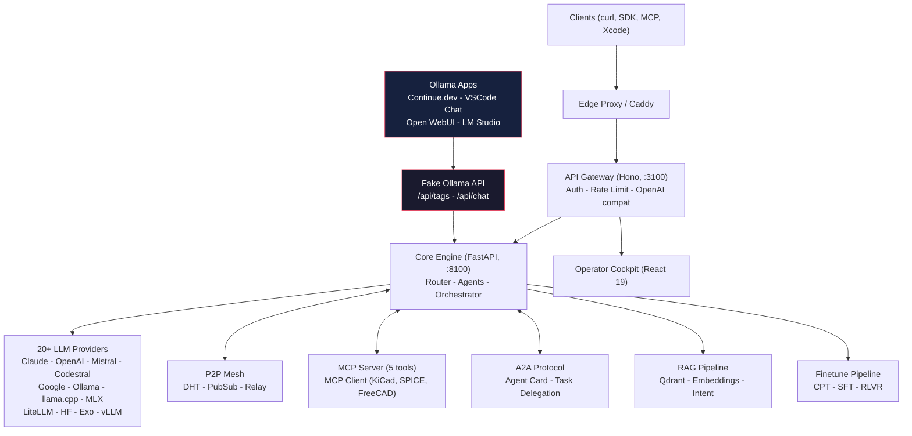

# Mascarade -- Multi-Agent LLM Orchestration for Electronics


Open-source AI orchestration engine specialized in electronics design (KiCad, SPICE, PCB, embedded systems). Multi-provider LLM routing, P2P mesh networking, domain-specific fine-tuning. Self-hosted, async-first, built for real hardware workflows.

**The only multi-agent LLM orchestrator purpose-built for electronics engineering.** Mascarade fine-tunes beat the HuggingFace #1 EE model by +125%.

## Architecture



## Key Features

| Category | Details |
| -------- | ------- |
| **LLM Providers** | 20+ providers -- Claude, OpenAI, Mistral, Codestral, Google, HuggingFace, Bedrock, Ollama, llama.cpp, CoreML, MLX, LiteLLM, Exo, vLLM |
| **Agents** | 16 pre-built -- coder, analyst, kicad-designer, spice-expert, pcb-routing, Mistral Studio (4 real agent IDs), CLI (Vibe/Codex/Claude Code) |
| **MCP** | Server (5 tools) + Client (KiCad, SPICE, FreeCAD, n8n, ERPNext, Graphiti) |
| **A2A** | Agent-to-Agent protocol (spec v0.3) with task delegation and lifecycle states |
| **RAG** | Qdrant vector store, multi-provider embeddings, intent classification |
| **ML Router** | Softmax classifier (17 features) auto-selects best model per prompt |
| **Fine-tuning** | 3-stage pipeline: CPT -> SFT -> RLVR with LoRA/QLoRA, DPO, SimPO, KTO |
| **P2P Mesh** | DHT, PubSub, relay with NAT traversal and distributed task queue |
| **Scheduler** | GPU-aware worker selection with predictive load balancing |
| **API Compat** | OpenAI `/v1/chat/completions` + Ollama `/api/chat` + Xcode Intelligence |
| **Observability** | Grafana, Prometheus, Loki, Tempo, OTEL, Langfuse, ClickHouse |

## Quick Start

```bash
git clone https://github.com/electron-rare/mascarade.git
cd mascarade
cp .env.example .env   # add your API keys

# Core services
docker compose --profile core up -d

# With observability stack
docker compose --profile core --profile observability up -d

# Health check
./scripts/mascarade-health.sh
```

Any Ollama-compatible app (Continue.dev, Open WebUI, LM Studio) can connect directly -- Mascarade exposes a Fake Ollama API that routes to all 20+ providers.

## Benchmark Results

Evaluated with Codestral as judge on 100 electronics prompts:

| Model | Size | Score /10 |
| ----- | ---- | --------- |
| **mascarade-spice-v1** | 2.5 GB | **6.89** |
| **mascarade-kicad-v1** | 2.5 GB | **6.82** |
| qwen2.5-7b (base) | 4.7 GB | 6.79 |
| kicadv2-24B | 14 GB | 5.62 |
| phi2-ee (HF #1 EE model) | 1.7 GB | 3.05 |

Mascarade fine-tunes outperform the top HuggingFace electronics model by +125% while being only 50% larger.

## Fine-tuned Models

Published on HuggingFace:

- [clemsail/mascarade-kicad-v2-lora](https://huggingface.co/clemsail/mascarade-kicad-v2-lora) -- KiCad schematic and PCB design
- [clemsail/mascarade-spice-v1-lora](https://huggingface.co/clemsail/mascarade-spice-v1-lora) -- SPICE circuit simulation
- [clemsail/mascarade-kicad-dataset](https://huggingface.co/datasets/clemsail/mascarade-kicad-dataset) -- Training dataset

10 additional domain models in the pipeline: IPC, EMC, analog, power, DSP, embedded, and more.

## Datasets

| Stage | Examples | Content |
| ----- | -------- | ------- |
| **CPT** (continual pre-training) | 492K | Verilog, schematics, semiconductor, circuit theory |
| **SFT** (supervised fine-tuning) | 27K | KiCad, SPICE, EMC, power, DSP, PlatformIO, FreeCAD, embedded |
| **Benchmark** | 130 | Multi-domain electronics evaluation prompts |

13 domains covered. Datasets generated via Codestral + grounded in 43K real open-source schematics.

## Fleet

| Machine | Role | GPU |
| ------- | ---- | --- |
| **photon** | Production (core + API), 18 agents live | -- |
| **KXKM-AI** | Fine-tuning, benchmarks, 15+ Ollama models | RTX 4090 24GB |
| **Tower** | General compute, code sync | Quadro P2000 5GB |
| **grosmac** | Development (Apple Silicon) | -- |
| **Cils** | macOS Intel node | -- |

P2P mesh connects all machines with HMAC-authenticated cluster communication.

## Project Structure

```
mascarade/
  core/        Python FastAPI core (routing, agents, P2P, finetune, RAG)
  api/         Node.js API gateway (Hono, auth, rate limiting)
  web/         React 19 operator cockpit
  clients/     Native clients (macOS Swift app, Docker bridge)
  finetune/    Datasets, training scripts, pipeline configs
  deploy/      Docker, observability, Dockerfiles
  scripts/     Ops scripts (monitor, health, deploy)
  docs/        Architecture docs, SOTA research
```

## Ecosystem

| Repo | Role |
| ---- | ---- |
| [mascarade](https://github.com/electron-rare/mascarade) | Core orchestration engine |
| [mascarade-datasets](https://github.com/electron-rare/mascarade-datasets) | Fine-tuning datasets (13 domains) |
| [mascarade-cockpit](https://github.com/electron-rare/mascarade-cockpit) | SvelteKit ops console |

## License

MIT
