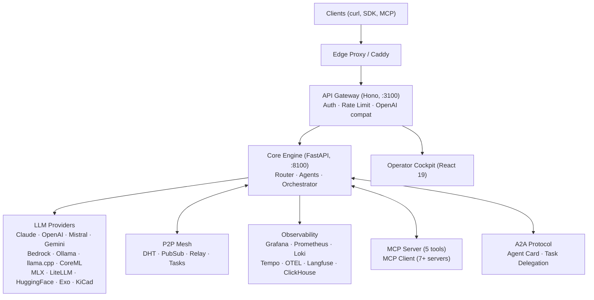

# Mascarade

> Multi-agent LLM orchestration engine with P2P mesh, distributed scheduling, and domain-specialized fine-tuning.

## Architecture

Mascarade is a two-tier system: a **Node.js API gateway** (Hono) handles auth, rate limiting, and OpenAI-compatible routing, while the **Python core** (FastAPI) runs LLM routing, agent orchestration, P2P mesh, and fine-tuning pipelines. An operator cockpit (React 19) provides real-time monitoring.



## Features

| Category | Details |
|----------|---------|
| **LLM Providers** | 13 providers — Claude, OpenAI, Mistral, Google, HuggingFace, Bedrock, Ollama, llama.cpp, CoreML, MLX, LiteLLM, Exo, KiCad Router |
| **Agents** | 12 built-in + 4 domain agents (FreeCAD, KiCad, Spice, Components) |
| **Skills** | 10 composable skills — chain-of-thought, structured-output, electronics-domain, etc. |
| **Routing** | ML routing classifier + rule-based fallback |
| **P2P Mesh** | DHT, PubSub, Relay, distributed task queue |
| **Scheduler** | Distributed scheduler with resource-aware scoring |
| **Fine-tuning** | 8-phase pipeline (DPO, SimPO, KTO, RLVR) |
| **MCP** | Server (5 tools) + Client (7+ industrial servers) |
| **A2A** | Agent Card + task delegation protocol |
| **Real-time** | WebSocket event streams |
| **API Compat** | OpenAI-compatible `/v1/chat/completions` endpoint |
| **Observability** | Grafana, Prometheus, Loki, Tempo, OTEL, Langfuse, ClickHouse |

## Quick Start

```bash
# Clone
git clone https://github.com/electron-rare/mascarade.git
cd mascarade

# Configure
cp .env.example .env
# Edit .env with your API keys

# Start core services
docker compose --profile core up -d

# Start with observability
docker compose --profile core --profile observability up -d

# Health check
./scripts/mascarade-health.sh

# TUI monitoring
./scripts/mascarade-monitor.sh
```

## Project Structure

```
mascarade/
├── core/           # Python FastAPI core (LLM routing, agents, P2P, finetune)
├── api/            # Node.js API gateway (Hono, auth, rate limiting)
├── web/            # React 19 operator cockpit
├── deploy/         # Docker, observability configs, Dockerfiles
├── finetune/       # Fine-tuning datasets, scripts, pipeline
├── scripts/        # Ops scripts (monitor, health, deploy)
├── skills/         # Skill documentation
└── docs/           # Architecture docs, SOTA research, analysis
```

## API

| Method | Endpoint | Description |
|--------|----------|-------------|
| `POST` | `/v1/chat/completions` | OpenAI-compatible chat completions |
| `POST` | `/api/agents` | Agent CRUD |
| `POST` | `/api/orchestrate` | Multi-agent orchestration |
| `GET`  | `/.well-known/agent.json` | A2A Agent Card |
| `WS`   | `/ws/traces` | Real-time trace stream |

## Configuration

Key environment variables (see `.env.example` for full list):

```bash
# Provider API keys
ANTHROPIC_API_KEY=
OPENAI_API_KEY=
GOOGLE_API_KEY=
MISTRAL_API_KEY=

# Defaults
DEFAULT_PROVIDER=anthropic
DEFAULT_MODEL=claude-sonnet-4-20250514

# Features
P2P_ENABLED=true
CLUSTER_ENABLED=true
A2A_ENABLED=true
```

## Documentation

- [Architecture Analysis (2026-03-21)](docs/ANALYSIS_2026-03-21.md)
- [SOTA Research (2026-03-21)](docs/RESEARCH_SOTA_2026-03-21.md)
- [Feature Map](docs/MASCARADE_FEATURE_MAP_2026-03-11.md)
- [Cluster & P2P Sequences](docs/CLUSTER_P2P_REMOTE_SEND_SEQUENCE_2026-03-11.md)
- [API-Core-Provider Sequence](docs/API_CORE_PROVIDER_SEQUENCE_2026-03-11.md)

## Ecosystem

| Repo | Role |
|------|------|
| **[mascarade](https://github.com/electron-rare/mascarade)** | Core orchestration engine, runtime, fine-tuning |
| **[mascarade-datasets](https://github.com/electron-rare/mascarade-datasets)** | Fine-tuning datasets (13 domains, ~74k examples) |
| **[mascarade-cockpit](https://github.com/electron-rare/mascarade-cockpit)** | SvelteKit ops console (Docker monitoring, metrics, energy) |

## License

MIT
