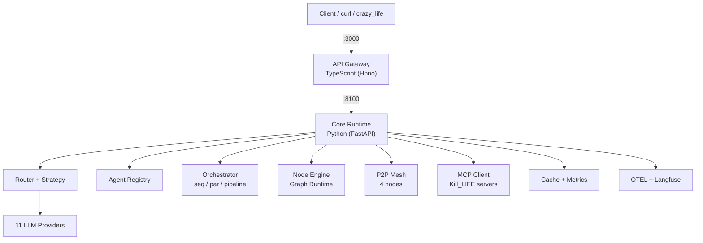

# Mascarade

Personal agentic LLM orchestration system. Intelligently routes requests across 11 LLM providers (Claude, GPT, Mistral, Bedrock, Gemini, Hugging Face, Ollama, llama.cpp, CoreML, and more) with specialized agents, multi-agent orchestration, caching, automatic fallback, and runtime surfaces for knowledge-base, CAD, and electronics.

## Ecosystem

Mascarade is part of a 5-repository ecosystem:

| Repo | Role |
|------|------|
| **[mascarade](https://github.com/electron-rare/mascarade)** | Runtime/ops, agentic orchestration, fine-tuning, LLM routing |
| **[mascarade-datasets](https://github.com/electron-rare/mascarade-datasets)** | Fine-tuning datasets (13 domains, ~74k examples) |
| **[mascarade-cockpit](https://github.com/electron-rare/mascarade-cockpit)** | SvelteKit ops console (Docker monitoring, metrics, energy) |
| **[crazy_life](https://github.com/electron-rare/crazy_life)** | Web cockpit and CrazyLane workflow editor |
| **[Kill_LIFE](https://github.com/electron-rare/Kill_LIFE)** | Agentic template for embedded AI projects (7 MCP servers) |

## Architecture



### Stack

| Layer | Technology | Port |
|-------|-----------|------|
| API Gateway | TypeScript, Hono, 30 route modules | 3000 |
| Core Runtime | Python 3.11+, FastAPI, async | 8100 |
| Frontend | React 19, XYFlow graph editor | — |
| Data | Redis, PostgreSQL, Qdrant, ClickHouse, Neo4j | — |
| AI Services | Ollama, TTS, STT | — |
| Observability | Prometheus, Grafana, Loki, Tempo, OTEL | — |
| Orchestration | LiteLLM, n8n, Dify, Langfuse | — |

## Quick Start

### Prerequisites

- Docker + Docker Compose
- Node.js 20+
- Python 3.11+ (with `uv` recommended)

### 1. Clone and configure

```bash
git clone https://github.com/electron-rare/mascarade.git
cd mascarade
cp .env.example .env
# Edit .env with your API keys (ANTHROPIC_API_KEY, OPENAI_API_KEY, etc.)
```

### 2. Start with Docker Compose

```bash
# Start core services
docker compose --profile core up -d

# Start full stack (including observability)
docker compose up -d
```

### 3. Development mode

```bash
# Python core
cd core && pip install -e . && python -m mascarade.server

# TypeScript API
cd api && npm install && npm run dev

# Web frontend
cd web && npm install && npm run dev
```

### 4. Verify

```bash
# Health check
curl http://localhost:8100/v1/version
curl http://localhost:3000/health

# Send a request
curl -X POST http://localhost:8100/v1/chat/completions \
  -H "Authorization: Bearer $MASCARADE_API_KEY" \
  -H "Content-Type: application/json" \
  -d '{"messages": [{"role": "user", "content": "Hello"}], "model": "claude-sonnet-4-20250514"}'
```

### 5. Run tests

```bash
# Python core tests (281 passing)
cd core && python -m pytest

# TypeScript API tests
cd api && npm test
```

## Features

### LLM Router
- **11 providers**: Claude, OpenAI, Mistral, Bedrock, Gemini, HuggingFace, Ollama, llama.cpp, CoreML, KiCad router
- **Routing strategies**: cheapest, fastest, best quality, specific provider
- **Automatic fallback**: provider failure triggers next in chain
- **Response caching**: prompt-hash based, Redis backed
- **OpenAI-compatible API**: frozen `/v1/chat/completions` contract
- **Streaming**: SSE support across all providers
- **Cost tracking**: per-request token usage and cost

### Agents
- **KiCad agent**: PCB design assistance via MCP
- **FreeCAD agent**: 3D CAD modeling via MCP
- **SPICE agent**: circuit simulation
- **Components agent**: electronics BOM management
- **Prompt versioning** and **skills system**

### Orchestrator
- Sequential, parallel, and pipeline execution modes
- Circuit breaker, retry with backoff, dead letter queue
- Execution context for state passing between steps
- Template-based orchestration patterns

### Node Engine
- DAG-based graph runtime with visual editor (XYFlow)
- Domain workers: AI, CAD, Electronics
- Cross-domain bridge for multi-domain workflows
- Hardware nodes: DMX controller, MIDI bridge, ESP32 client
- Persistence layer for save/load

### P2P Mesh
- **4-node cluster**: VM bootstrap, GrosMac bridge, CILS, Tower, KXKM-AI (RTX 4090)
- libp2p with DHT, gossip, mDNS discovery
- Tailscale relay for remote nodes
- Claim-based task distribution
- Capabilities advertisement (GPU, storage, compute)

### Fine-Tuning Pipeline
- **Best stack**: Qwen2.5-Coder-1.5B + Unsloth + SimPO + Magicoder-OSS-75K
- **7 agents**: student, teacher, reinforcer, analyst, validator, documentalist, archivist
- GGUF conversion pipeline (F16 → Q4_K_M: 3.09G → 941MB)
- Ollama deployment with auto-registration
- P2P distributed training on RTX 4090

### MCP Integration
- HTTP transport MCP client (`call_tool_http()`)
- Graphiti knowledge graph (Neo4j backed)
- 7 Kill_LIFE MCP servers: kicad, freecad, openscad, validate-specs, knowledge-base, github-dispatch, huggingface

### Observability
- Prometheus metrics + Grafana dashboards
- Loki log aggregation + Promtail
- Tempo distributed tracing
- OTEL collector pipeline
- Langfuse LLM-specific observability

## Integration Status

| Integration | Status | Notes |
|------------|--------|-------|
| Claude / Anthropic | Active | Primary provider |
| OpenAI / GPT | Active | |
| Mistral | Active | |
| AWS Bedrock | Active | TOCTOU race fixed |
| Google Gemini | Active | |
| Hugging Face | Active | Inference API |
| Ollama (local) | Active | mascarade-coder deployed |
| llama.cpp | Active | GGUF models |
| Apple CoreML | Active | M-series Macs |
| Kill_LIFE MCP | Active | 7 servers |
| Graphiti / Neo4j | Active | Knowledge graph |
| P2P Mesh | Active | 4 nodes connected |
| Langfuse | Active | LLM observability |
| crazy_life cockpit | In progress | Vue 3 migration |

## Apple Intelligence Roadmap

Mascarade is preparing native Apple Silicon integration for 2026:

| Phase | Timeline | Feature | Status |
|-------|----------|---------|--------|
| 1 | Q2 2026 | **MLX-LM provider** — OpenAI-compatible server, native Metal GPU inference | Planned |
| 1 | Q2 2026 | **Exo distributed inference** — split large models across Mac cluster | Planned |
| 2 | Q3 2026 | **Apple Foundation Models** — 3B on-device via Swift bridge | Planned |
| 3 | Q4 2026 | **Core AI framework** — unified Apple ML API (post-WWDC 2026) | Planned |
| 3 | Q4 2026 | **App Intents / Siri** — voice-driven LLM orchestration | Planned |

New `local-first` routing strategy will prefer local Apple Silicon inference with cloud fallback.

See [`docs/APPLE_INTELLIGENCE_SPEC.md`](./docs/APPLE_INTELLIGENCE_SPEC.md) for full technical specification.

## API Versioning & Stability Contract

Current version: **API v1.0.0**. All endpoints prefixed by `/v1/`.

**Frozen contracts** (no breaking changes in v1.x):
- `POST /v1/chat/completions` — OpenAI-compatible interface
- `GET /v1/version` — Version and capabilities

**Guarantees**:
- No breaking changes in v1.x releases
- New optional fields may be added (clients must ignore unknown fields)
- Deprecated features supported for minimum 6 months with RFC 8594 headers
- 45+ regression tests protect the API contract

See [`CHANGELOG.md`](./CHANGELOG.md) for detailed change history.

## Documentation

| Document | Description |
|----------|-------------|
| [`docs/ARCHITECTURE.md`](./docs/ARCHITECTURE.md) | Full architecture with Mermaid diagrams |
| [`docs/FEATURE_MAP.md`](./docs/FEATURE_MAP.md) | Complete feature map with status and priorities |
| [`docs/APPLE_INTELLIGENCE_SPEC.md`](./docs/APPLE_INTELLIGENCE_SPEC.md) | Apple Intelligence integration spec |
| [`docs/API_CORE_PROVIDER_SEQUENCE_2026-03-11.md`](./docs/API_CORE_PROVIDER_SEQUENCE_2026-03-11.md) | Runtime sequence diagram |
| [`docs/CLUSTER_P2P_REMOTE_SEND_SEQUENCE_2026-03-11.md`](./docs/CLUSTER_P2P_REMOTE_SEND_SEQUENCE_2026-03-11.md) | P2P cluster sequence diagram |
| [`docs/RUNBOOK_APPLE_LLM_LOCAL.md`](./docs/RUNBOOK_APPLE_LLM_LOCAL.md) | Apple local runtime runbook |
| [`FINE_TUNING_GUIDE.md`](./FINE_TUNING_GUIDE.md) | Fine-tuning pipeline guide |
| [`P2P_NETWORK_README.md`](./P2P_NETWORK_README.md) | P2P mesh documentation |

## License

See [`LICENSE.md`](./LICENSE.md).
