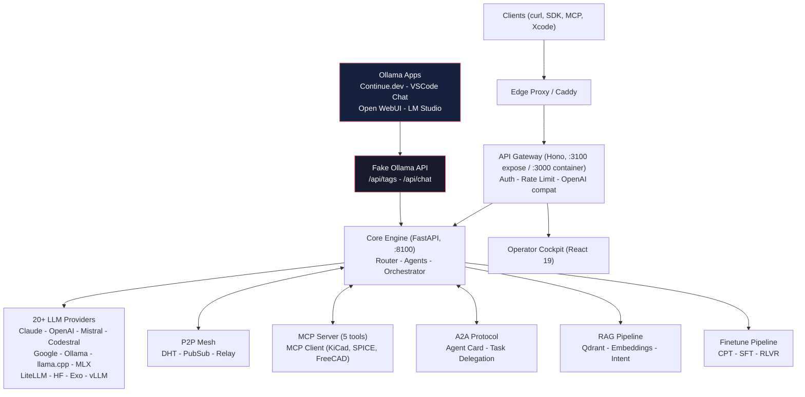

# Mascarade -- Orchestration LLM Multi-Agents pour l'électronique


Moteur open-source d'orchestration IA spécialisé dans la conception électronique (KiCad, SPICE, PCB, systèmes embarqués). Routage LLM multi-fournisseurs, réseau maillé P2P, fine-tuning orienté domaine. Auto-hébergé, async-first, conçu pour des workflows matériels réels.

**Le seul orchestrateur LLM multi-agents conçu spécifiquement pour l'ingénierie électronique.** Les fine-tunes Mascarade surpassent le modèle EE #1 de HuggingFace de +125%.

## Architecture



## Fonctionnalités clés

| Catégorie | Détails |
| -------- | ------- |
| **LLM Providers** | 20+ fournisseurs -- Claude, OpenAI, Mistral, Codestral, Google, HuggingFace, Bedrock, Ollama, llama.cpp, CoreML, MLX, LiteLLM, Exo, vLLM |
| **Agents** | 16 préconstruits -- coder, analyst, kicad-designer, spice-expert, pcb-routing, Mistral Studio (4 IDs d'agent réels), CLI (Vibe/Codex/Claude Code) |
| **MCP** | Serveur (5 outils) + Client (KiCad x5, SPICEBridge 28 outils, FreeCAD, n8n, ERPNext) |
| **A2A** | Protocole Agent-to-Agent (spec v0.3) avec délégation de tâches et états de cycle de vie |
| **RAG** | Recherche hybride Qdrant (dense+BM25+RRF), reranking LLM, fallback CRAG, recherche web SearXNG, embeddings bge-m3 |
| **ML Router** | Classifieur softmax (17 features) sélectionne automatiquement le meilleur modèle par prompt |
| **Fine-tuning** | Pipeline en 3 étapes : CPT -> SFT -> RLVR. LoRA/QLoRA, DPO, SimPO, KTO, GRPO. 14 mini-modèles métier |
| **Data Quality** | Pipeline SOTA 2026 : SemDeDup, scoring IFD, multi-judge (3 LLMs), scoring par capacité |
| **P2P Mesh** | DHT, PubSub, relais avec traversal NAT et file de tâches distribuée |
| **Scheduler** | Sélection de workers aware GPU avec équilibrage de charge prédictif |
| **API Compat** | OpenAI `/v1/chat/completions` + Ollama `/api/chat` + Xcode Intelligence |
| **Observability** | Grafana, Prometheus, Loki, Tempo, OTEL, Langfuse, ClickHouse |

## Démarrage rapide

```bash
git clone https://github.com/electron-rare/mascarade.git
cd mascarade
cp .env.example .env   # add your API keys

# Core services
docker compose --profile core up -d

# With observability stack
docker compose --profile core --profile observability up -d

# Health check
./scripts/mascarade-health.sh
```

Ports par défaut dans ce dépôt :

- Core API: `8100`
- Hono API exposée par Docker Compose : `3100` (`API_PORT` dans `.env`)
- Processus Hono API à l'intérieur du conteneur : `3000`

Pour le développement local de l'API hors Docker, `api/src/index.ts` utilise par défaut `API_PORT=3100`.
Si vous exécutez des scripts legacy qui ciblent `3000`, démarrez l'API avec `API_PORT=3000 npm run dev`.

Toute application compatible Ollama (Continue.dev, Open WebUI, LM Studio) peut se connecter directement -- Mascarade expose une Fake Ollama API qui route vers plus de 20 fournisseurs.

## Résultats de benchmark

Juge Codestral API, 130 prompts (100 standard + 30 adversariaux) :

| Modèle | Taille | Score /10 | Latence |
| ----- | ---- | --------- | ------- |
| **mascarade-emc** | 2.5 GB | **7.14** | 2.3s |
| **mascarade-power** | 2.5 GB | **7.10** | 2.3s |
| **mascarade-dsp** | 2.5 GB | **7.07** | 2.3s |
| **mascarade-spice-v1** | 2.5 GB | **6.89** | 2.3s |
| **mascarade-kicad-v1** | 2.5 GB | **6.82** | 2.3s |
| qwen2.5-7b (base) | 4.7 GB | 6.89 | 9.5s |
| phi2-ee (HF #1 EE model) | 1.7 GB | 2.72 | 1.5s |

Les fine-tunes Mascarade surpassent le meilleur modèle électronique HuggingFace de **+125%** avec une **latence 4x plus faible** que le modèle de base.

## Modèles fine-tunés

Publiés sur HuggingFace :

- [clemsail/mascarade-kicad-v2-lora](https://huggingface.co/clemsail/mascarade-kicad-v2-lora) -- Conception de schémas et PCB KiCad
- [clemsail/mascarade-spice-v1-lora](https://huggingface.co/clemsail/mascarade-spice-v1-lora) -- Simulation de circuits SPICE
- [clemsail/mascarade-kicad-dataset](https://huggingface.co/datasets/clemsail/mascarade-kicad-dataset) -- Dataset d'entraînement

14 mini-modèles métier entraînés (9 complets, 5 en réentraînement sur données enrichies) :

| Modèle | Domaine | Exemples | Sources de données |
| ----- | ------ | -------- | ------------ |
| mascarade-spice-v3 | Simulation SPICE | 13,723 | mascarade + symbench/spice-datasets + ngspice |
| mascarade-verilog-v1 | Verilog/RTL | 26,532 | RTLCoder + VeriReason (GRPO) |
| mascarade-emc-v2 | Conformité EMC/EMI | 3,016 | mascarade original |
| mascarade-ipc-v2 | Normes IPC/JLCPCB | 2,251 | Codestral generated |
| mascarade-dsp-v2 | DSP (ARM CMSIS) | 2,015 | mascarade + CMSIS-DSP + liquid-dsp |
| mascarade-power-v2 | Électronique de puissance | 1,967 | mascarade original |
| mascarade-kicad-v4 | Conception KiCad 10 | 1,931 | Multi-provider grounded |
| mascarade-embedded-v3 | Systèmes embarqués | 1,669 | mascarade + Pico SDK + ch32fun RISC-V |
| mascarade-analog-v2 | Analogique/audio | 1,249 | Codestral generated |
| mascarade-freecad-v1 | FreeCAD/3D CAD | 3,974 | mascarade original |
| mascarade-platformio-v1 | PlatformIO/Arduino | 763 | mascarade original |
| mascarade-missing-v2 | RF, sécurité, batterie | 891 | Codestral generated |
| mascarade-iot-v2 | IoT (ESP-IDF) | 385 | ESP-IDF examples (Apache 2.0) |
| mascarade-stm32-v1 | STM32 HAL | 313 | mascarade original |

## Datasets

| Étape | Exemples | Contenu |
| ----- | -------- | ------- |
| **CPT** (continual pre-training) | 492K | Verilog (390K), schémas KiCad (43K), semi-conducteurs (59K) |
| **SFT** (supervised fine-tuning) | 61K | 14 domaines : SPICE, Verilog, KiCad, EMC, IPC, DSP, power, embedded, analog, FreeCAD, PlatformIO, IoT, RF, safety |
| **Quality Sources** | 8.2K | Code réel provenant de ESP-IDF, CMSIS-DSP, liquid-dsp, Pico SDK, ngspice, ch32fun RISC-V, spice-datasets |
| **Benchmark** | 130 | 100 prompts électroniques standards + 30 adversariaux |

### Pipeline de qualité des données (SOTA 2026)

```text
Sources (700K+) -> Format Audit -> Cross-Dedup (10K removed)
    -> Hallucination Cleaning -> LLM Verification (devstral judge)
    -> Semantic Dedup (bge-m3) -> IFD Scoring -> Multi-Judge (3 LLMs)
    -> Per-Capability Scoring -> Curated Dataset (61K verified)
```

Basé sur : SemDeDup (arXiv 2303.09540), Cherry LLM IFD (arXiv 2308.12032), AlpaGasus (arXiv 2307.08701), SkillRater (arXiv 2602.11615).

Données enrichies à partir de 8 dépôts open-source vérifiés (MIT/Apache/BSD) : espressif/esp-idf, ARM-software/CMSIS-DSP, jgaeddert/liquid-dsp, raspberrypi/pico-examples, cnlohr/ch32fun, symbench/spice-datasets, ngspice.

## Fleet

| Machine | Rôle | GPU |
| ------- | ---- | --- |
| **photon** | Production (core + API), 18 agents en ligne | -- |
| **KXKM-AI** | Fine-tuning, benchmarks, 15+ modèles Ollama | RTX 4090 24GB |
| **Tower** | Calcul généraliste, synchronisation de code | Quadro P2000 5GB |
| **grosmac** | Développement (Apple Silicon) | -- |
| **Cils** | Nœud macOS Intel | -- |

Le mesh P2P connecte toutes les machines avec une communication de cluster authentifiée par HMAC.

## Structure du projet

```raw
mascarade/
  core/        Python FastAPI core (routing, agents, P2P, finetune, RAG)
  api/         Node.js API gateway (Hono, auth, rate limiting)
  web/         React 19 operator cockpit
  clients/     Native clients (macOS Swift app, Docker bridge)
  finetune/    Datasets, training scripts, pipeline configs
  deploy/      Docker, observability, Dockerfiles
  scripts/     Ops scripts (monitor, health, deploy)
  docs/        Architecture docs, SOTA research
```

## Écosystème

| Repo | Rôle |
| ---- | ---- |
| [mascarade](https://github.com/electron-rare/mascarade) | Moteur d'orchestration principal |
| [mascarade-datasets](https://github.com/electron-rare/mascarade-datasets) | Datasets de fine-tuning (13 domaines) |
| [mascarade-cockpit](https://github.com/electron-rare/mascarade-cockpit) | Console ops SvelteKit |

## Licence

MIT

<iframe src="https://github.com/sponsors/electron-rare/card" title="Sponsor electron-rare" height="225" width="600" style="border: 0;"></iframe>
