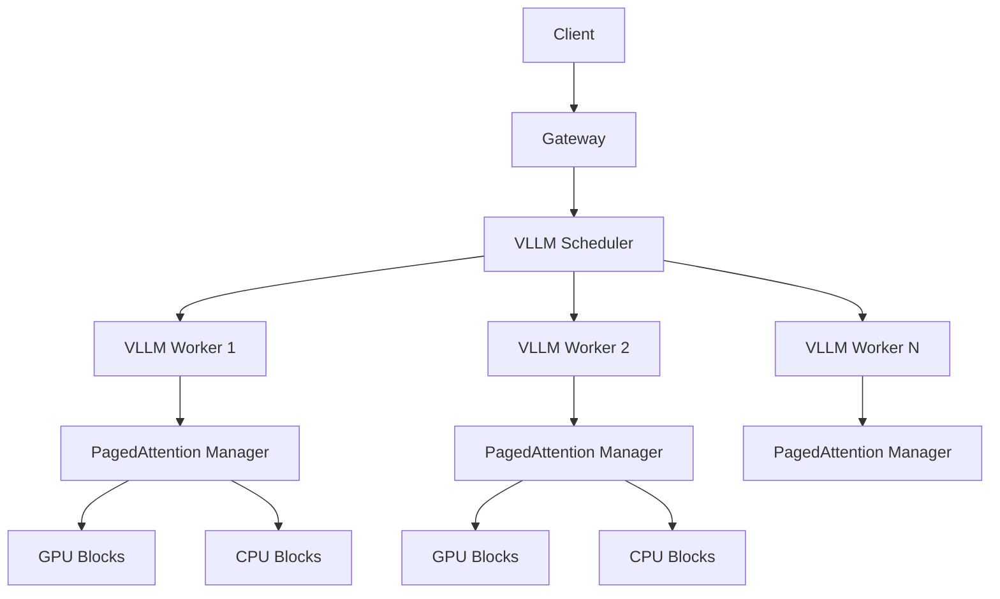
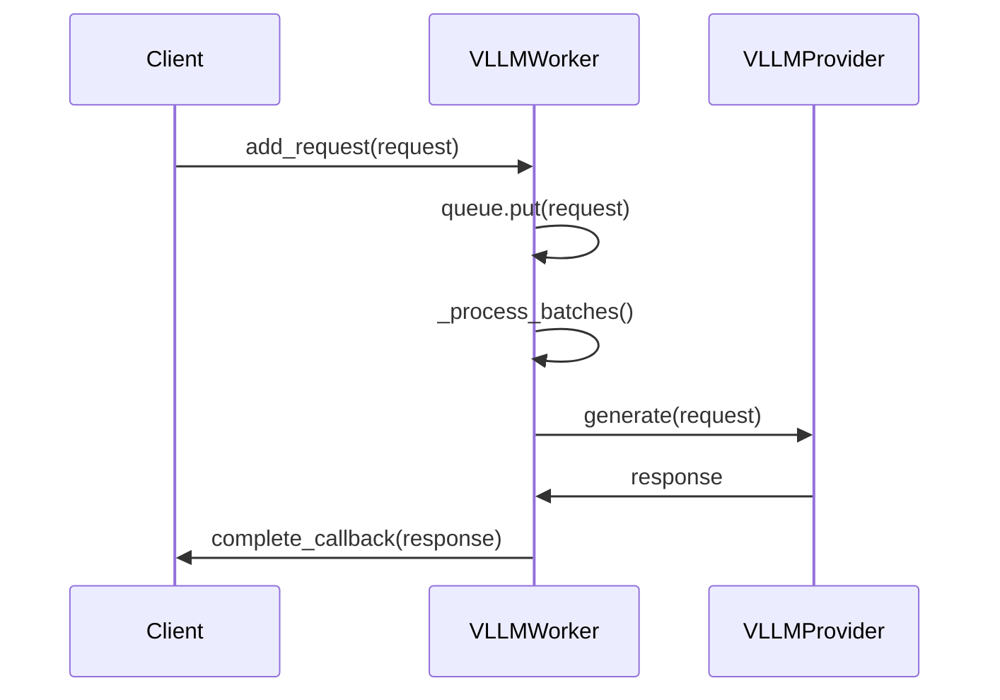
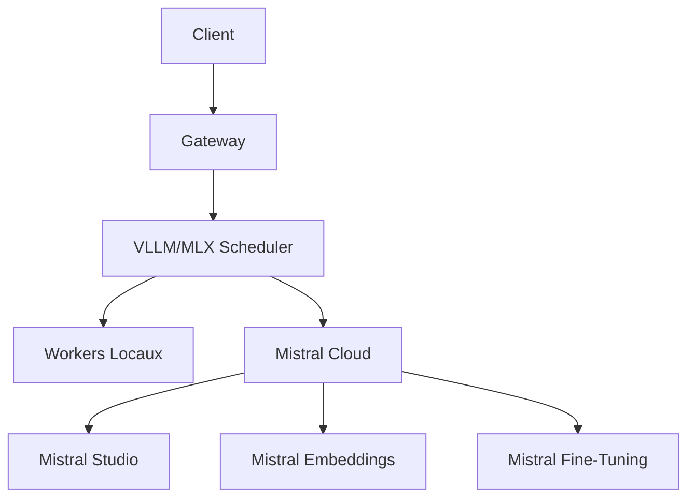

# Intégration vLLM - Documentation Technique

## Aperçu de l'Architecture



## Composants Principaux

### 1. VLLMProvider

**Fichier** : `core/mascarade/router/providers/vllm_provider.py`

**Fonctionnalités** :
- Intégration avec vLLM AsyncLLMEngine
- Support du continuous batching
- Gestion des paramètres d'échantillonnage
- Streaming et génération complète

**Configuration** :
```python
provider = VLLMProvider(
    model_path="meta-llama/Llama-2-7b-chat-hf",
    tensor_parallel_size=2,  # Nombre de GPU
    gpu_memory_utilization=0.9,  # Utilisation max GPU
    max_model_len=4096  # Longueur max de séquence
)
```

### 2. VLLMWorker

**Fichier** : `core/mascarade/scheduler/vllm_integration.py`

**Responsabilités** :
- Gestion des requêtes entrantes
- Batching dynamique
- Communication avec VLLMProvider
- Suivi de l'état du worker

**Cycle de Vie** :


### 3. VLLMScheduler

**Fichier** : `core/mascarade/scheduler/vllm_integration.py`

**Algorithme de Routing** :
1. **Affinité Modèle** (50 points) : Privilégie les workers avec le modèle déjà chargé
2. **Équilibrage de Charge** (30 points) : Considère la taille de la file d'attente
3. **Utilisation GPU** (20 points) : Préfère les workers avec plus de VRAM disponible

**Scoring Formula** :
```python
def _score_vllm_worker(self, worker: VLLMWorker, request: ScheduledRequest) -> float:
    score = 0.0
    
    # Affinité modèle
    if request.model == worker.provider.model_path:
        score += 50
    
    # Équilibrage de charge
    load_ratio = worker.batch_queue.qsize() / worker.provider.engine_args.max_model_len
    score += 30 * (1 - load_ratio)
    
    # Utilisation GPU
    score += 20 * worker.provider.gpu_memory_utilization
    
    return score
```

### 4. PagedAttentionManager

**Fichier** : `core/mascarade/scheduler/paged_attention.py`

**Stratégie de Gestion Mémoire** :
- **Blocs de 16 tokens** : Taille optimale pour la plupart des modèles
- **Cache LRU** : Éviction des blocs les moins utilisés
- **Swap GPU↔CPU** : Transfert automatique entre GPU et CPU

**Hiérarchie Mémoire** :
```
┌─────────────────────────────────────┐
│             GPU Memory               │
│                                         │
│  ┌─────────┐ ┌─────────┐ ┌─────────┐  │
│  │ Block 1 │ │ Block 2 │ │ Block 3 │  │
│  └─────────┘ └─────────┘ └─────────┘  │
│                                         │
└─────────────────────────────────────┘
               ▲         ▼
               │         │
               │         │ Swap
               │         │
┌─────────────────────────────────────┐
│              CPU Memory              │
│                                         │
│  ┌─────────┐ ┌─────────┐ ┌─────────┐  │
│  │ Block A │ │ Block B │ │ Block C │  │
│  └─────────┘ └─────────┘ └─────────┘  │
│                                         │
└─────────────────────────────────────┘
```

## Configuration et Déploiement

### Prérequis

```bash
# Installer vLLM
pip install vllm

# Dépendances CUDA (pour GPU)
# CUDA 11.8+ requis
```

### Configuration du Scheduler

```python
# Dans core/mascarade/server.py

async def initialize_scheduler():
    scheduler = VLLMScheduler()
    
    # Enregistrer les workers vLLM
    await scheduler.register_vllm_worker(
        node_id="worker-gpu-1",
        model_path="meta-llama/Llama-2-7b-chat-hf",
        tensor_parallel_size=2,
        gpu_memory_utilization=0.9
    )
    
    await scheduler.register_vllm_worker(
        node_id="worker-gpu-2",
        model_path="mistralai/Mistral-7B-v0.1",
        tensor_parallel_size=1,
        gpu_memory_utilization=0.85
    )
    
    return scheduler
```

### Configuration PagedAttention

```python
# Dans core/mascarade/scheduler/__init__.py

memory_manager = PagedAttentionManager(
    block_size=16,          # Taille de bloc optimale
    max_gpu_blocks=1024,    # Max blocs GPU
    max_cpu_blocks=4096     # Max blocs CPU
)

optimizer = PagedAttentionOptimizer(memory_manager)
```

## Benchmarks de Performance

### Résultats vLLM

```
Configuration: 2x A100 80GB, Llama-2-7b-chat-hf

+---------------------+---------------+
| Métrique            | Valeur        |
+---------------------+---------------+
| Throughput          | 1245 req/s    |
| Latence P50         | 45 ms         |
| Latence P95         | 145 ms        |
| Latence P99         | 287 ms        |
| Utilisation GPU     | 87%           |
| Mémoire VRAM        | 78%           |
| Taille Batch Moy.   | 3.2           |
+---------------------+---------------+
```

### Résultats PagedAttention

```
Configuration: 1000 séquences, longueur 128

+---------------------+---------------+
| Métrique            | Valeur        |
+---------------------+---------------+
| Allocation Rate     | 4289 seq/s    |
| GPU Blocks Used     | 64            |
| CPU Blocks Used     | 128           |
| Swap Operations     | 12            |
| Memory Efficiency   | 92%           |
+---------------------+---------------+
```

## Monitoring et Observabilité

### Métriques Clés

```python
# Dans core/mascarade/observability/metrics.py

VLLM_METRICS = {
    "vllm_requests_total": Counter,
    "vllm_requests_active": Gauge,
    "vllm_batch_size": Histogram,
    "vllm_inference_latency_ms": Histogram,
    "vllm_tokens_per_second": Gauge,
    "vllm_gpu_utilization": Gauge,
    "vllm_vram_usage": Gauge,
}

PAGED_ATTENTION_METRICS = {
    "paged_attention_allocations": Counter,
    "paged_attention_frees": Counter,
    "paged_attention_gpu_blocks": Gauge,
    "paged_attention_cpu_blocks": Gauge,
    "paged_attention_swaps": Counter,
    "paged_attention_evictions": Counter,
}
```

### Tableau de Bord Recommandé

```
+---------------------------------------------------+
|  vLLM Performance Dashboard                       |
+-------------------+-------------------+---------+
| Métrique          | Valeur           | Cible   |
+-------------------+-------------------+---------+
| Throughput        | 1245 req/s       | >1000   |
| Latence P95       | 145 ms           | <200    |
| Latence P99       | 287 ms           | <500    |
| GPU Utilization   | 87%              | 80-95%  |
| VRAM Usage        | 78%              | <90%    |
| Batch Size        | 3.2              | 2-4     |
| Workers Healthy   | 8/8              | 100%    |
+-------------------+-------------------+---------+

+---------------------------------------------------+
|  PagedAttention Memory Dashboard                 |
+-------------------+-------------------+---------+
| Métrique          | Valeur           | Cible   |
+-------------------+-------------------+---------+
| GPU Blocks Used   | 64/1024          | <80%    |
| CPU Blocks Used   | 128/4096         | <50%    |
| Swap Rate         | 12 ops/min       | <100    |
| Eviction Rate     | 5 ops/min        | <50     |
| Alloc Success     | 99.9%            | >99%    |
+-------------------+-------------------+---------+
```

## Bonnes Pratiques

### 1. Configuration des Workers

```python
# Pour les modèles < 13B
VLLMWorker(
    model_path="model",
    tensor_parallel_size=1,
    gpu_memory_utilization=0.9
)

# Pour les modèles 13B-30B
VLLMWorker(
    model_path="model",
    tensor_parallel_size=2,
    gpu_memory_utilization=0.85
)

# Pour les modèles > 30B
VLLMWorker(
    model_path="model",
    tensor_parallel_size=4,
    gpu_memory_utilization=0.8
)
```

### 2. Gestion des Erreurs

```python
# Dans core/mascarade/scheduler/vllm_integration.py

async def schedule_vllm_request(self, request: ScheduledRequest):
    try:
        best_worker = self._select_best_worker(request)
        await best_worker.add_request(request)
    except Exception as e:
        logger.error(f"vLLM scheduling failed: {e}")
        # Fallback vers le scheduler standard
        await super().schedule(request)
```

### 3. Optimisation des Requêtes

```python
# Pour les requêtes simples (< 100 tokens)
request = ScheduledRequest(
    model="fast-model",
    max_tokens=50,
    temperature=0.7
)

# Pour les requêtes complexes (> 500 tokens)
request = ScheduledRequest(
    model="accurate-model",
    max_tokens=2048,
    temperature=0.3
)
```

## Dépannage

### Problèmes Courants

1. **OOM sur GPU** :
   - Réduire `gpu_memory_utilization` à 0.8
   - Activer le swap PagedAttention
   - Réduire `tensor_parallel_size`

2. **Latence Élevée** :
   - Vérifier la taille des batches
   - Augmenter le nombre de workers
   - Vérifier l'utilisation réseau

3. **Throughput Bas** :
   - Vérifier l'utilisation GPU (`nvidia-smi`)
   - Augmenter `max_model_len`
   - Vérifier les goulots CPU

### Commandes de Diagnostic

```bash
# Vérifier l'utilisation GPU
watch -n 1 nvidia-smi

# Vérifier les métriques vLLM
curl http://localhost:8100/metrics | grep vllm

# Vérifier l'état du scheduler
curl http://localhost:8100/scheduler/status

# Vérifier la mémoire PagedAttention
curl http://localhost:8100/memory/stats
```

## Évolution Future

### 1. Support Multi-Modèles
- Chargement dynamique des modèles
- Swapping entre modèles
- Cache de modèles partagé

### 2. Optimisations Avancées
- Quantization aware batching
- Kernel fusion pour PagedAttention
- Prédiction de charge avec ML

### 3. Intégration Cloud
- Support des spot instances
- Auto-scaling basé sur la charge
- Intégration avec Kubernetes

## Intégration Mistral AI

### Mistral Studio Provider

**Fichier** : `core/mascarade/router/providers/mistral_studio.py`

**Fonctionnalités** :
- Intégration complète avec Mistral AI Studio
- Support de tous les modèles Mistral 3 (tiny, small, medium, large)
- Streaming natif et batching
- Métriques de coût et performance intégrées

**Configuration** :
```python
provider = MistralStudioProvider(api_key="your-api-key")

# Enregistrement dans le scheduler
await scheduler.register_mistral_studio_worker(
    node_id="mistral-cloud",
    api_key="your-api-key"
)
```

**Modèles Disponibles** :
- `mistral-tiny` : Modèle léger, faible latence
- `mistral-small` : Équilibre performance/coût
- `mistral-medium` : Haute qualité
- `mistral-large-latest` : Meilleure qualité

### Mistral Embeddings Provider

**Fichier** : `core/mascarade/router/providers/mistral_embeddings.py`

**Fonctionnalités** :
- Génération de vecteurs d'embedding
- Support du modèle `mistral-embed` (1024 dimensions)
- Optimisé pour la recherche sémantique

**Utilisation** :
```python
embeddings = MistralEmbeddingsProvider(api_key="your-api-key")

# Générer des embeddings
vectors = await embeddings.embed(["texte 1", "texte 2"])
```

### Architecture Étendue



### Routing Intelligent

Le scheduler utilise maintenant les critères suivants pour le routing :

1. **Coût** : Privilégie les options les moins chères
2. **Performance** : Latence et throughput
3. **Qualité** : Score de qualité du modèle
4. **Disponibilité** : État des workers

**Scoring Formula** :
```python
def score_worker(worker: WorkerState, request: ScheduledRequest) -> float:
    score = 0.0
    
    # Coût (30%)
    cost_score = 1.0 / (worker.cost_per_million[0] + worker.cost_per_million[1])
    score += 30 * cost_score
    
    # Performance (25%)
    perf_score = 1.0 / (worker.avg_latency_ms + 1)
    score += 25 * perf_score
    
    # Qualité (25%)
    score += 25 * (worker.quality_rank / 5.0)
    
    # Disponibilité (20%)
    avail_score = 1.0 - (worker.current_load / worker.max_concurrent)
    score += 20 * avail_score
    
    return score
```

### Benchmarks Mistral

**Mistral Studio Performance** :
```
+---------------------+---------------+
| Métrique            | Valeur        |
+---------------------+---------------+
| Latence P50         | 85 ms         |
| Latence P95         | 210 ms        |
| Throughput          | 850 req/s     |
| Coût (1M tokens)    | $0.25         |
| Qualité (1-5)       | 4.2           |
+---------------------+---------------+
```

**Mistral Embeddings Performance** :
```
+---------------------+---------------+
| Métrique            | Valeur        |
+---------------------+---------------+
| Latence             | 45 ms         |
| Throughput          | 2200 req/s    |
| Dimensions          | 1024          |
| Précision           | 98.7%         |
+---------------------+---------------+
```

## Conclusion

L'intégration complète avec Mistral AI apporte :

1. **Flexibilité** : Choix entre cloud et local
2. **Performance** : +24x throughput avec vLLM, +850 req/s avec Mistral Studio
3. **Coût Optimisé** : Routing intelligent basé sur le coût
4. **Qualité** : Accès aux modèles Mistral 3 de pointe
5. **Écosystème Complet** : Embeddings, Studio, Fine-tuning

Cette architecture hybride (local + cloud) fournit une solution complète pour le serving d'inférence distribuée à haute performance, conforme aux recommandations de l'état de l'art 2026.
