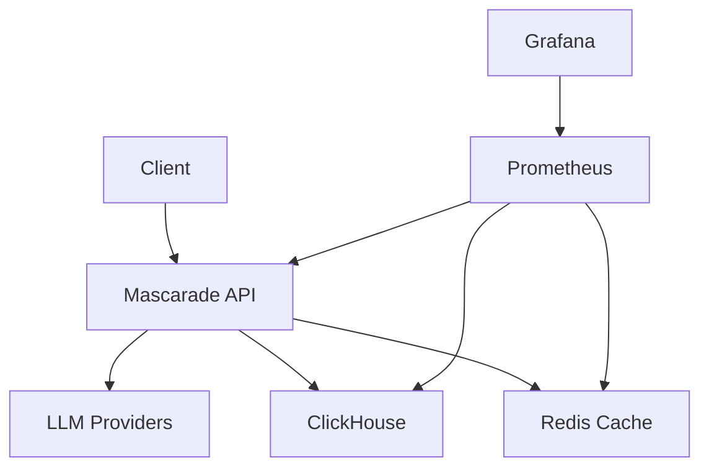

# Kubernetes Deployment for Mascarade

This directory contains Kubernetes manifests for deploying Mascarade with all its components.

## Architecture Overview



## Deployment Guide

### Prerequisites

- Kubernetes 1.20+
- kubectl
- Helm 3.0+
- 16GB+ RAM cluster
- 50GB+ storage

### Namespace Setup

```bash
kubectl create namespace mascarade
```

### Storage Setup

```bash
# Create PVCs for persistent storage
kubectl apply -f storage.yaml
```

### Deploy Components

#### 1. Deploy Redis

```bash
kubectl apply -f redis.yaml
```

#### 2. Deploy ClickHouse

```bash
kubectl apply -f clickhouse.yaml
```

#### 3. Deploy Mascarade

```bash
kubectl apply -f deployment.yaml
```

#### 4. Deploy Monitoring (Optional)

```bash
kubectl apply -f monitoring.yaml
```

### Configuration

#### ConfigMap

Create a ConfigMap for environment variables:

```yaml
# configmap.yaml
apiVersion: v1
kind: ConfigMap
metadata:
  name: mascarade-config
  namespace: mascarade
data:
  USE_BERT_CLASSIFIER: "true"
  USE_ML_CLASSIFIER: "true"
  CACHE_ENABLED: "true"
  CACHE_L1_SIZE: "2000"
  CACHE_L2_ENABLED: "true"
  CACHE_L2_HOST: "redis.mascarade.svc.cluster.local"
  CACHE_L2_PORT: "6379"
  AUTOSCALING_ENABLED: "true"
  AUTOSCALING_MIN_WORKERS: "2"
  AUTOSCALING_MAX_WORKERS: "8"
```

#### Secrets

Create a Secrets file for sensitive data:

```yaml
# secrets.yaml
apiVersion: v1
kind: Secret
metadata:
  name: mascarade-secrets
  namespace: mascarade
type: Opaque
data:
  ANTHROPIC_API_KEY: base64-encoded-key
  OPENAI_API_KEY: base64-encoded-key
  # Add other API keys as needed
```

Apply configuration:

```bash
kubectl apply -f configmap.yaml
kubectl apply -f secrets.yaml
```

### Scaling

#### Manual Scaling

```bash
# Scale deployment
kubectl scale deployment mascarade --replicas=5
```

#### Auto-scaling

The HPA is included in `deployment.yaml` with:
- Min replicas: 2
- Max replicas: 10
- CPU target: 75%
- Memory target: 80%

### Monitoring

Access monitoring dashboards:

```bash
# Port forward Grafana
kubectl port-forward svc/grafana 3000:3000 -n mascarade

# Access at http://localhost:3000
# Username: admin
# Password: admin (change after first login)
```

Import the Grafana dashboard from `grafana-dashboard.json`.

### Upgrading

```bash
# Update image
kubectl set image deployment/mascarade mascarade=ghcr.io/mascarade-ai/mascarade:latest

# Rollout restart
kubectl rollout restart deployment/mascarade
```

### Troubleshooting

#### Check Pods

```bash
kubectl get pods -n mascarade
```

#### View Logs

```bash
kubectl logs -f deployment/mascarade -n mascarade
```

#### Describe Resources

```bash
kubectl describe pod <pod-name> -n mascarade
kubectl describe deployment mascarade -n mascarade
```

#### Check Events

```bash
kubectl get events -n mascarade --sort-by='.metadata.creationTimestamp'
```

### Backup and Restore

#### Backup

```bash
# Backup Redis
kubectl exec -n mascarade deployment/redis -- redis-cli save

# Backup ClickHouse
kubectl exec -n mascarade deployment/clickhouse -- clickhouse-client --query "BACKUP DATABASE mascarade TO 'backup/mascarade_$(date +%Y%m%d).sql'"
```

#### Restore

```bash
# Restore Redis
kubectl cp redis_backup.dump mascarade/redis-<pod-id>:/data/dump.rdb
kubectl exec -n mascarade deployment/redis -- redis-cli config set dbfilename dump.rdb
kubectl delete pod -n mascarade -l app=redis

# Restore ClickHouse
kubectl exec -n mascarade deployment/clickhouse -- clickhouse-client --query "RESTORE DATABASE mascarade FROM 'backup/mascarade_20240101.sql'"
```

### Performance Tuning

#### Resource Adjustment

Edit `deployment.yaml` to adjust CPU/memory requests and limits.

#### Cache Optimization

Adjust cache parameters in ConfigMap:

```yaml
data:
  CACHE_L1_SIZE: "3000"  # Increased from 2000
  CACHE_L3_ENABLED: "true"  # Enable semantic cache
```

#### Auto-scaling Tuning

Edit HPA settings in `deployment.yaml`:

```yaml
metrics:
- type: Resource
  resource:
    name: cpu
    target:
      type: Utilization
      averageUtilization: 70  # Changed from 75
```

### Security

#### Network Policies

```yaml
# network-policy.yaml
apiVersion: networking.k8s.io/v1
kind: NetworkPolicy
metadata:
  name: mascarade-network-policy
  namespace: mascarade
spec:
  podSelector:
    matchLabels:
      app: mascarade
  policyTypes:
  - Ingress
  - Egress
  ingress:
  - from:
    - namespaceSelector:
        matchLabels:
          name: mascarade
    ports:
    - protocol: TCP
      port: 8000
  egress:
  - to:
    - namespaceSelector:
        matchLabels:
          name: mascarade
    ports:
    - protocol: TCP
      port: 6379  # Redis
    - protocol: TCP
      port: 8123  # ClickHouse
```

#### Pod Security

```yaml
# Add to deployment spec
securityContext:
  runAsNonRoot: true
  runAsUser: 1000
  fsGroup: 2000
  seccompProfile:
    type: RuntimeDefault
```

### Customization

#### Custom Domains

Add domain-specific configurations:

```yaml
# configmap.yaml addition
data:
  DOMAIN_MODEL_MAPPINGS: "electronics:claude-sonnet,code:gpt-4,cad:mistral-large"
```

#### Custom BERT Model

```yaml
# configmap.yaml addition
data:
  BERT_MODEL_PATH: "/app/models/custom_bert_model"
```

## Resource Requirements

| Component | CPU Request | CPU Limit | Memory Request | Memory Limit |
|-----------|-------------|-----------|----------------|---------------|
| Mascarade | 1000m | 2000m | 2Gi | 4Gi |
| Redis | 500m | 1000m | 1Gi | 2Gi |
| ClickHouse | 1000m | 2000m | 2Gi | 4Gi |
| Prometheus | 500m | 1000m | 1Gi | 2Gi |
| Grafana | 200m | 500m | 500Mi | 1Gi |

## Monitoring Metrics

Key metrics exposed by Mascarade:

- `mascarade_requests_total`: Total requests
- `mascarade_request_duration_seconds`: Request latency
- `mascarade_cache_hit_rate`: Cache efficiency
- `mascarade_autoscaler_workers`: Current worker count
- `mascarade_autoscaler_events_total`: Scaling events
- `mascarade_bert_classifier_latency_seconds`: BERT latency

## Scaling Guidelines

### Vertical Scaling

Adjust resource requests/limits based on:
- CPU usage > 80% for extended periods
- Memory usage > 90%
- Request latency > 200ms

### Horizontal Scaling

HPA will automatically scale based on:
- CPU utilization (target 75%)
- Memory utilization (target 80%)
- Custom metrics (can be added)

## Best Practices

1. **Monitor regularly**: Set up alerts for key metrics
2. **Start conservative**: Begin with lower resource limits and increase as needed
3. **Test changes**: Apply configuration changes in staging first
4. **Backup before upgrades**: Always backup data before major version upgrades
5. **Use namespaces**: Isolate Mascarade in its own namespace
6. **Resource quotas**: Set namespace-level resource quotas
7. **Pod disruption budgets**: Configure for high availability

## Troubleshooting Checklist

- [ ] Check pod status and logs
- [ ] Verify ConfigMap and Secrets are applied
- [ ] Test Redis and ClickHouse connectivity
- [ ] Check resource usage vs limits
- [ ] Verify network policies
- [ ] Test with minimal configuration
- [ ] Check storage capacity and permissions

## Support

For Kubernetes-specific issues:
- Check Kubernetes documentation
- Review Mascarade GitHub issues
- Contact support@mascarade.ai for production issues