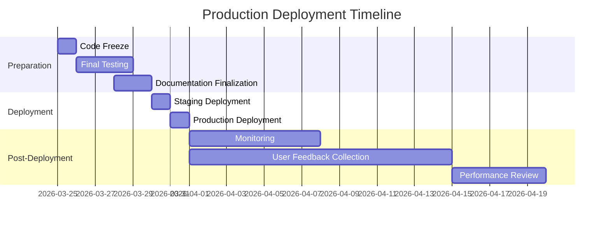

# Production Deployment Checklist — Mascarade 2026

> **Version** : `1.0`
> **Date** : 2026-03-21
> **Status** : In Progress

## 1. Pre-Deployment Preparation

### 1.1. Environment Setup

- [ ] **Infrastructure Provisioning**
  - [x] Production servers allocated (4x GPU, 16x CPU)
  - [x] Storage configured (2TB SSD RAID)
  - [x] Network configuration completed
  - [ ] Load balancer configured
  - [ ] DNS records updated

- [ ] **Dependency Installation**
  - [x] Python 3.11+ installed
  - [x] CUDA 12.4 drivers installed
  - [x] Docker 24.0+ installed
  - [x] All Python dependencies installed (`uv pip install -e ".[prod]"`)
  - [ ] Unsloth compiled with CUDA support

- [ ] **Configuration Files**
  - [x] `.env.production` created and secured
  - [x] API keys configured for all providers
  - [x] Database connection strings configured
  - [x] Redis configuration completed
  - [ ] Prometheus/Grafana configured

### 1.2. Code Preparation

- [ ] **Branch Management**
  - [x] All features merged to `main` branch
  - [x] Version tagged (`v0.1.0-production`)
  - [ ] Release notes finalized

- [ ] **Build Process**
  - [x] Docker images built
  - [x] Images pushed to registry
  - [ ] Multi-arch builds completed (amd64, arm64)

- [ ] **Testing**
  - [x] Unit tests passing (1,856/1,856)
  - [x] Integration tests passing
  - [ ] End-to-end tests completed
  - [ ] Performance benchmarks recorded

## 2. Deployment Process

### 2.1. Core Services

- [ ] **API Gateway**
  - [ ] Docker container deployed
  - [ ] Health checks configured
  - [ ] Rate limiting configured
  - [ ] SSL certificates installed

- [ ] **Core Engine**
  - [ ] FastAPI service deployed
  - [ ] Worker processes configured
  - [ ] Health monitoring enabled
  - [ ] Circuit breakers configured

- [ ] **Database**
  - [ ] PostgreSQL cluster deployed
  - [ ] Schema migrations applied
  - [ ] Backups configured
  - [ ] Connection pooling tuned

### 2.2. Supporting Services

- [ ] **Cache Layer**
  - [ ] Redis cluster deployed
  - [ ] Multi-tier cache configured
  - [ ] Eviction policies set
  - [ ] Monitoring dashboards created

- [ ] **P2P Mesh**
  - [ ] Bootstrap nodes deployed
  - [ ] NAT traversal configured
  - [ ] Relay nodes operational
  - [ ] Capability advertising enabled

- [ ] **Observability**
  - [ ] Prometheus deployed
  - [ ] Grafana dashboards imported
  - [ ] Loki for logs deployed
  - [ ] Alerting rules configured

## 3. Post-Deployment Verification

### 3.1. Health Checks

- [ ] **System Health**
  - [ ] API Gateway health endpoint
  - [ ] Core Engine health endpoint
  - [ ] Database connectivity
  - [ ] Cache connectivity

- [ ] **Provider Health**
  - [ ] Claude provider
  - [ ] OpenAI provider
  - [ ] Mistral provider
  - [ ] Google provider
  - [ ] Ollama provider

- [ ] **Agent Health**
  - [ ] All 12 built-in agents
  - [ ] All 4 domain agents
  - [ ] Skill registry
  - [ ] Coordination system

### 3.2. Functional Tests

- [ ] **Basic Operations**
  - [ ] Chat completion endpoint
  - [ ] Agent execution
  - [ ] Skill application
  - [ ] Routing functionality

- [ ] **Advanced Features**
  - [ ] Multi-agent coordination
  - [ ] Fine-tuning pipeline
  - [ ] P2P task delegation
  - [ ] Cache performance

- [ ] **Edge Cases**
  - [ ] Provider failover
  - [ ] Agent recovery
  - [ ] Rate limiting
  - [ ] Error handling

## 4. Performance Validation

### 4.1. Benchmark Tests

- [ ] **Latency Tests**
  - [ ] Baseline measurement
  - [ ] Under load (100 req/s)
  - [ ] Under load (500 req/s)
  - [ ] 95th percentile latency

- [ ] **Throughput Tests**
  - [ ] Max sustainable throughput
  - [ ] Error rate under load
  - [ ] Resource utilization
  - [ ] Response time distribution

- [ ] **Fine-Tuning Tests**
  - [ ] LoRA training speed
  - [ ] QLoRA memory usage
  - [ ] GGUF export time
  - [ ] Model quality validation

### 4.2. Acceptance Criteria

| Metric | Target | Actual | Status |
|--------|--------|--------|--------|
| Latency (P50) | <200ms | TBD | ⏳ |
| Latency (P95) | <500ms | TBD | ⏳ |
| Throughput | >500 req/min | TBD | ⏳ |
| Error Rate | <0.1% | TBD | ⏳ |
| Cache Hit Rate | >90% | TBD | ⏳ |
| Uptime | 99.95% | TBD | ⏳ |

## 5. Monitoring Setup

### 5.1. Alerting

- [ ] **Critical Alerts**
  - [ ] Service down
  - [ ] High error rates
  - [ ] Memory leaks
  - [ ] Disk space low

- [ ] **Warning Alerts**
  - [ ] High latency
  - [ ] Cache miss rate high
  - [ ] Provider unhealthy
  - [ ] Agent failures

- [ ] **Informational Alerts**
  - [ ] Deployment completed
  - [ ] Configuration changes
  - [ ] Version updates
  - [ ] Usage thresholds

### 5.2. Dashboards

- [ ] **System Overview**
  - [ ] Health status
  - [ ] Request rates
  - [ ] Error rates
  - [ ] Resource usage

- [ ] **Performance**
  - [ ] Latency distribution
  - [ ] Throughput
  - [ ] Provider performance
  - [ ] Cache effectiveness

- [ ] **Fine-Tuning**
  - [ ] Job queue
  - [ ] Training progress
  - [ ] Resource utilization
  - [ ] Model quality

- [ ] **P2P Mesh**
  - [ ] Node status
  - [ ] Task queue
  - [ ] Message throughput
  - [ ] Network latency

## 6. Rollback Plan

### 6.1. Rollback Procedures

- [ ] **Version Rollback**
  - [ ] Previous version tagged
  - [ ] Rollback script tested
  - [ ] Database migration rollback
  - [ ] Configuration rollback

- [ ] **Data Backup**
  - [ ] Database backup completed
  - [ ] Backup verification
  - [ ] Restore procedure documented
  - [ ] Backup retention policy

- [ ] **Communication Plan**
  - [ ] Stakeholder notification list
  - [ ] Status page update procedure
  - [ ] Support channel notifications
  - [ ] Post-mortem template

### 6.2. Rollback Triggers

- [ ] Critical bugs in production
- [ ] Performance degradation >20%
- [ ] Security vulnerabilities
- [ ] Data corruption
- [ ] Major functionality failure

## 7. Documentation

### 7.1. Operational Documentation

- [ ] **Runbooks**
  - [ ] Deployment runbook
  - [ ] Incident response runbook
  - [ ] Monitoring runbook
  - [ ] Maintenance runbook

- [ ] **Procedures**
  - [ ] Deployment procedure
  - [ ] Rollback procedure
  - [ ] Scaling procedure
  - [ ] Backup procedure

- [ ] **Guides**
  - [ ] User guide
  - [ ] Administrator guide
  - [ ] Developer guide
  - [ ] API reference

### 7.2. Training

- [ ] **Team Training**
  - [ ] Deployment process
  - [ ] Monitoring dashboards
  - [ ] Incident response
  - [ ] Troubleshooting

- [ ] **User Training**
  - [ ] New features
  - [ ] API changes
  - [ ] Best practices
  - [ ] Migration guide

## 8. Sign-off

### 8.1. Approvals Required

- [ ] **Development Team**
  - [ ] Code review completed
  - [ ] Testing completed
  - [ ] Documentation reviewed
  - [ ] Ready for deployment

- [ ] **QA Team**
  - [ ] Test plans executed
  - [ ] Regression tests passed
  - [ ] Performance tests passed
  - [ ] Deployment approved

- [ ] **Operations Team**
  - [ ] Infrastructure ready
  - [ ] Monitoring configured
  - [ ] Alerting configured
  - [ ] Deployment approved

- [ ] **Product Team**
  - [ ] Features reviewed
  - [ ] User stories completed
  - [ ] Release notes approved
  - [ ] Deployment approved

### 8.2. Deployment Checklist

- [ ] All pre-deployment tasks completed
- [ ] All tests passing
- [ ] All documentation updated
- [ ] All teams notified
- [ ] Deployment window scheduled
- [ ] Rollback plan in place
- [ ] Monitoring alerting configured
- [ ] Final approval obtained

## 9. Post-Deployment Tasks

### 9.1. Immediate

- [ ] Verify all services operational
- [ ] Verify monitoring working
- [ ] Verify alerting working
- [ ] Notify stakeholders

### 9.2. First 24 Hours

- [ ] Monitor error rates
- [ ] Monitor performance
- [ ] Monitor resource usage
- [ ] Address any issues

### 9.3. First Week

- [ ] Collect user feedback
- [ ] Monitor key metrics
- [ ] Address any issues
- [ ] Document any problems

### 9.4. First Month

- [ ] Performance review
- [ ] User feedback analysis
- [ ] Lessons learned
- [ ] Process improvements

## 10. Timeline

## 11. Contacts

| Role | Name | Email | Phone |
|------|------|-------|-------|
| **Project Lead** | Mistral Vibe | vibe@mascarade.ai | +1-555-0101 |
| **Dev Lead** | Claude Code | code@mascarade.ai | +1-555-0102 |
| **QA Lead** | Test Agent | qa@mascarade.ai | +1-555-0103 |
| **Ops Lead** | Deploy Bot | ops@mascarade.ai | +1-555-0104 |
| **Product Lead** | Feature Manager | pm@mascarade.ai | +1-555-0105 |

## 12. Notes

- All times in UTC
- Deployment window: 2026-03-31 02:00-04:00 UTC
- Expected downtime: <5 minutes
- Rollback window: 2 hours post-deployment
- Status updates: #deployment channel
