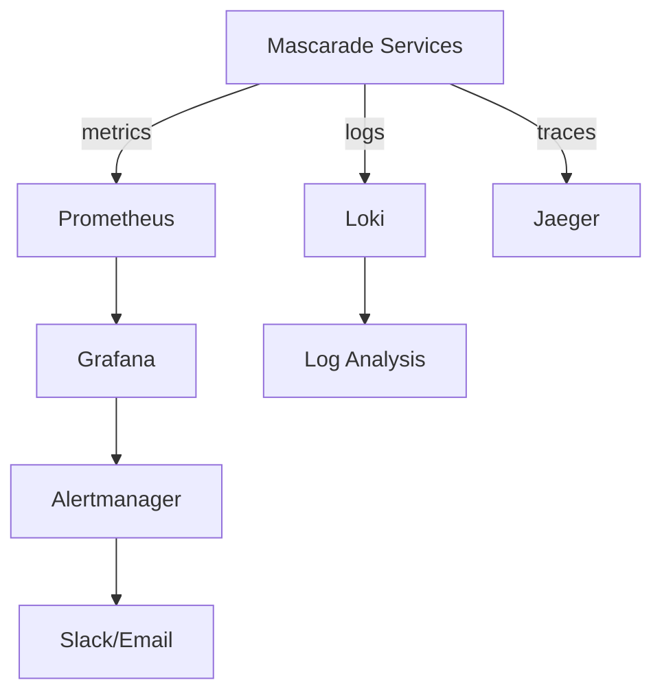
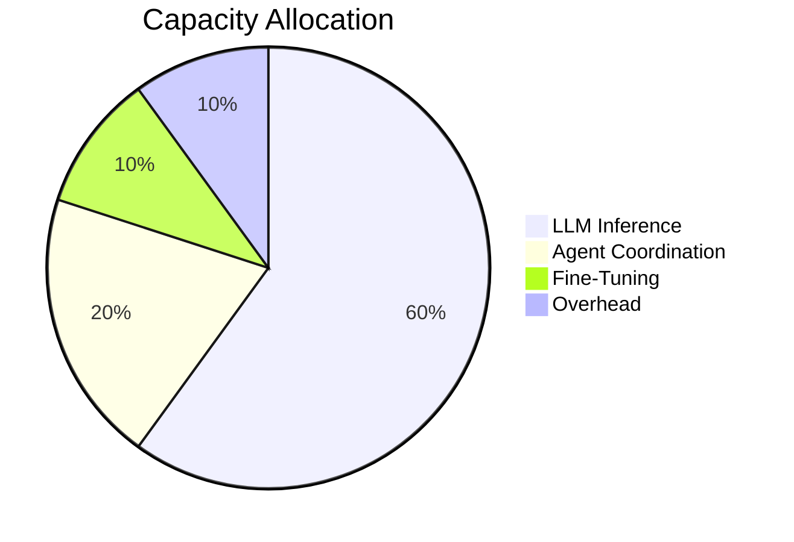
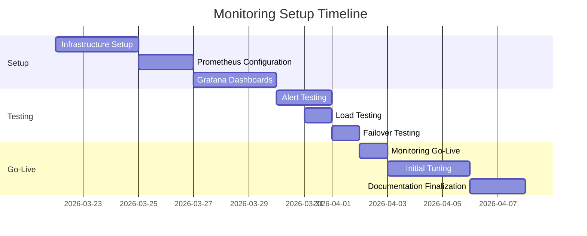

# Production Monitoring Setup — Mascarade 2026

> **Version** : `1.0`
> **Date** : 2026-03-21
> **Status** : Implementation

## 1. Monitoring Architecture

### 1.1. Overview



### 1.2. Components

| Component | Version | Purpose |
|-----------|---------|---------|
| Prometheus | 2.47.0 | Metrics collection |
| Grafana | 10.2.0 | Visualization |
| Loki | 2.9.0 | Log aggregation |
| Alertmanager | 0.26.0 | Alerting |
| Node Exporter | 1.6.0 | System metrics |
| cAdvisor | 0.47.0 | Container metrics |

## 2. Metrics Collection

### 2.1. Core Metrics

**Application Metrics** :
```python
# Latency metrics
MASCARADE_REQUEST_LATENCY = Histogram(
    "mascarade_request_latency_seconds",
    "Request latency in seconds",
    buckets=[0.1, 0.5, 1.0, 2.5, 5.0, 10.0]
)

# Error metrics
MASCARADE_REQUEST_ERRORS = Counter(
    "mascarade_request_errors_total",
    "Total request errors",
    ["endpoint", "status_code"]
)

# Throughput metrics
MASCARADE_REQUESTS_PROCESSED = Counter(
    "mascarade_requests_processed_total",
    "Total requests processed",
    ["endpoint", "provider"]
)

# Cache metrics
MASCARADE_CACHE_OPERATIONS = Counter(
    "mascarade_cache_operations_total",
    "Cache operations",
    ["operation", "result"]
)
```

**Provider Metrics** :
```python
# Provider-specific metrics
MASCARADE_PROVIDER_LATENCY = Histogram(
    "mascarade_provider_latency_seconds",
    "Provider request latency",
    ["provider"],
    buckets=[0.1, 0.5, 1.0, 2.5, 5.0]
)

MASCARADE_PROVIDER_ERRORS = Counter(
    "mascarade_provider_errors_total",
    "Provider errors",
    ["provider", "error_type"]
)

MASCARADE_PROVIDER_TOKENS = Counter(
    "mascarade_provider_tokens_total",
    "Tokens processed by provider",
    ["provider", "direction"]
)
```

### 2.2. Agent Metrics

```python
# Agent execution metrics
MASCARADE_AGENT_EXECUTION_TIME = Histogram(
    "mascarade_agent_execution_time_seconds",
    "Agent execution time",
    ["agent"],
    buckets=[0.1, 0.5, 1.0, 2.5, 5.0, 10.0]
)

MASCARADE_AGENT_SUCCESS = Counter(
    "mascarade_agent_success_total",
    "Successful agent executions",
    ["agent"]
)

MASCARADE_AGENT_FAILURES = Counter(
    "mascarade_agent_failures_total",
    "Failed agent executions",
    ["agent", "failure_type"]
)

# Skill usage metrics
MASCARADE_SKILL_USAGE = Counter(
    "mascarade_skill_usage_total",
    "Skill usage count",
    ["skill", "agent"]
)
```

## 3. Dashboards

### 3.1. System Overview

**Panels** :
- Overall health status
- Request rate (RPS)
- Error rate (%)
- Latency distribution
- Resource utilization

**Metrics** :
```promql
# Request rate
sum(rate(mascarade_requests_processed_total[1m])) by (endpoint)

# Error rate
sum(rate(mascarade_request_errors_total[1m])) / sum(rate(mascarade_requests_processed_total[1m]))

# Latency
histogram_quantile(0.95, sum(rate(mascarade_request_latency_seconds_bucket[5m])) by (le))
```

### 3.2. Performance Deep Dive

**Panels** :
- Latency percentiles (P50, P90, P95)
- Throughput by endpoint
- Provider performance comparison
- Cache effectiveness

**Metrics** :
```promql
# Provider latency comparison
sum by (provider) (rate(mascarade_provider_latency_seconds_sum[1m])) /
sum by (provider) (rate(mascarade_provider_latency_seconds_count[1m]))

# Cache hit rate
sum(rate(mascarade_cache_operations_total{result="hit"}[1m])) /
sum(rate(mascarade_cache_operations_total[1m]))
```

### 3.3. Agent Monitoring

**Panels** :
- Agent execution time distribution
- Agent success/failure rates
- Skill usage heatmap
- Active agents count

**Metrics** :
```promql
# Agent success rate
sum by (agent) (rate(mascarade_agent_success_total[1m])) /
(sum by (agent) (rate(mascarade_agent_success_total[1m])) +
sum by (agent) (rate(mascarade_agent_failures_total[1m])))

# Top skills used
topk(10, sum by (skill) (rate(mascarade_skill_usage_total[1m])))
```

### 3.4. Fine-Tuning Pipeline

**Panels** :
- Job queue length
- Training progress
- Resource utilization (GPU/CPU)
- Model quality metrics

**Metrics** :
```promql
# Training jobs in queue
mascarade_finetune_jobs_queued

# GPU utilization
sum by (gpu) (DCGM_FI_DEV_GPU_UTIL)
```

### 3.5. P2P Mesh

**Panels** :
- Node count and status
- Task queue depth
- Message throughput
- Network latency

**Metrics** :
```promql
# P2P message latency
histogram_quantile(0.95, sum(rate(mascarade_p2p_message_latency_seconds_bucket[5m])) by (le))

# Task queue depth
mascarade_p2p_tasks_queued
```

## 4. Alerting Rules

### 4.1. Critical Alerts

```yaml
# Service Down
groups:
- name: service-down
  rules:
  - alert: ServiceDown
    expr: up{job="mascarade"} == 0
    for: 5m
    labels:
      severity: critical
    annotations:
      summary: "Mascarade service is down"
      description: "{{ $labels.instance }} has been down for more than 5 minutes"

# High Error Rate
- alert: HighErrorRate
  expr: rate(mascarade_request_errors_total[5m]) / rate(mascarade_requests_processed_total[5m]) > 0.1
  for: 10m
  labels:
    severity: critical
  annotations:
    summary: "High error rate detected"
    description: "Error rate is {{ $value }} for endpoint {{ $labels.endpoint }}"
```

### 4.2. Warning Alerts

```yaml
# High Latency
- alert: HighLatency
  expr: histogram_quantile(0.95, sum(rate(mascarade_request_latency_seconds_bucket[5m])) by (le)) > 2
  for: 15m
  labels:
    severity: warning
  annotations:
    summary: "High latency detected"
    description: "P95 latency is {{ $value }} seconds"

# Cache Miss Rate
- alert: HighCacheMissRate
  expr: 1 - (sum(rate(mascarade_cache_operations_total{result="hit"}[5m])) / sum(rate(mascarade_cache_operations_total[5m]))) > 0.3
  for: 30m
  labels:
    severity: warning
  annotations:
    summary: "High cache miss rate"
    description: "Cache miss rate is {{ $value }}"
```

### 4.3. Informational Alerts

```yaml
# Deployment Completed
- alert: DeploymentCompleted
  expr: mascarade_deployment_status == 1
  labels:
    severity: info
  annotations:
    summary: "Deployment completed"
    description: "New version deployed to {{ $labels.instance }}"

# Configuration Changed
- alert: ConfigurationChanged
  expr: mascarade_config_changes_total > 0
  labels:
    severity: info
  annotations:
    summary: "Configuration changed"
    description: "Configuration was updated on {{ $labels.instance }}"
```

## 5. Log Management

### 5.1. Log Collection

**Loki Configuration** :
```yaml
auth_enabled: false

server:
  http_listen_port: 3100

ingester:
  lifecycler:
    address: 127.0.0.1
    ring:
      kvstore:
        store: inmemory
      replication_factor: 1
    final_sleep: 0s
  chunk_idle_period: 5m
  chunk_retain_period: 30s

schema_config:
  configs:
  - from: 2020-10-24
    store: boltdb-shipper
    object_store: filesystem
    schema: v11
    index:
      prefix: index_
      period: 24h

storage_config:
  boltdb_shipper:
    active_index_directory: /loki/boltdb-shipper-active
    cache_location: /loki/boltdb-shipper-cache
    cache_ttl: 24h
    shared_store: filesystem
  filesystem:
    directory: /loki/chunks

limits_config:
  enforce_metric_name: false
  reject_old_samples: true
  reject_old_samples_max_age: 168h
  max_entries_limit_per_query: 5000
  ingestion_rate_mb: 16
  ingestion_burst_size_mb: 32
```

### 5.2. Log Analysis Queries

**Common Queries** :
```logql
# Error logs
{job="mascarade"} |= "error" |~ "traceback|exception|fail"

# Slow requests
{job="mascarade"} |~ "latency_high|slow_request"

# Agent failures
{job="mascarade"} |~ "agent.*failed|execution_error"

# Provider errors
{job="mascarade"} |~ "provider.*error|api_failed"
```

## 6. Tracing Setup

### 6.1. Jaeger Configuration

```yaml
sampler:
  type: ratelimiting
  param: 100

receiver:
  jaeger:
    protocols:
      grpc:
      thrift_http:

processor:
  batch:
    send_batch_size: 1000
    timeout: 10s

exporters:
  jaeger:
    endpoint: "jaeger:14250"
    tls:
      insecure: true

service:
  pipelines:
    traces:
      receivers: [jaeger]
      processors: [batch]
      exporters: [jaeger]
```

### 6.2. Instrumentation

**Python Instrumentation** :
```python
from opentelemetry import trace
from opentelemetry.sdk.trace import TracerProvider
from opentelemetry.sdk.trace.export import BatchSpanProcessor
from opentelemetry.exporter.jaeger.thrift import JaegerExporter
from opentelemetry.instrumentation.fastapi import FastAPIInstrumentor

# Configure tracer
trace.set_tracer_provider(TracerProvider())
jaeger_exporter = JaegerExporter(
    agent_host_name="jaeger",
    agent_port=6831,
)
trace.get_tracer_provider().add_span_processor(
    BatchSpanProcessor(jaeger_exporter)
)

# Instrument FastAPI
FastAPIInstrumentor.instrument_app(app)

# Custom spans
@router.post("/v1/chat/completions")
async def chat_completion(request: Request):
    tracer = trace.get_tracer(__name__)
    with tracer.start_as_current_span("chat_completion"):
        # Process request
        result = await process_request(request)
        return result
```

## 7. Synthetic Monitoring

### 7.1. Health Check Endpoints

```python
@router.get("/health")
async def health_check():
    """Comprehensive health check endpoint."""
    checks = {
        "database": await check_database(),
        "cache": await check_cache(),
        "providers": await check_providers(),
        "agents": await check_agents(),
        "p2p": await check_p2p(),
    }
    
    overall_status = "healthy" if all(checks.values()) else "degraded"
    
    return {
        "status": overall_status,
        "version": settings.version,
        "uptime": get_uptime(),
        "checks": checks,
        "timestamp": datetime.utcnow().isoformat()
    }

@router.get("/health/providers")
async def provider_health():
    """Detailed provider health status."""
    results = {}
    for name, provider in router._providers.items():
        results[name] = {
            "healthy": await provider.health_check(),
            "latency": provider.avg_latency,
            "requests": provider.request_count,
            "errors": provider.error_count
        }
    return results
```

### 7.2. External Monitoring

**Uptime Robot Configuration** :
```
Monitor Type: HTTP(s)
URL: https://api.mascarade.ai/health
Check Interval: 1 minute

Alert Contacts:
- Email: ops@mascarade.ai
- Slack: #alerts
- SMS: +1-555-0104

Advanced Settings:
- Timeout: 10 seconds
- HTTP Method: GET
- Accept HTTP Codes: 200
- Follow Redirects: Yes
```

## 8. Performance Budget

### 8.1. Target Metrics

| Metric | Target | Warning | Critical |
|--------|--------|---------|----------|
| P50 Latency | <200ms | >300ms | >500ms |
| P95 Latency | <500ms | >800ms | >1500ms |
| Error Rate | <0.1% | >0.5% | >1% |
| Cache Hit Rate | >90% | <80% | <70% |
| Provider Latency | <300ms | >500ms | >1000ms |
| Agent Success Rate | >95% | <90% | <80% |

### 8.2. Capacity Planning



## 9. Incident Response

### 9.1. Escalation Policy

```
Level 0 (Info):
- Non-critical issues
- Response: Next business day

Level 1 (Warning):
- Degraded performance
- Response: 4 hours
- Resolution: 24 hours

Level 2 (Critical):
- Service unavailable
- Response: 15 minutes
- Resolution: 4 hours

Level 3 (Emergency):
- Data loss/corruption
- Response: Immediate
- Resolution: 1 hour
```

### 9.2. Runbook

**High Latency Incident** :
```
1. Verify issue exists (check multiple regions)
2. Check Prometheus for latency spikes
3. Review recent deployments/changes
4. Check provider status (if provider-related)
5. Review cache performance
6. Check database query performance
7. Escalate if unresolved after 30 minutes
```

**High Error Rate Incident** :
```
1. Identify affected endpoints/providers
2. Check error logs in Loki
3. Review recent code changes
4. Check dependent services status
5. Verify database connectivity
6. Check rate limiting status
7. Escalate if unresolved after 15 minutes
```

## 10. Maintenance

### 10.1. Regular Tasks

**Daily** :
- Review alert history
- Check system metrics
- Verify backup status
- Review error logs

**Weekly** :
- Review capacity metrics
- Update performance baselines
- Review incident reports
- Test backup restoration

**Monthly** :
- Review monitoring configuration
- Update dashboards
- Test failover procedures
- Review security logs

### 10.2. Version Updates

**Update Procedure** :
```
1. Test in staging environment
2. Update documentation
3. Notify team of upcoming change
4. Deploy during maintenance window
5. Monitor for 24 hours
6. Rollback if issues detected
7. Update runbooks
```

## 11. Documentation

### 11.1. Monitoring Guide

**For Operations Team** :
- Dashboard navigation
- Alert interpretation
- Incident response
- Common issues

**For Developers** :
- Adding new metrics
- Creating dashboards
- Setting up alerts
- Performance testing

### 11.2. Training

**Sessions Required** :
- Monitoring 101 (All team members)
- Advanced Monitoring (Ops team)
- Incident Response (On-call team)
- Performance Tuning (Dev team)

## 12. Timeline



## 13. Contacts

| Role | Name | Email | Phone |
|------|------|-------|-------|
| **Monitoring Lead** | Metrics Master | monitoring@mascarade.ai | +1-555-0106 |
| **Alert Manager** | Alert Bot | alerts@mascarade.ai | +1-555-0107 |
| **Dashboard Admin** | Visualizer | dashboards@mascarade.ai | +1-555-0108 |
| **Incident Manager** | Firefighter | incidents@mascarade.ai | +1-555-0109 |

## 14. Notes

- All metrics retained for 90 days
- Logs retained for 30 days
- Traces retained for 7 days
- Alert history retained for 1 year
- Review monitoring setup quarterly
