# Architecture Avancée des Agents — Mascarade

> **Version** : `1.0`
> **Date** : 2026-03-21
> **Auteur** : Mistral Vibe

## 1. Modèle de Base des Agents

### 1.1. Hiérarchie des Classes

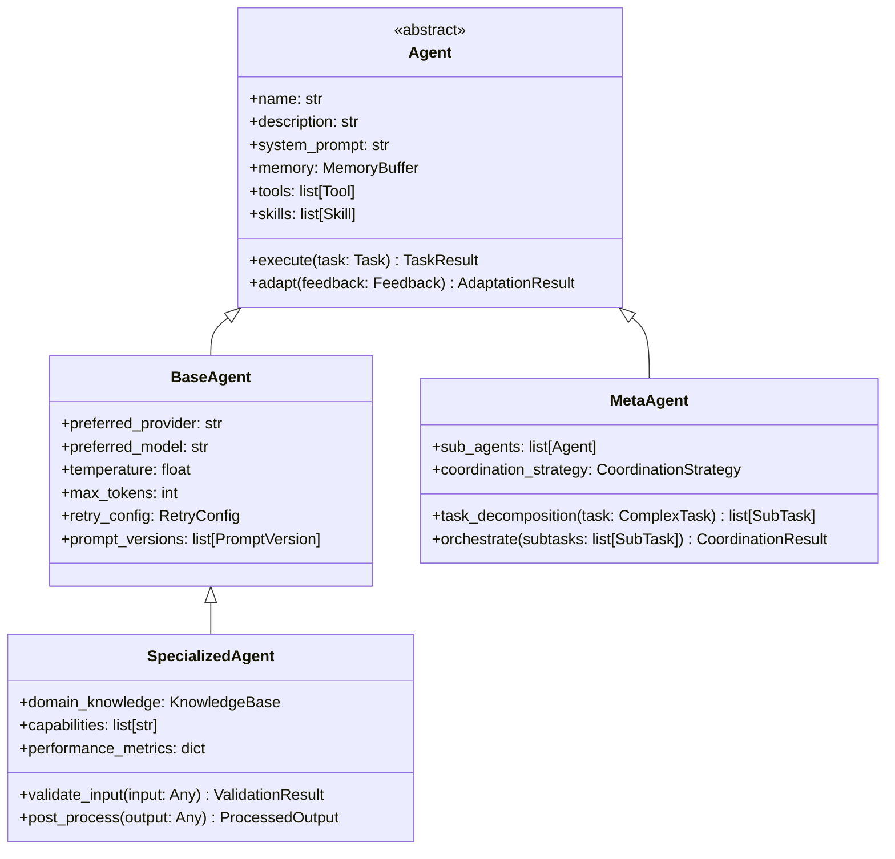

### 1.2. Cycle de Vie d'un Agent

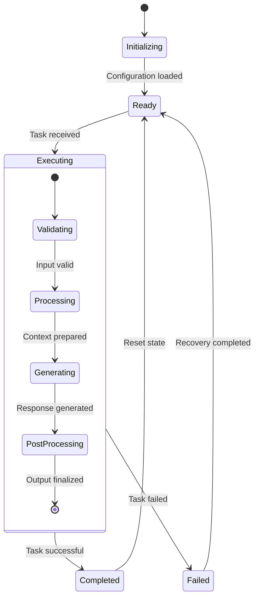

## 2. Système de Compétences Composables

### 2.1. Architecture des Skills

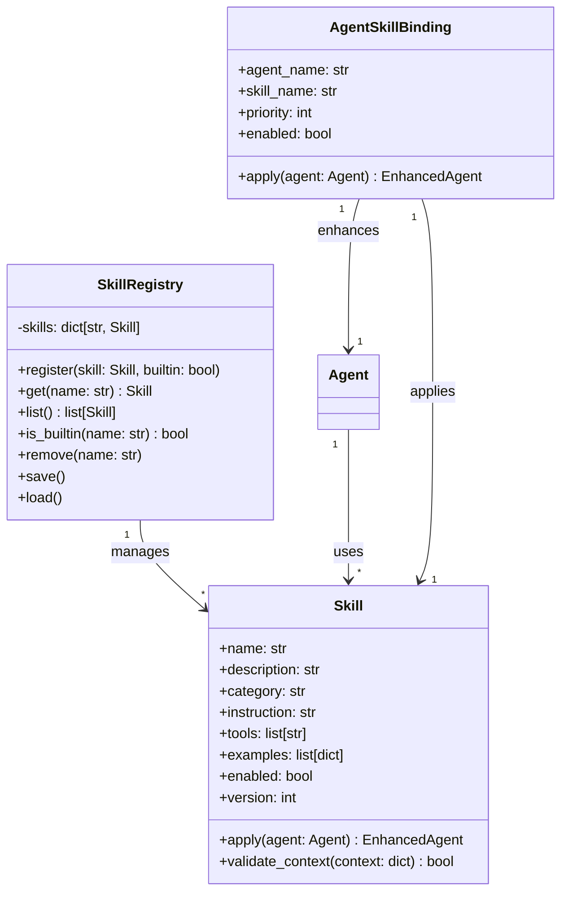

### 2.2. Catégories de Compétences

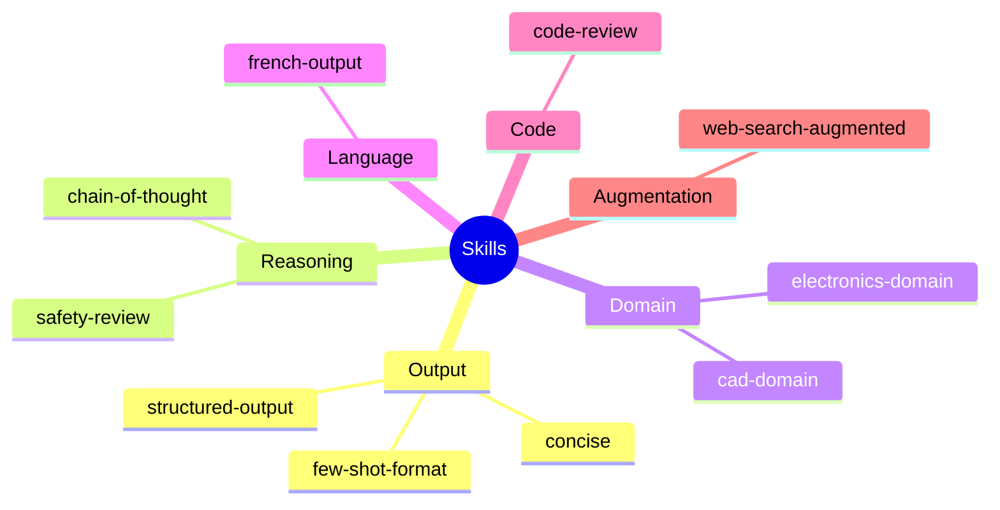

## 3. Mécanisme d'Exécution

### 3.1. Pipeline d'Exécution

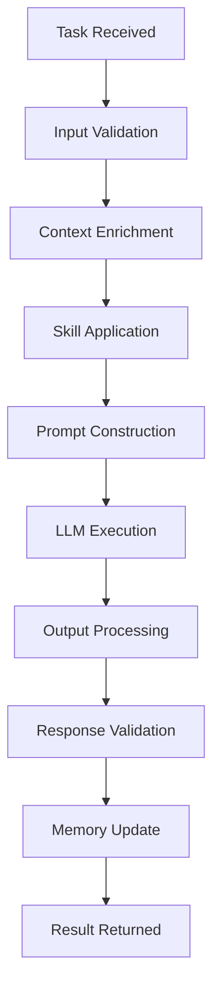

### 3.2. Gestion des Erreurs

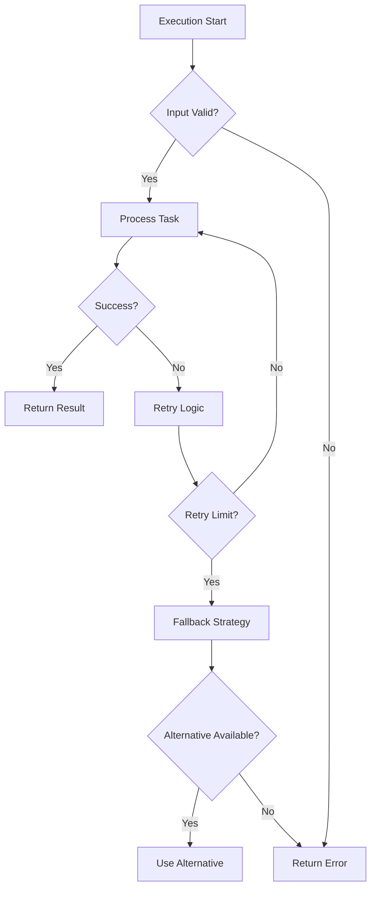

## 4. Système de Mémoire et Contexte

### 4.1. Architecture de la Mémoire

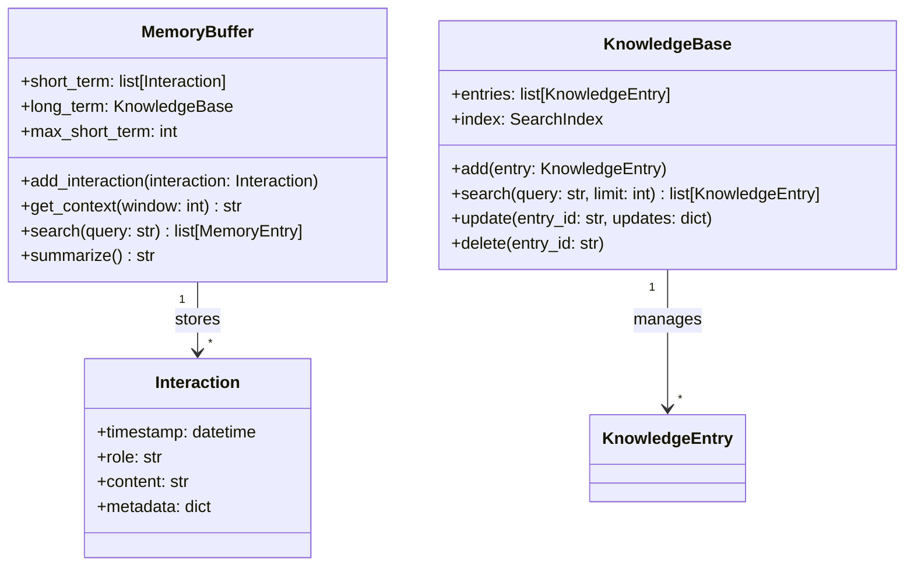

### 4.2. Stratégies de Gestion du Contexte

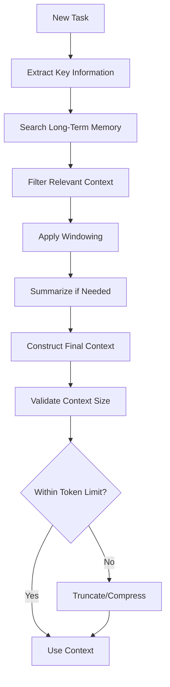

## 5. Coordination Multi-Agents

### 5.1. Patterns de Coordination

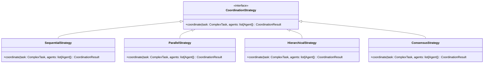

### 5.2. Décomposition de Tâches

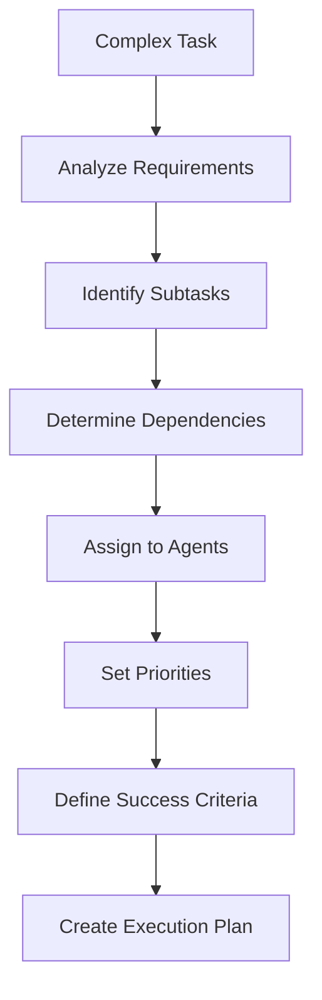

## 6. Optimisations de Performance

### 6.1. Stratégies de Caching

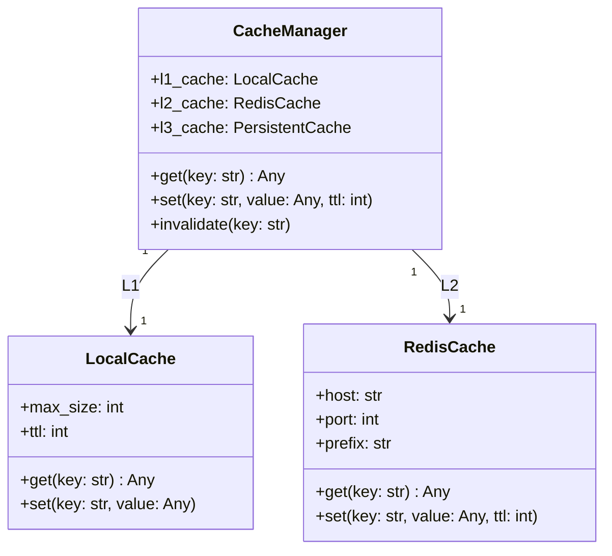

### 6.2. Optimisation des Requêtes

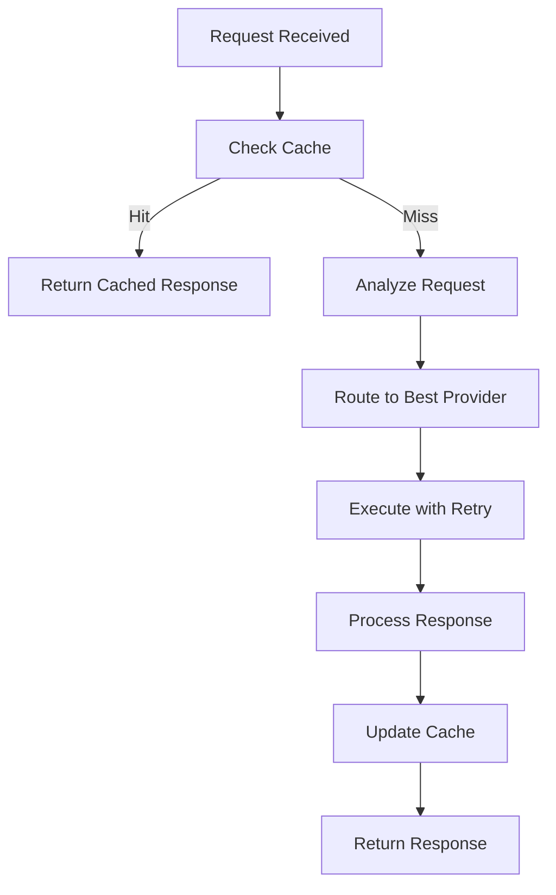

## 7. Sécurité et Validation

### 7.1. Pipeline de Sécurité

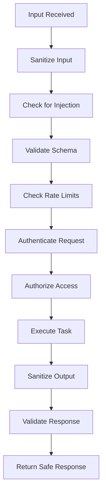

### 7.2. Détection des Anomalies

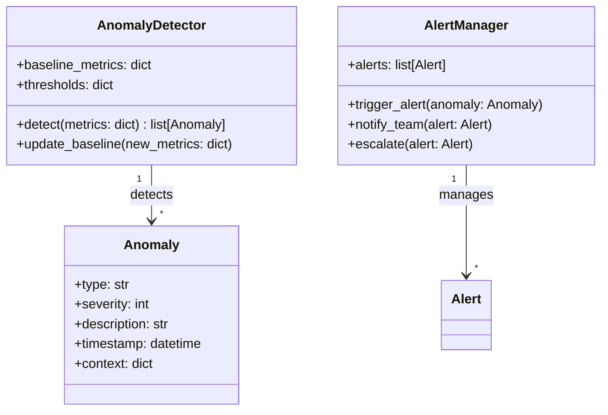

## 8. Métriques et Monitoring

### 8.1. Métriques Clés

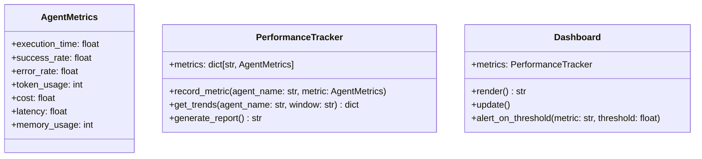

### 8.2. Tableau de Bord

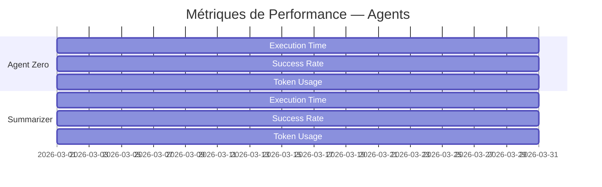

## 9. Conclusion

Cette architecture avancée des agents fournit un cadre robuste et extensible pour le système d'orchestration multi-agents de Mascarade. Les principaux avantages incluent :

1. **Modularité** : Séparation claire entre les agents de base et les agents spécialisés
2. **Extensibilité** : Système de compétences composables pour une adaptation facile
3. **Fiabilité** : Mécanismes de gestion des erreurs et de reprise robustes
4. **Performance** : Optimisations de caching et de routage intelligentes
5. **Observabilité** : Métriques complètes et monitoring en temps réel

**Prochaines étapes** :
1. Implémenter les classes de base selon cette architecture
2. Développer le système de coordination multi-agents
3. Intégrer les optimisations de performance
4. Mettre en place le système de monitoring complet
