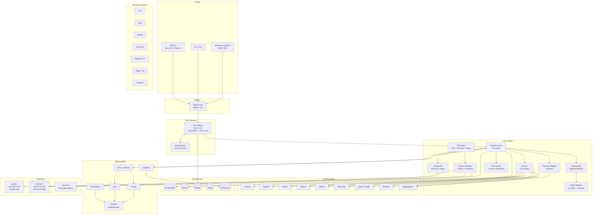
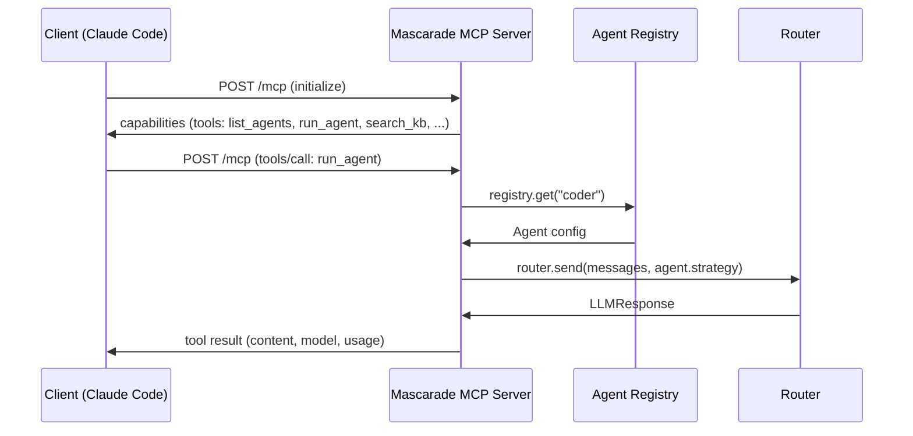
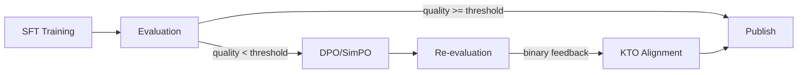

# Mascarade — Analyse Exhaustive & Plan d'Intégration IA

> Date : 2026-03-21 | Auteur : Claude Opus 4.6 + Clems

---

## 1. SWOT — Forces / Faiblesses / Opportunités / Menaces

### Forces
- **Architecture multi-couche mature** : Core Python (FastAPI) + API Node.js (Hono) + Web React 19
- **11 providers LLM** dont local (Ollama, llama.cpp, CoreML, MLX)
- **P2P mesh complet** : DHT, PubSub, Relay, Tasks, Stream Forwarding (13 modules)
- **Pipeline finetune 8 phases** : research → train → DPO → publish
- **Observabilité enterprise** : Grafana + Prometheus + Loki + Tempo + OTEL + Langfuse + ClickHouse
- **MCP client** pour 7+ serveurs industriels
- **Node Engine** : exécution DAG avec type system riche
- **Distributed Scheduler** avec scoring multi-critères (affinité, charge, VRAM, latence)
- **30+ services Docker** orchestrés avec health checks

### Faiblesses
- **Tests insuffisants** : ~20% couverture estimée, 0 tests web
- **Sécurité réseau** : pas de mTLS, réseau bridge unique, docker.sock monté
- **Concurrence non protégée** : registres mutables sans locks
- **Duplication** : 2 systèmes de skills (v1/v2), router/scheduler découplés
- **Chemins hardcodés** et URLs en dur dans plusieurs modules
- **Pas de mode MCP serveur** (mascarade ne s'expose pas comme outil)
- **Pas de pagination** dans les API de listing

### Opportunités
- **MCP serveur** : exposer les agents comme outils MCP pour Claude Code, Cursor, etc.
- **A2A protocol** : interopérabilité avec l'écosystème agent (Google ADK, OpenAI Agents)
- **OpenLLMetry** : auto-instrumentation de tous les appels LLM (1 ligne)
- **SimPO / KTO / RLVR** : méthodes d'alignement modernes pour le finetune
- **Exo** : sharding de modèles 70B+ sur le cluster hétérogène
- **LiteLLM** : accès instantané à 100+ modèles via proxy

### Menaces
- **Frameworks concurrents** : LangGraph, CrewAI, Agno convergent vers les mêmes features
- **Drift technique** : 213 commits non pushés accumulés = risque de divergence
- **Complexité croissante** : 30+ services sans Kubernetes = opérations manuelles
- **Ollama cassé** sur macOS Tahoe = gap dans l'inférence locale

---

## 2. Architecture — Diagramme Mermaid



---

## 3. Feature Map — Modules × Maturité

| Module | Maturité | Tests | Sécurité | Documentation | Priorité |
|--------|----------|-------|----------|---------------|----------|
| **Router (11 providers)** | 🟢 Production | 🟡 Partiel | 🟢 OK | 🟡 Partiel | - |
| **Agent Registry** | 🟢 Production | 🟡 Partiel | 🟢 OK | 🟢 OK | - |
| **P2P Mesh (13 modules)** | 🟡 Beta | 🟡 Partiel | 🟡 Signatures opt. | 🔴 Faible | P1 |
| **Finetune Pipeline** | 🟡 Beta | 🟡 Partiel | 🟢 OK | 🟡 Partiel | P2 |
| **Node Engine** | 🟠 Alpha | 🔴 Faible | 🟡 Pas de type check | 🔴 Faible | P1 |
| **Scheduler** | 🟠 Alpha | 🔴 Faible | 🟢 OK | 🔴 Faible | P1 |
| **DB/RBAC** | 🟠 Alpha | 🔴 Faible | 🔴 Hash API keys | 🔴 Faible | P0 |
| **MCP Client** | 🟢 Production | 🟡 Partiel | 🟡 Sandbox FreeCAD | 🟡 Partiel | - |
| **API Node.js** | 🟢 Production | 🟢 26 tests | 🟢 RBAC + rate limit | 🟡 Partiel | - |
| **Web React** | 🟢 Production | 🔴 0 tests | 🟡 Pas de CSP app | 🔴 Faible | P2 |
| **Observabilité** | 🟢 Production | - | 🟢 OK | 🟢 8 dashboards | - |
| **MCP Serveur (absent)** | 🔴 Inexistant | - | - | - | P1 |
| **A2A Protocol (absent)** | 🔴 Inexistant | - | - | - | P2 |

---

## 4. Matrice de Priorités — Actions d'Intégration IA

### P0 — Critique (cette semaine)

| # | Action | Effort | Impact | Assigné |
|---|--------|--------|--------|---------|
| 1 | Fix sécurité DB : hasher API keys (argon2), fix SQL injection analytics | 4h | Critique | agent-security |
| 2 | Ajouter asyncio.Lock sur registres mutables | 2h | Critique | agent-concurrency |
| 3 | Ajouter OpenLLMetry (1 ligne init) | 30min | Haut | agent-observability |

### P1 — Haute priorité (cette quinzaine)

| # | Action | Effort | Impact | Assigné |
|---|--------|--------|--------|---------|
| 4 | Exposer agents comme MCP serveur (Streamable HTTP) | 2j | Très haut | agent-mcp |
| 5 | Tests unitaires routers + scheduler + node_engine (cible 60%) | 3j | Haut | agent-testing |
| 6 | Unifier skills v1/v2, clarifier scheduler↔router | 1j | Moyen | agent-architecture |
| 7 | P2P : enforcer signatures par défaut, ajouter mTLS | 1j | Haut | agent-security |
| 8 | Segmentation réseau Docker (frontend/backend/observability) | 4h | Haut | agent-infra |

### P2 — Moyenne priorité (ce mois)

| # | Action | Effort | Impact | Assigné |
|---|--------|--------|--------|---------|
| 9 | Intégrer LiteLLM comme provider optionnel | 4h | Moyen | agent-providers |
| 10 | Ajouter SimPO + KTO au finetune pipeline | 1j | Moyen | agent-finetune |
| 11 | Tests composants web (Vitest + RTL) | 2j | Moyen | agent-testing |
| 12 | WebSocket temps réel (remplacer polling) | 2j | Moyen | agent-web |
| 13 | A2A protocol : agent discovery + delegation | 3j | Haut | agent-a2a |
| 14 | Loki TTL + backup strategy | 4h | Haut | agent-infra |

### P3 — Long terme (ce trimestre)

| # | Action | Effort | Impact | Assigné |
|---|--------|--------|--------|---------|
| 15 | Exo integration pour model sharding 70B+ | 1sem | Moyen | agent-p2p |
| 16 | RLVR pipeline (KiCad DRC comme reward vérifiable) | 1sem | Haut | agent-finetune |
| 17 | ML-based routing (RouteLLM / classifier custom) | 1sem | Moyen | agent-router |
| 18 | Migration vers Kubernetes (Helm charts) | 2sem | Moyen | agent-infra |

---

## 5. Specs Techniques — Intégrations Prioritaires

### 5.1 MCP Serveur (P1)



**Fichier cible** : `core/mascarade/mcp/server.py`
**Dépendance** : `mcp>=1.9` (Streamable HTTP)
**Tools exposés** : `list_agents`, `run_agent`, `search_knowledge_base`, `orchestrate`, `list_providers`

### 5.2 OpenLLMetry (P0)

```python
# server.py — ajouter après imports
from openllmetry import init as openllmetry_init
openllmetry_init(exporter="langfuse")
# C'est tout. Auto-instrumente anthropic, openai, mistral, etc.
```

### 5.3 SimPO + KTO (P2)



**Fichier cible** : `core/mascarade/finetune/agents/reinforcer.py`
**Dépendance** : `trl>=0.26.0` (SimPO, KTO support)

---

## 6. Dépendances à Ajouter

```toml
# pyproject.toml — core
[project]
dependencies = [
    # ... existants ...
    "openllmetry-sdk>=0.33",        # P0: Auto-instrumentation LLM
]

[project.optional-dependencies]
mcp-server = [
    "mcp>=1.9",                      # P1: MCP server SDK
]
finetune = [
    "trl>=0.26.0,<1",               # P2: SimPO, KTO, GRPO
    "unsloth>=2026.3",              # Latest optimizations
]
```

---

## 7. Bibliothèques Open-Source Recommandées

| Bibliothèque | Usage | URL |
|--------------|-------|-----|
| **OpenLLMetry** | Auto-instrumentation LLM → OTel | github.com/traceloop/openllmetry |
| **MCP Python SDK** | Serveur MCP Streamable HTTP | pypi.org/project/mcp |
| **LiteLLM** | Proxy 100+ modèles, cost tracking | github.com/BerriAI/litellm |
| **Exo** | Distributed inference P2P | github.com/exo-explore/exo |
| **RouteLLM** | Routing ML-based | github.com/lm-sys/RouteLLM |
| **LLaMA-Factory** | Fine-tuning UI + 100+ models | github.com/hiyouga/LlamaFactory |
| **Zod** (TS) | Validation input API Node.js | github.com/colinhacks/zod |

---

## 8. Métriques de Santé Projet

| Métrique | Valeur | Cible |
|----------|--------|-------|
| LOC Python Core | ~18,500 | - |
| LOC API Node.js | ~21,100 | - |
| LOC Web React | ~13,200 | - |
| Tests Python | ~42 fichiers | 80+ |
| Tests API | 26 fichiers | 40+ |
| Tests Web | 0 | 30+ |
| Couverture estimée | ~20% | 60% |
| Services Docker | 30+ | - |
| Dashboards Grafana | 8 | - |
| Providers LLM | 11 | 13+ (LiteLLM, Exo) |
| Agents built-in | 12 | - |
| Domain agents | 4 | - |
| MCP servers connectés | 7+ | 10+ |
| TODO/FIXME dans le code | 0 | 0 |
