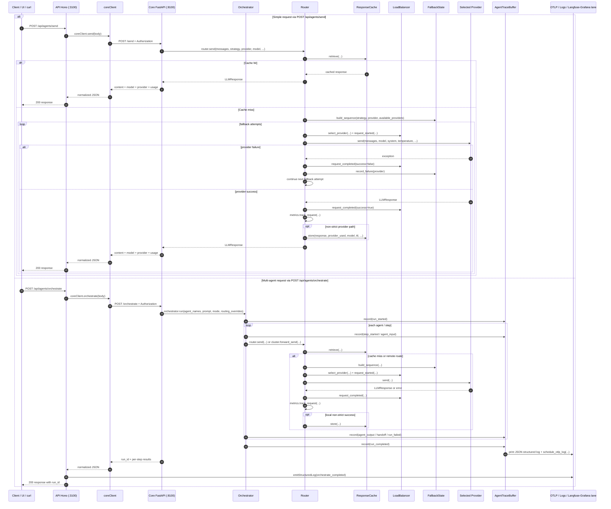
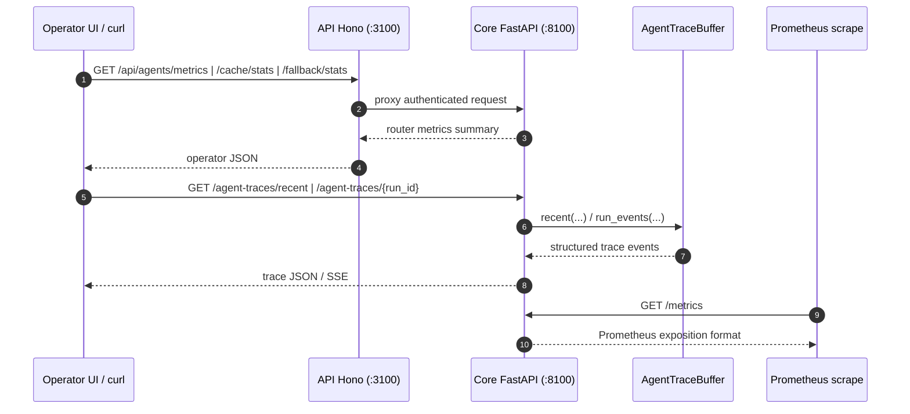

# API -> Core -> Providers -> Observability — Sequence Diagram — 2026-03-11

## Scope

Ce document fixe le chemin d'execution principal entre:

- la facade HTTP `api/` (Hono)
- le core Python `core/mascarade/server.py` (FastAPI)
- le routeur providers `core/mascarade/router/router.py`
- la surface d'observabilite runtime (`agent traces`, OTLP logs, metrics)

References code:

- `api/src/routes/agents.ts`
- `api/src/client/core.ts`
- `core/mascarade/server.py`
- `core/mascarade/router/router.py`
- `core/mascarade/orchestrator/engine.py`
- `core/mascarade/observability/agent_trace.py`

## Main runtime sequence

## Observability read paths

## Notes

- `api/` reste une facade: elle valide peu, relaie vers `core`, et ajoute une couche de journalisation operateur.
- `core` porte la logique de routage, de fallback, de cache, de load balancing et la plupart des traces d'execution.
- `AgentTraceBuffer` ne sert pas seulement la consultation `recent/run_id`; il emet aussi des logs structures et planifie un export OTLP.
- `POST /v1/chat/completions` sur le core suit pratiquement la meme branche que `POST /send`, avec une adaptation OpenAI-compatible en entree/sortie.
- les stats `metrics/cache/load-balancer/fallback` sont des vues de controle du routeur, pas une trace causale complete d'un run.
