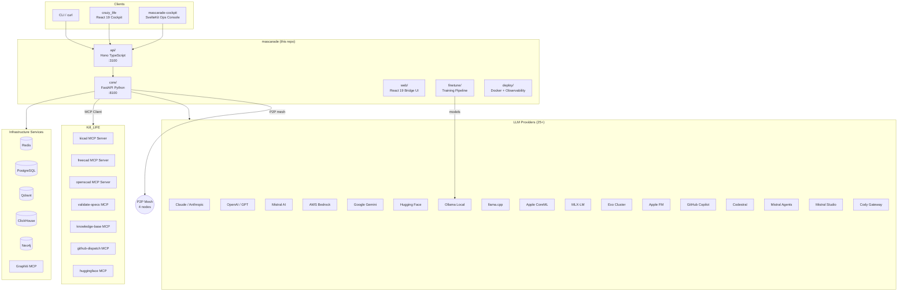
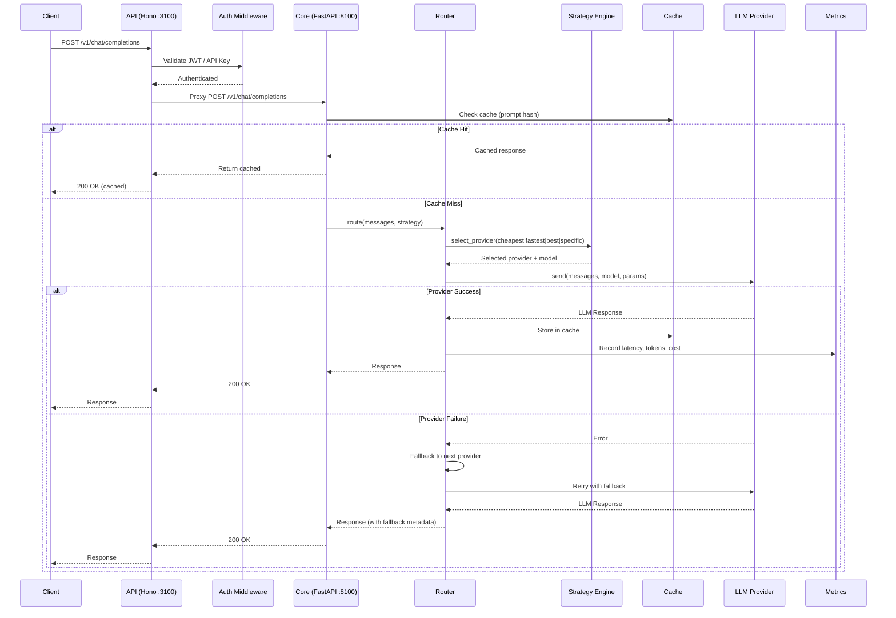
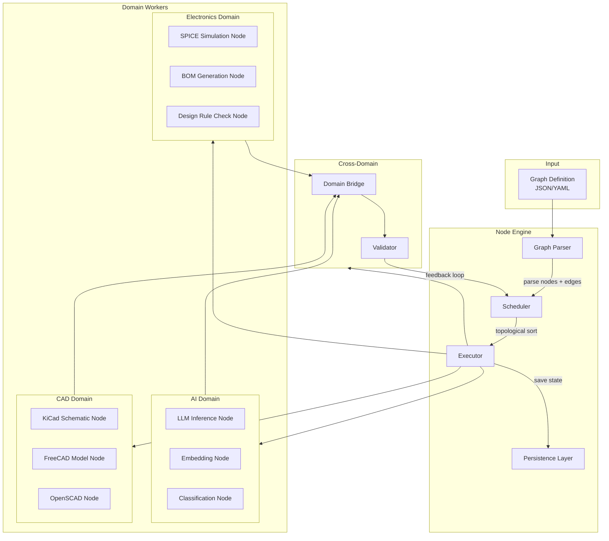
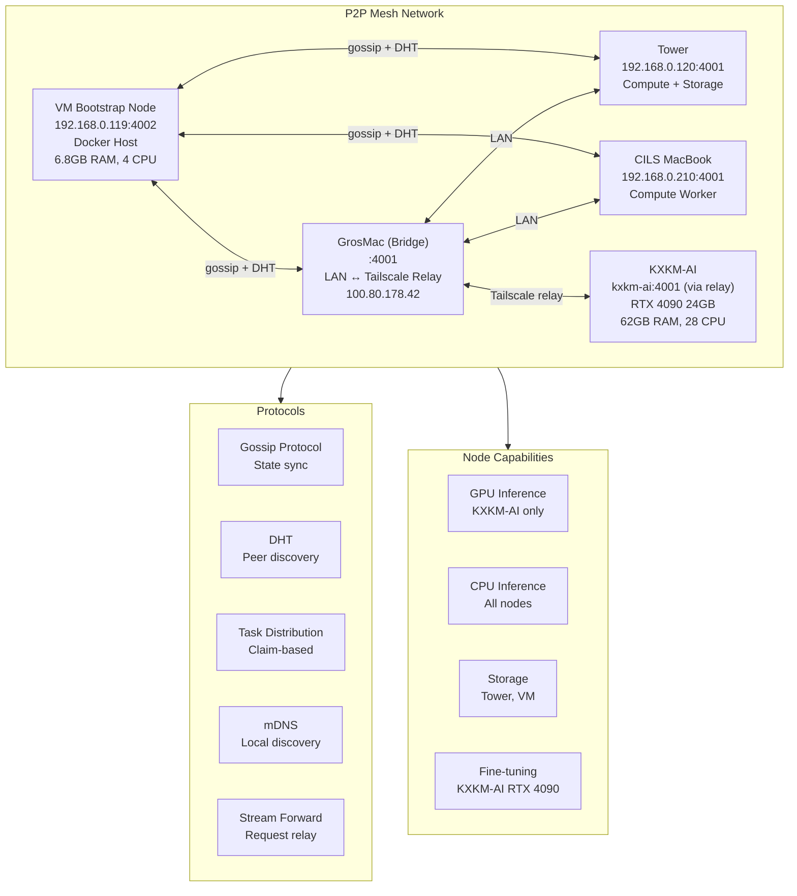
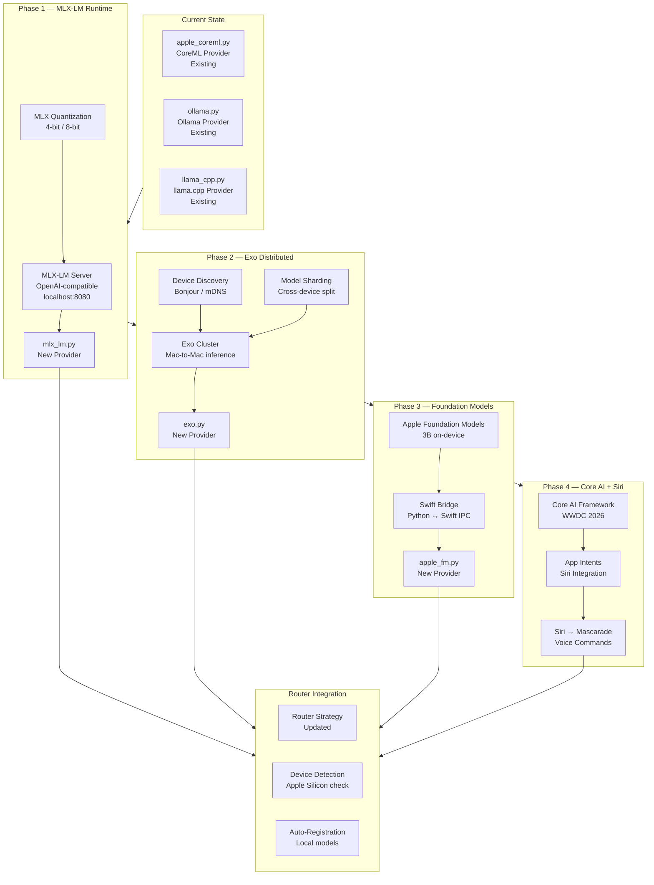
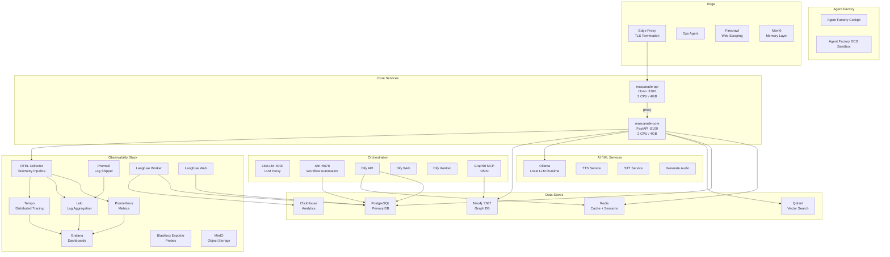

# Mascarade Architecture

> Last updated: 2026-03-25

## 1. System Overview — Ecosystem

Mascarade is a personal agentic LLM orchestration platform spanning three core repositories and two supporting repos.

## 2. Core Architecture — Layers and Modules

```mermaid
graph TB
    subgraph API_Layer["API Layer — TypeScript (Hono, :3100)"]
        AUTH_MW[Auth Middleware<br/>JWT + API Key]
        RATE[Rate Limiter]
        ROUTES[33 Route Modules]
    end

    subgraph Core_Layer["Core Layer — Python (FastAPI, :8100)"]
        subgraph Router_Module["Router"]
            STRATEGY[Strategy Engine<br/>cheapest/fastest/best/specific]
            PROVIDERS[25+ Provider Adapters]
            FALLBACK[Fallback Chain]
            LB[Load Balancer]
        end

        subgraph Agent_Module["Agents"]
            REGISTRY[Agent Registry]
            KICAD_A[KiCad Agent]
            FREECAD_A[FreeCAD Agent]
            SPICE_A[SPICE Agent]
            COMP_A[Components Agent]
            SKILLS[Agent Skills]
            PROMPT_V[Prompt Versioning]
        end

        subgraph Orchestrator_Module["Orchestrator"]
            ENGINE[Orchestration Engine]
            PLAN_EXEC[Plan-and-Execute]
            TEMPLATES[Templates<br/>seq/par/pipeline]
            CB[Circuit Breaker]
            RETRY[Retry Logic]
            DLQ[Dead Letter Queue]
            CTX[Execution Context]
        end

        subgraph RAG_Module["Agentic RAG"]
            RAG_ENGINE[RAG Engine]
            RAG_RETRIEVE[Retriever]
            RAG_RERANK[Reranker]
        end

        subgraph NodeEngine_Module["Node Engine"]
            NE_ENGINE[Engine Core]
            NE_GRAPH[Graph Runtime]
            NE_EXEC[Executor]
            NE_PERSIST[Persistence]
            subgraph Workers["Workers"]
                AI_W[AI Workers]
                CAD_W[CAD Workers]
                ELEC_W[Electronics Workers]
            end
        end

        subgraph P2P_Module["P2P Mesh"]
            LIBP2P[libp2p Node]
            DHT[DHT]
            PUBSUB[PubSub / Gossip]
            RELAY[Relay]
            P2P_AUTH[Auth / Identity]
            P2P_TASKS[Task Distribution]
            DISCOVERY[mDNS Discovery]
        end

        subgraph Support["Support Services"]
            CACHE[Cache Layer]
            MCP_CLIENT[MCP Client]
            METRICS[Metrics / Prometheus]
            OBS[Observability<br/>OTEL + Langfuse]
            RBAC[RBAC / Auth]
            FINETUNE_MOD[Finetune Module]
            ANALYTICS[Analytics]
            USAGE[Usage Tracking]
            CONV[Conversation Store]
        end
    end

    API_Layer --> Core_Layer
    Router_Module --> PROVIDERS
    Agent_Module --> Router_Module
    Orchestrator_Module --> Agent_Module
    NodeEngine_Module --> Orchestrator_Module
    P2P_Module --> Router_Module
```

## 3. Request Flow — Client to Provider

## 4. Node Engine Execution Flow

## 5. P2P Mesh Topology

## 6. Fine-Tuning Pipeline Flow

```mermaid
flowchart LR
    subgraph DataPrep["Phase 1 — Data Preparation"]
        DS_BOOT[dataset_bootstrap.py<br/>13 domains, ~74k examples]
        DS_QUAL[dataset_quality.py<br/>Quality filters]
        DS_REFRESH[dataset_refresh.py<br/>Refresh from sources]
        HF_DS[HuggingFace Datasets<br/>mascarade-datasets repo]

        DS_BOOT --> DS_QUAL --> DS_REFRESH --> HF_DS
    end

    subgraph Training["Phase 2 — Training"]
        DISTILL[distill_dataset.py<br/>Teacher distillation]
        TRAIN[train_local.py<br/>Unsloth + LoRA]
        DPO[train_dpo.py<br/>SimPO alignment]
        BATCH[batch_full_pipeline.sh<br/>End-to-end]

        DISTILL --> TRAIN --> DPO
    end

    subgraph Agents_FT["Fine-Tune Agents"]
        STUDENT[Student Agent<br/>Learns from data]
        TEACHER[Teacher Agent<br/>Generates distillation]
        REINFORCER[Reinforcer Agent<br/>DPO/SimPO]
        ANALYST[Analyst Agent<br/>Benchmarks]
        VALIDATOR[Validator Agent<br/>Quality gates]
        DOCUMENTALIST[Documentalist Agent<br/>Docs & reports]
        ARCHIVIST[Archivist Agent<br/>HF upload]
    end

    subgraph Deploy["Phase 3 — Deployment"]
        PROMOTE[promote_model.py<br/>Quality gate]
        GGUF[GGUF Conversion<br/>F16 → Q4_K_M]
        OLLAMA_D[Ollama Deploy<br/>Modelfile + push]
        P2P_D[P2P Distribution<br/>distribute_task]

        PROMOTE --> GGUF --> OLLAMA_D --> P2P_D
    end

    HF_DS --> DISTILL
    DPO --> PROMOTE
    Agents_FT -.->|orchestrate| Training
    Agents_FT -.->|orchestrate| Deploy

    subgraph Stack["Best Stack"]
        MODEL[Qwen2.5-Coder-1.5B]
        UNSLOTH[Unsloth LoRA]
        SIMPO[SimPO Alignment]
        DATASET[Magicoder-OSS-Instruct-75K]
    end
```

## 7. Apple Intelligence Integration Plan

## 8. Deployment Architecture — Docker Services

## Module Index

| Module | Path | Purpose |
|--------|------|---------|
| Server | `core/mascarade/server.py` | FastAPI application entrypoint |
| Router | `core/mascarade/router/` | LLM provider routing + strategy |
| Providers | `core/mascarade/router/providers/` | 25+ LLM provider adapters |
| Agents | `core/mascarade/agents/` | Specialized agents (KiCad, FreeCAD, SPICE, Components) |
| Orchestrator | `core/mascarade/orchestrator/` | Multi-agent execution engine |
| Plan-and-Execute | `core/mascarade/orchestrator/plan_execute.py` | Plan-and-Execute orchestrator |
| Agentic RAG | `core/mascarade/rag/` | Agentic retrieval-augmented generation |
| Node Engine | `core/mascarade/node_engine/` | Visual graph execution runtime |
| P2P | `core/mascarade/p2p/` | libp2p mesh networking |
| MCP | `core/mascarade/mcp/` | Model Context Protocol client |
| Cache | `core/mascarade/cache/` | Response caching |
| Auth | `core/mascarade/auth.py` | Authentication |
| RBAC | `core/mascarade/rbac.py` | Role-based access control |
| Observability | `core/mascarade/observability/` | OTEL, traces, spans |
| Metrics | `core/mascarade/metrics/` | Prometheus metrics |
| Analytics | `core/mascarade/analytics/` | Usage analytics |
| Finetune | `core/mascarade/finetune/` | Fine-tune orchestration |
| Cluster | `core/mascarade/cluster.py` | Cluster coordination |
| Config | `core/mascarade/config.py` | Central configuration |
| API Routes | `api/src/routes/` | 30 TypeScript route modules |
| Web UI | `web/src/` | React 19 frontend |
| Deploy | `deploy/` | Dockerfiles, observability configs |
| Finetune Pipeline | `finetune/` | Training scripts + datasets |
