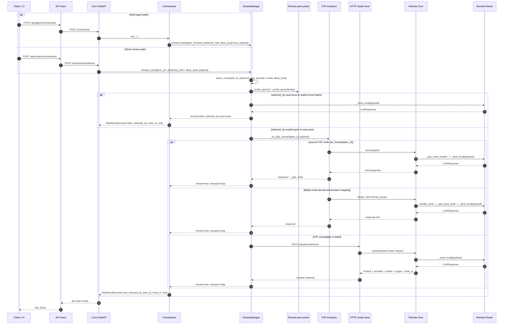

# Cluster / P2P / Remote Send - Sequence Diagram - 2026-03-11

## Scope

Ce document fixe le chemin d'execution du forwarding cluster pour un agent ou un appel direct:

- selection locale vs peer distant
- tentative P2P avant fallback HTTP
- execution distante sur `/cluster/node/send`
- metadata de routage remontee vers l'API operateur

References code:

- `core/mascarade/orchestrator/engine.py`
- `core/mascarade/cluster.py`
- `core/mascarade/server.py`
- `core/mascarade/p2p/asyncio_node.py`
- `core/mascarade/p2p/stream_forward.py`
- `core/mascarade/p2p/libp2p_node.py`

## Remote send sequence

## Route selection notes

- `explicit-peer`: un `peer_id` est fourni, le cluster force ce noeud.
- `auto-local`: le noeud courant satisfait `role/provider/model`.
- `auto-peer`: un peer sain et compatible est choisi par latence.
- `auto-peer-fallback`: un peer sain est choisi meme sans filtre fort si rien d'autre ne matche.

## Transport notes

- Le chemin P2P `asyncio` passe par `P2PStreamForwarder` et ajoute `_p2p_meta` dans la reponse brute.
- Le chemin P2P `libp2p` passe par `P2PNode.forward_send()` et le stream `SEND_PROTOCOL`.
- Si aucun transport P2P operable n'est disponible, le cluster retombe sur `POST /cluster/node/send`.

## Observability notes

- `TaskResult` remonte deja `remote`, `selected_by`, `peer_id`, `node_id` et `role`.
- `ClusterManager.forward_send()` remonte aussi `transport` et `latency_ms`.
- le lot courant remonte aussi `routing_selected_by`, `routing_transport` et `routing_latency_ms` dans `AgentTraceBuffer` pour les evenements `agent_output`.
- les surfaces cockpit `web/src/pages/Logs.tsx` et `web/src/pages/Orchestrate.tsx` les affichent maintenant comme badges `route`, `transport` et `latence` pour raccourcir la lecture operateur.
