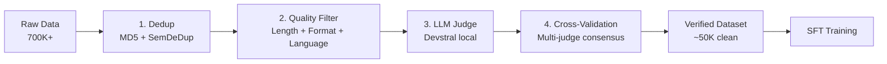

# mascarade Dataset Curation Pipeline — SOTA 2026

## Overview

Pipeline en 5 etapes pour garantir la qualite des datasets de finetune electronics.
Chaque etape filtre les exemples mauvais et ne garde que le contenu verifie.



## Etape 1 — Deduplication (3 niveaux)

### 1a. Exact dedup (MD5 hash)
- Hash des 500 premiers caracteres de chaque exemple
- Supprime les doublons exacts intra et inter-fichiers
- Resultat: ~10K doublons supprimes sur 700K

### 1b. Near-dedup (MinHash + LSH)
```
Parametres recommandes (SOTA BigCode):
- K = 5 (shingle size, 5-grams)
- T = 0.7 (Jaccard similarity threshold)
- P = 128 (permutations)
- B = 16 bands, R = 8 rows
```

### 1c. Semantic dedup (SemDeDup avec bge-m3)
```python
from sentence_transformers import SentenceTransformer
model = SentenceTransformer("BAAI/bge-m3")

# Encode tous les exemples
embeddings = model.encode(texts, batch_size=64)

# Cluster avec FAISS
import faiss
index = faiss.IndexFlatIP(embeddings.shape[1])
index.add(embeddings)

# Pour chaque cluster, garder le meilleur exemple (plus long, plus de code)
# Threshold: cosine similarity > 0.92 = probable duplicat semantique
```

**Pourquoi bge-m3** : multilingual (fr+en), 1024 dims, supporte long context (8192 tokens), SOTA sur MTEB 2025.

## Etape 2 — Filtrage qualite

### Criteres automatiques
| Critere | Seuil | Raison |
|---------|-------|--------|
| Longueur reponse | > 100 chars | Pas de stubs |
| Longueur question | > 20 chars | Pas de questions vides |
| Ratio Q/A | A > 0.2 * Q | Reponse pas trop courte |
| Mots uniques | > 15 | Pas de repetition |
| Langue | en/fr detecte | Pas de chinois/russe random |
| Format JSON | valide | Pas de lignes cassees |

### Patterns de hallucination
```python
HALLUCINATION_PATTERNS = [
    r"IPC-\d{5,}",           # Fake IPC numbers
    r"KiCad\s+(?:11|12|13)", # Future KiCad versions
    r"JLCPCB.*0\.000",       # Impossible precision
]
REFUSAL_PATTERNS = [
    "I'm sorry", "I cannot", "As an AI", "I apologize"
]
```

## Etape 3 — LLM Judge (single model)

Chaque Q&A est evaluee par un modele local (Devstral 24B ou Qwen3-8B) :

```
Prompt: /no_think
Rate this Q&A 1-10:
- Is the answer technically CORRECT?
- Does it match the QUESTION?
- Does it HALLUCINATE?
- Should it say "I don't know" instead?

Score < 5 → SUPPRIME
Score 5-6 → FLAG pour review
Score 7+ → GARDE
```

**Resultats session 2026-03-24** :
- Score moyen: 6.5-6.9/10 selon les datasets
- Taux de rejet: 4-9% (pire: kicad_final 9%, meilleur: analog 4.5%)

## Etape 4 — Multi-Judge Consensus (SOTA 2026)

Au lieu d'un seul juge, on utilise 3 modeles differents et on fait un vote majoritaire :

| Juge | Modele | Force |
|------|--------|-------|
| Juge 1 | Devstral 24B (local) | Code, Verilog, technique |
| Juge 2 | Codestral API | JSON fiable, rapide |
| Juge 3 | Qwen3-8B (local) | Reasoning, multi-langue |

```python
def multi_judge(question, answer):
    scores = [
        judge_devstral(question, answer),
        judge_codestral(question, answer),
        judge_qwen3(question, answer),
    ]
    avg = sum(scores) / len(scores)
    agreement = max(scores) - min(scores)

    if avg >= 7 and agreement <= 3:
        return "KEEP"      # Consensus fort
    elif avg >= 5 and agreement <= 4:
        return "KEEP_WARN"  # Acceptable
    else:
        return "REMOVE"     # Desaccord ou mauvais
```

**Avantage** : reduit le biais d'un seul modele. Si Devstral dit 8 mais Codestral dit 3, on investigue.

## Etape 5 — IFD Scoring (Instruction Following Difficulty)

Mesure la difficulte pour le modele de suivre l'instruction :

```python
def ifd_score(model, tokenizer, instruction, response):
    """
    IFD = log P(response | instruction) / log P(response)

    Si IFD est tres bas (<0.3): l'exemple est trop facile (le modele sait deja)
    Si IFD est tres haut (>0.9): l'exemple est trop dur (bruit)
    Optimal: 0.4-0.8
    """
    # P(response | instruction)
    input_ids = tokenizer(instruction + response, return_tensors="pt")
    loss_cond = model(**input_ids, labels=input_ids["input_ids"]).loss

    # P(response) sans instruction
    response_ids = tokenizer(response, return_tensors="pt")
    loss_uncond = model(**response_ids, labels=response_ids["input_ids"]).loss

    return (loss_cond / loss_uncond).item()
```

**Usage** : apres le multi-judge, on calcule l'IFD pour prioriser les exemples qui apportent le plus au modele.

## Etape 6 — Data Mixing (proportions par domaine)

```python
DOMAIN_WEIGHTS = {
    "spice":       0.20,  # Coeur de metier (SPICE simulation)
    "kicad":       0.15,  # KiCad PCB design
    "verilog":     0.10,  # RTL/FPGA (gros dataset mais domaine different)
    "embedded":    0.12,  # MCU firmware
    "ipc":         0.08,  # Normes/standards
    "emc":         0.08,  # EMC/EMI
    "power":       0.08,  # Power electronics
    "dsp":         0.06,  # Signal processing
    "analog":      0.05,  # Analog design
    "freecad":     0.03,  # 3D/CAD
    "platformio":  0.03,  # Build tools
    "stm32":       0.02,  # STM32 specifique
}
```

## Resultats actuels

| Metrique | Valeur |
|----------|--------|
| Donnees brutes collectees | 700K+ |
| Apres dedup + filtrage | ~61K |
| Apres verification LLM | ~56K (estime, en cours) |
| Score moyen juge | 6.5-6.9/10 |
| Taux de rejet | 4-9% |
| Sources de code reel | 8 repos open-source (8248 exemples) |
| Sources HuggingFace | 15+ datasets telecharges |
| Sources generees (Codestral) | 7 generateurs (IPC, KiCad10, analog, embedded, missing, RF, etc.) |

## Scripts

| Script | Description |
|--------|-------------|
| `scripts/deep-clean-all.py` | Dedup MD5 + hallucination patterns |
| `scripts/verify-all-datasets.py` | LLM judge local (Devstral/Qwen3) |
| `scripts/deep-audit-quality.py` | Cross-dedup + Codestral judge (10 samples/dataset) |
| `scripts/extract-quality-sources.py` | Extraction code reel depuis repos GitHub |
| `scripts/audit-datasets.py` | Format validation + stats |
| `scripts/clean-hallucinations.py` | Pattern-based hallucination removal |
| `scripts/batch-clean-all.py` | Full batch cleanup pipeline |

## Comparaison avec SOTA

| Technique | BigCode (The Stack) | mascarade | Status |
|-----------|-------------------|-----------|--------|
| MD5 exact dedup | ✅ | ✅ | Done |
| MinHash + LSH | ✅ (K=5, T=0.7) | ✅ (MD5 only) | A ameliorer |
| SemDeDup (embeddings) | ❌ | Planifie (bge-m3) | TODO |
| LLM Judge | ❌ | ✅ (Devstral local) | Done |
| Multi-Judge | ❌ | Planifie (3 modeles) | TODO |
| IFD Scoring | ❌ | Planifie | TODO |
| Code quality (linting) | ✅ (pylint/eslint) | ❌ | TODO |
| License filtering | ✅ | Partiel | A completer |
