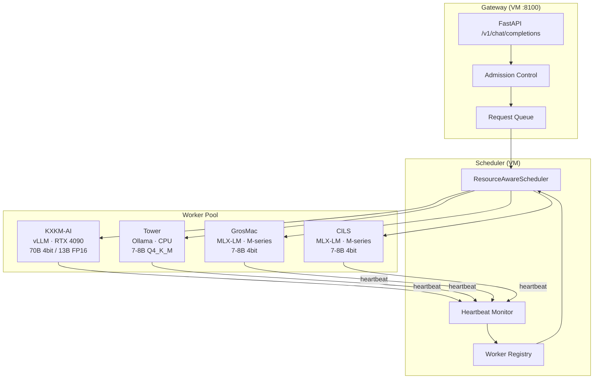

# Architecture de Serving Distribué Multi-Machine — Mascarade

## Architecture cible : **MascaradeGrid**

Gateway → Scheduler → Worker Pool (hétérogène Apple Silicon + NVIDIA)

---

## 1. Inventaire du cluster

| Node | Rôle | CPU | RAM | GPU / VRAM | Runtime | IP |
|------|------|-----|-----|------------|---------|------|
| **KXKM-AI** | Worker GPU | 28 cores | 62 GB | RTX 4090 24 GB | vLLM / Ollama | kxkm-ai (Tailscale) |
| **Tower** | Worker compute+storage | ~8 cores | ~32 GB | — | Ollama / llama.cpp | 192.168.0.120 |
| **GrosMac** | Bridge + Worker | M-series | ~16 GB | Apple GPU (unified) | MLX-LM / Ollama | local / 100.80.178.42 |
| **CILS** | Worker compute | M-series | ~16 GB | Apple GPU (unified) | MLX-LM / Ollama | 192.168.0.210 |
| **VM** | Gateway + Scheduler | 4 cores | 6.8 GB | — | — | 192.168.0.119 |

---

## 2. Architecture en couches



---

## 3. Algorithme de dispatch — `ResourceAwareScheduler`

### Scoring de chaque worker pour une requête donnée

```
score(worker, request) =
    w_vram  × vram_fit(worker, request)        # 0 ou 1 — le modèle tient-il?
  + w_load  × (1 - worker.current_load / worker.max_concurrent)  # charge relative
  + w_speed × (1 / worker.avg_latency_ms)      # rapidité historique
  + w_queue × (1 / (worker.queue_depth + 1))    # profondeur de file
  + w_affinity × model_affinity(worker, request.model)  # modèle déjà chargé?
```

**Poids par défaut :**
| Facteur | Poids | Justification |
|---------|-------|---------------|
| `w_vram` | 100 | Éliminatoire — si le modèle ne tient pas, score = 0 |
| `w_affinity` | 30 | Évite le rechargement de modèle (~10-30s) |
| `w_load` | 20 | Répartition de charge |
| `w_speed` | 15 | Favorise les workers rapides |
| `w_queue` | 10 | Évite les files saturées |

### Pseudo-code

```python
class ResourceAwareScheduler:
    def __init__(self):
        self.workers: dict[str, WorkerState] = {}
        self.pending: asyncio.Queue[ScheduledRequest] = asyncio.Queue(maxsize=1000)

    async def schedule(self, request: InferenceRequest) -> WorkerState:
        candidates = [w for w in self.workers.values() if w.alive and w.accepts(request)]
        if not candidates:
            raise BackpressureError("No worker available")

        scored = [(self._score(w, request), w) for w in candidates]
        scored.sort(key=lambda x: x[0], reverse=True)
        best = scored[0][1]

        best.queue_depth += 1
        best.current_load += 1
        return best

    def _score(self, worker: WorkerState, req: InferenceRequest) -> float:
        if not worker.can_fit_model(req.model):
            return 0.0
        score = 0.0
        score += 30 * (1.0 if req.model in worker.loaded_models else 0.0)
        score += 20 * (1 - worker.current_load / max(worker.max_concurrent, 1))
        score += 15 * (1.0 / max(worker.avg_latency_ms, 1))
        score += 10 * (1.0 / (worker.queue_depth + 1))
        return score
```

---

## 4. Politique de Load Balancing

### Stratégie : **Weighted-Least-Loaded with Affinity**

1. **Filtrage** : Exclure les workers `dead` ou circuit-breaker `open`
2. **Affinity check** : Le modèle demandé est-il déjà chargé? (+30 pts)
3. **Load check** : Score inversement proportionnel à la charge
4. **Tiebreak** : Latence historique P50

### Modes de fonctionnement

| Mode | Quand | Comportement |
|------|-------|-------------|
| **Normal** | queue < 80% | Dispatch au meilleur score |
| **Busy** | queue 80-95% | Prioriser workers libres, ignorer affinity |
| **Saturé** | queue > 95% | Admission control : rejeter les nouvelles requêtes (429) |
| **Dégradé** | < 2 workers alive | Alerte + fallback providers cloud |

---

## 5. Politique mémoire

### Par type de node

| Node | Stratégie | Détails |
|------|-----------|---------|
| **KXKM-AI (24 GB VRAM)** | Multi-model VRAM | 2-3 modèles Q4 simultanés, swap LRU si besoin |
| **GrosMac / CILS (unified)** | Single-model MLX | 1 modèle 4bit en mémoire unifiée, swap = kill + reload |
| **Tower (CPU)** | RAM-mapped GGUF | mmap() le fichier GGUF, OS gère le paging |
| **VM (no GPU)** | Proxy only | Pas de modèle local, forwarding uniquement |

### Règles

- **VRAM budget** : Ne jamais dépasser 90% VRAM (laisser ~2.4 GB pour CUDA context sur KXKM)
- **Model eviction** : LRU — le modèle le moins récemment utilisé est déchargé
- **Preloading** : Les modèles fréquents (top 3) sont pré-chargés au démarrage
- **Zero-copy** : Sur Apple Silicon, unified memory = pas de copie CPU↔GPU
- **KV-cache** : Limiter à 80% de la mémoire restante après chargement modèle

---

## 6. Stratégie réseau

```
                    ┌──────────────────┐
                    │    VM Gateway    │
                    │  192.168.0.119   │
                    └───────┬──────────┘
                            │ LAN 1Gbps
            ┌───────────────┼───────────────┐
            │               │               │
    ┌───────▼──────┐ ┌──────▼──────┐ ┌──────▼──────┐
    │    Tower     │ │    CILS     │ │   GrosMac   │
    │ .0.120       │ │ .0.210      │ │  (bridge)   │
    └──────────────┘ └─────────────┘ └──────┬──────┘
                                            │ Tailscale
                                     ┌──────▼──────┐
                                     │   KXKM-AI   │
                                     │  (remote)   │
                                     └─────────────┘
```

### Protocoles

| Communication | Protocole | Port | Latence typique |
|---------------|-----------|------|-----------------|
| Gateway → Worker (LAN) | HTTP/2 | 8201 | < 1ms |
| Gateway → KXKM (Tailscale) | HTTP/2 via WireGuard | 8201 | 5-20ms |
| Heartbeat | UDP broadcast (LAN) + HTTP GET (Tailscale) | 8202 | < 1ms / 10ms |
| Streaming | SSE over HTTP/2 | 8201 | Continu |
| Model sync | rsync over SSH | 22 | Batch |

### Optimisations

- **Connexion pool** : httpx.AsyncClient persistant par worker (keep-alive)
- **Streaming proxy** : Gateway forward SSE chunks sans buffering
- **Batch grouping** : Grouper les requêtes vers le même worker/modèle dans un batch HTTP
- **Timeout hierarchy** : Connect 5s → Stream first-byte 30s → Stream total 300s

---

## 7. Stratégie de reprise sur panne

### Détection

```python
class HeartbeatMonitor:
    HEARTBEAT_INTERVAL = 5     # secondes
    DEAD_THRESHOLD = 3         # heartbeats manqués = dead
    SLOW_THRESHOLD_MS = 5000   # latence heartbeat > 5s = slow

    async def check_worker(self, worker: WorkerState):
        try:
            t0 = time.monotonic()
            resp = await self.client.get(f"{worker.url}/health", timeout=3)
            latency = (time.monotonic() - t0) * 1000

            if latency > self.SLOW_THRESHOLD_MS:
                worker.status = "slow"
            else:
                worker.status = "alive"
                worker.missed_heartbeats = 0
                worker.update_resources(resp.json())  # VRAM libre, CPU%, etc.

        except Exception:
            worker.missed_heartbeats += 1
            if worker.missed_heartbeats >= self.DEAD_THRESHOLD:
                worker.status = "dead"
                self._drain_worker(worker)
```

### Reprise

| Événement | Action |
|-----------|--------|
| Worker `dead` | Redistribuer sa queue, marquer circuit-breaker `open` |
| Worker `slow` | Réduire `max_concurrent` de 50%, pas de nouvelles requêtes lourdes |
| Worker revient `alive` | Warm-up progressif (1 req → 2 → 4 → max en 60s) |
| Tous workers down | Fallback providers cloud (Claude, OpenAI) via router existant |
| Requête timeout | Retry sur un autre worker (max 1 retry), sinon 504 |
| Model load fail | Marquer modèle `unavailable` sur ce worker, essayer un autre |

### Circuit Breaker par worker

```
Closed ──[3 failures]──▶ Open ──[30s]──▶ Half-Open ──[1 success]──▶ Closed
                                            │
                                         [1 failure]
                                            │
                                            ▼
                                          Open
```

---

## 8. Batching dynamique

### Stratégie

Sur KXKM-AI (vLLM, seul node avec vrai batching GPU) :

```python
class DynamicBatcher:
    MAX_BATCH_SIZE = 8       # requêtes
    MAX_WAIT_MS = 50         # latence max d'attente pour former un batch
    MAX_TOTAL_TOKENS = 4096  # tokens max par batch (limité par VRAM)

    async def collect_batch(self) -> list[InferenceRequest]:
        batch = []
        deadline = time.monotonic() + self.MAX_WAIT_MS / 1000

        while len(batch) < self.MAX_BATCH_SIZE and time.monotonic() < deadline:
            try:
                req = await asyncio.wait_for(
                    self.queue.get(),
                    timeout=max(0, deadline - time.monotonic())
                )
                if self._fits_budget(batch, req):
                    batch.append(req)
                else:
                    await self.queue.put(req)  # requeue
                    break
            except asyncio.TimeoutError:
                break

        return batch
```

Sur les Macs (MLX-LM, Ollama) : **Pas de batching** — traitement séquentiel, 1 requête à la fois (mémoire unifiée limitée).

---

## 9. Admission Control & Backpressure

```python
class AdmissionController:
    MAX_QUEUE_DEPTH = 200
    MAX_WAIT_TIME_S = 30

    async def admit(self, request: InferenceRequest) -> bool:
        # 1. Queue pleine → 429
        if self.scheduler.total_queue_depth >= self.MAX_QUEUE_DEPTH:
            raise HTTPException(429, "System overloaded, retry later")

        # 2. Aucun worker capable → 503
        capable = self.scheduler.workers_for_model(request.model)
        if not capable:
            raise HTTPException(503, f"No worker available for model {request.model}")

        # 3. Estimation du temps d'attente
        est_wait = self.scheduler.estimate_wait(request)
        if est_wait > self.MAX_WAIT_TIME_S:
            raise HTTPException(429, f"Estimated wait {est_wait:.0f}s exceeds limit")

        # 4. Token budget check (évite OOM)
        if request.max_tokens > self._max_available_tokens():
            request.max_tokens = self._max_available_tokens()

        return True
```

---

## 10. Observabilité distribuée

### Métriques Prometheus (par worker)

```yaml
# Worker-level
mascarade_worker_gpu_utilization{node="kxkm-ai"}          # 0-100%
mascarade_worker_vram_used_bytes{node="kxkm-ai"}           # bytes
mascarade_worker_vram_total_bytes{node="kxkm-ai"}          # bytes
mascarade_worker_cpu_percent{node="tower"}                  # 0-100%
mascarade_worker_ram_used_bytes{node="tower"}               # bytes
mascarade_worker_queue_depth{node="grosmac"}                # int
mascarade_worker_active_requests{node="cils"}               # int
mascarade_worker_loaded_models{node="kxkm-ai",model="..."}  # gauge

# Scheduler-level
mascarade_scheduler_total_queue_depth                       # int
mascarade_scheduler_requests_total{status="ok|error|timeout"} # counter
mascarade_scheduler_dispatch_latency_ms                     # histogram
mascarade_scheduler_worker_score{node="..."}                # gauge

# Request-level
mascarade_request_ttfb_ms{model="...",node="..."}          # histogram (time to first byte)
mascarade_request_total_ms{model="...",node="..."}          # histogram
mascarade_request_tokens_generated{model="..."}             # counter
mascarade_request_batch_size{node="kxkm-ai"}               # histogram
```

### Alertes

| Condition | Seuil | Action |
|-----------|-------|--------|
| VRAM usage > 90% | 5 min sustained | Évict LRU model |
| Queue depth > 150 | Immédiat | Backpressure mode |
| Worker dead | 3 heartbeats | Redistribute + alert |
| P99 latency > 30s | 5 min window | Scale down batch size |
| Error rate > 10% | 1 min window | Circuit breaker open |

---

## 11. Optimisations classées par ROI

| # | Optimisation | Impact | Effort | ROI |
|---|-------------|--------|--------|-----|
| 1 | **Model affinity routing** | Évite reload 10-30s | Faible | **Très élevé** |
| 2 | **Persistent HTTP connections** | -50% overhead réseau | Faible | **Très élevé** |
| 3 | **SSE streaming passthrough** | TTFB immédiat | Faible | **Élevé** |
| 4 | **Heartbeat-based worker health** | Détection panne < 15s | Moyen | **Élevé** |
| 5 | **VRAM-aware scheduling** | Évite OOM crashes | Moyen | **Élevé** |
| 6 | **Dynamic batching (KXKM)** | +2-4x throughput GPU | Moyen | **Élevé** |
| 7 | **KV-cache reuse** | -30% compute sur context long | Élevé | **Moyen** |
| 8 | **Speculative decoding (MLX)** | +30-50% tok/s sur Macs | Moyen | **Moyen** |
| 9 | **Tensor parallelism (Exo)** | Permet 70B sur 2+ Macs | Élevé | **Moyen** |
| 10 | **Quantization auto-select** | Adapte Q4/Q8/FP16 au budget VRAM | Moyen | **Moyen** |

---

## 12. Trois propositions d'implémentation

### Proposition Simple (1-2 jours)

Modifier le `LoadBalancer` existant pour ajouter le worker scoring + heartbeat.

```
Gateway (VM) → HTTP round-robin → Workers (Ollama/MLX-LM sur chaque node)
                                   Chaque worker expose /health avec métriques
                                   Gateway poll /health toutes les 5s
                                   Routing = least-loaded + model affinity
```

**Fichiers à modifier :**
- `load_balancer/balancer.py` → ajouter `WorkerState`, scoring, heartbeat
- `cluster.py` → worker registration via mDNS
- `config.py` → `CLUSTER_WORKERS` env var

### Proposition Intermédiaire (1-2 semaines)

Architecture complète avec scheduler dédié, admission control, batching.

```
Gateway → AdmissionController → ResourceAwareScheduler → Worker Pool
                                         ↑
                                   HeartbeatMonitor
                                   (VRAM/CPU/RAM metrics)
```

**Nouveaux modules :**
- `core/mascarade/scheduler/` — scheduler, batcher, admission control
- `core/mascarade/worker/` — worker agent (tourne sur chaque node)
- `deploy/worker-agent/` — Dockerfile worker léger

### Proposition Avancée (1-2 mois)

Full MascaradeGrid avec Exo pour tensor parallelism, vLLM pour batching GPU, auto-scaling.

```
Gateway → Scheduler → Exo Cluster (Macs, tensor parallel 70B)
                    → vLLM (KXKM-AI, continuous batching)
                    → Ollama (Tower, CPU fallback)
                    + Auto model placement
                    + Predictive scaling
                    + Distributed KV-cache
```

---

## 13. Plan d'implémentation (Proposition Intermédiaire)

### Phase 1 — Worker Health (2h)
- [ ] `WorkerState` dataclass (url, status, vram_free, cpu_pct, loaded_models, queue_depth)
- [ ] `HeartbeatMonitor` — poll /health sur chaque worker toutes les 5s
- [ ] Worker registration via config (`CLUSTER_WORKERS=kxkm-ai:8201,tower:8201,...`)

### Phase 2 — ResourceAwareScheduler (4h)
- [ ] Scoring function (affinity + load + speed + queue)
- [ ] Integration avec le Router existant (`_select_provider` → scheduler-aware)
- [ ] Admission control (queue depth, model availability)

### Phase 3 — Worker Agent (4h)
- [ ] Script léger (`scripts/worker_agent.py`) qui tourne sur chaque node
- [ ] Expose `/health` avec : VRAM libre, CPU%, RAM%, loaded models, queue depth
- [ ] Auto-detect runtime (MLX-LM, Ollama, vLLM)
- [ ] Forward `/v1/chat/completions` au runtime local

### Phase 4 — Streaming & Batching (4h)
- [ ] SSE passthrough sans buffering dans le gateway
- [ ] Dynamic batching sur KXKM (vLLM continuous batching)
- [ ] Request coalescing pour même modèle

### Phase 5 — Observabilité (2h)
- [ ] Prometheus metrics par worker
- [ ] Grafana dashboard "MascaradeGrid"
- [ ] Alertes VRAM/queue/dead worker

### Phase 6 — Résilience (2h)
- [ ] Circuit breaker par worker
- [ ] Retry sur worker alternatif
- [ ] Fallback providers cloud
- [ ] Warm-up progressif
