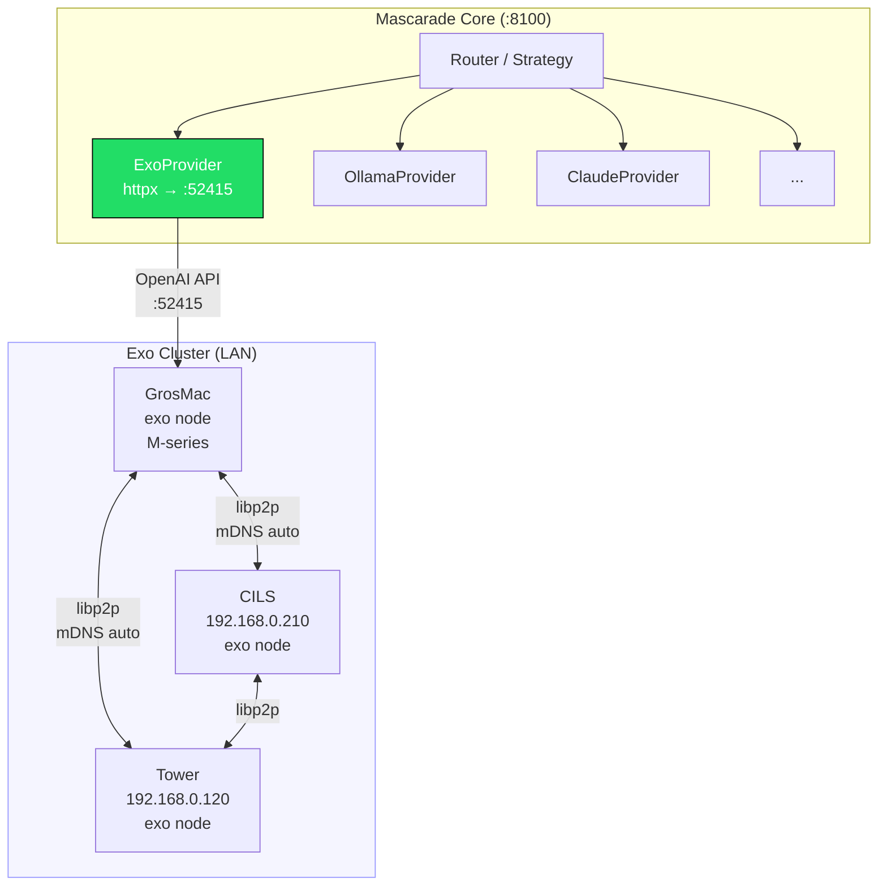
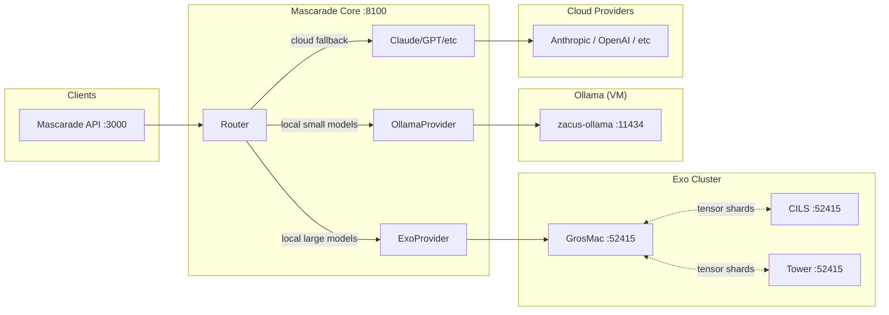

# Exo Distributed Inference — Integration Specification

> Date: 2026-03-21
> Status: Draft
> Author: auto-generated research

## 1. Executive Summary

[Exo](https://github.com/exo-explore/exo) is an open-source (Apache 2.0) distributed inference framework by exo labs. It connects multiple Apple Silicon (or CPU-Linux) devices into a unified AI cluster, enabling execution of large models (up to 671B parameters) that no single machine could run alone. Exo uses MLX as its inference backend, supports automatic peer discovery via libp2p/mDNS, and exposes an **OpenAI-compatible API** — making it a natural fit as a mascarade LLM provider.

**Key value proposition for mascarade:** Run large open-weight models (DeepSeek-V3 671B, Qwen3-235B, Llama 405B) across the existing Mac cluster (GrosMac + CILS + Tower) without cloud costs, and plug them into the mascarade router as a first-class provider.

## 2. Exo Technical Profile

### 2.1 Core Capabilities

| Feature | Detail |
|---------|--------|
| **License** | Apache 2.0 |
| **Language** | Python + Rust (networking) |
| **Inference backend** | MLX (macOS GPU), CPU fallback (Linux) |
| **Parallelism** | Pipeline (default) + Tensor (RDMA, Thunderbolt 5) |
| **Peer discovery** | Automatic via libp2p (mDNS/Bonjour on LAN) |
| **API compatibility** | OpenAI `/v1/chat/completions`, Claude `/v1/messages`, Ollama `/ollama/api/*` |
| **Dashboard** | Web UI on port 52415 |
| **Model format** | MLX-format HuggingFace models (e.g. `mlx-community/*`) |
| **Cluster isolation** | `EXO_LIBP2P_NAMESPACE` env var |

### 2.2 Supported Models (tested by exo team)

- Llama 3.2 (1B, 3B) — 4-bit, 8-bit
- DeepSeek v3.1 671B — 8-bit
- Qwen3-235B — 8-bit
- Kimi K2 Thinking — native 4-bit
- Any `mlx-community/*` HuggingFace model via `/models/add`

### 2.3 Performance Benchmarks (official)

| Setup | Model | Speedup |
|-------|-------|---------|
| 2x M-series devices | Various | ~1.8x over single device |
| 4x M3 Ultra (512GB each, RDMA) | Qwen3-235B 8-bit | ~3.2x over single device |
| RDMA (Thunderbolt 5) | N/A | 99% latency reduction vs TCP |

### 2.4 API Endpoints

```
GET  /models                          — List available models
GET  /models?status=downloaded         — List downloaded models
GET  /models/search?query=...&limit=N  — Search HuggingFace
POST /models/add                       — Register a HF model
GET  /instance/previews?model_id=...   — Preview shard placements
POST /instance                         — Create model instance
DELETE /instance/{id}                  — Tear down instance

POST /v1/chat/completions             — OpenAI-compatible chat
POST /v1/messages                     — Claude-compatible messages
POST /v1/responses                    — OpenAI Responses API
POST /ollama/api/chat                 — Ollama-compatible chat
GET  /ollama/api/tags                 — Ollama-compatible model list

GET  /state                           — Cluster / deployment state
```

Dashboard at `http://<any-node>:52415`.

### 2.5 Installation

Exo is installed from source (no stable `pip install`):

```bash
git clone https://github.com/exo-explore/exo
cd exo/dashboard && npm install && npm run build && cd ..
uv run exo                # starts node + joins/creates cluster
```

**Prerequisites (macOS):**
- Xcode (Metal toolchain)
- Homebrew, uv, macmon, Node.js 18+, Rust nightly

**Environment variables:**

| Variable | Purpose | Default |
|----------|---------|---------|
| `EXO_MODELS_PATH` | Colon-separated pre-downloaded model paths | — |
| `EXO_MODELS_DIR` | Model download directory | `~/.exo/models` |
| `EXO_OFFLINE` | Run without internet | `false` |
| `EXO_ENABLE_IMAGE_MODELS` | Enable image models | `false` |
| `EXO_LIBP2P_NAMESPACE` | Cluster isolation namespace | — |
| `EXO_TRACING_ENABLED` | Performance tracing | `false` |

### 2.6 Peer Discovery

Exo uses **libp2p** with mDNS (Bonjour) for automatic LAN peer discovery. Nodes running `exo` on the same network automatically find each other and form a cluster — no manual IP configuration needed. The topology-aware scheduler then distributes model shards based on each node's available memory, compute, and network latency.

For cluster isolation (multiple independent clusters on the same LAN), set `EXO_LIBP2P_NAMESPACE` to a unique value on each cluster group.

## 3. Architecture — How It Fits

### 3.1 Integration Model: Exo as a Mascarade Provider

Exo exposes an OpenAI-compatible API. The cleanest integration is a new `ExoProvider` that talks to Exo's `/v1/chat/completions` endpoint — exactly like the existing `OllamaProvider` or `LlamaCppProvider` but pointed at Exo's port 52415.



### 3.2 Relationship to Mascarade P2P Mesh

Mascarade already has a P2P mesh (4 nodes, port 4001) for task distribution (fine-tuning, gossip, DHT). Exo is a **separate overlay** with its own libp2p mesh for inference-specific tensor distribution. They are complementary:

| Concern | Mascarade P2P | Exo Cluster |
|---------|--------------|-------------|
| Purpose | Task orchestration, gossip, DHT | Distributed tensor inference |
| Protocol | Custom P2P (:4001) | libp2p + mDNS (:52415) |
| Nodes | VM, GrosMac, CILS, Tower, KXKM-AI | GrosMac, CILS, Tower (Mac only) |
| Data | Task payloads, model metadata | Model weights, tensor shards |

Mascarade's P2P mesh can **orchestrate** Exo (start/stop instances, health checks) while Exo handles the heavy inference workload independently.

### 3.3 Full System View



## 4. Integration Plan

### Phase 1: Infrastructure Setup (1 day)

1. Install Exo on all three Macs (GrosMac, CILS, Tower)
2. Verify automatic peer discovery on the 192.168.0.x LAN
3. Download a test model (`mlx-community/Llama-3.2-1B-Instruct-4bit`)
4. Confirm `/v1/chat/completions` responds correctly from any node
5. Set `EXO_LIBP2P_NAMESPACE=mascarade` for cluster isolation

### Phase 2: ExoProvider Implementation (0.5 day)

Create `core/mascarade/router/providers/exo.py`:

```python
class ExoProvider(LLMProvider):
    name = "exo"
    default_model = "mlx-community/Llama-3.2-1B-Instruct-4bit"
    cost_per_million = (0.0, 0.0)  # local inference
    speed_rank = 2   # faster than Ollama for large models
    quality_rank = 3  # depends on model loaded

    def __init__(self):
        self._base_url = settings.exo_base_url  # http://localhost:52415
        self._client = httpx.AsyncClient(...)

    async def send(self, messages, ...) -> LLMResponse:
        # POST /v1/chat/completions (OpenAI format)
        ...

    async def stream(self, messages, ...) -> AsyncIterator[str]:
        # POST /v1/chat/completions with stream=true
        # SSE format identical to OpenAI
        ...

    def available_models(self) -> list[str]:
        # GET /models?status=downloaded
        ...
```

### Phase 3: Configuration (0.5 day)

Add to `core/mascarade/config.py`:

```python
exo_enabled: bool = False
exo_base_url: str = "http://localhost:52415"
exo_timeout_seconds: float = 300.0  # large models need time
exo_namespace: str = "mascarade"
```

Register in `__init__.py`:

```python
try:
    from mascarade.router.providers.exo import ExoProvider
    __all__.append("ExoProvider")
except ImportError:
    pass
```

### Phase 4: Router Integration (0.5 day)

- Register ExoProvider in the provider registry
- Add routing strategy: use Exo for large open-weight models, Ollama for small/fast models, cloud for proprietary models
- Add health check endpoint for Exo cluster status
- Wire up to existing `/send` and `/stream` API routes

### Phase 5: Operational Tooling (0.5 day)

- Setup script (`scripts/setup_exo_cluster.sh`) — see companion file
- Systemd/launchd service definitions for auto-start
- Monitoring: poll `/state` endpoint, feed into existing observability stack
- Model management: pre-download models to all nodes via `EXO_MODELS_PATH`

## 5. Configuration Reference

### Environment Variables (mascarade .env)

```bash
# Exo distributed inference cluster
EXO_ENABLED=true
EXO_BASE_URL=http://localhost:52415
EXO_TIMEOUT_SECONDS=300
EXO_NAMESPACE=mascarade
```

### Exo Node Configuration (each Mac)

```bash
# In ~/.zshrc or launch script
export EXO_LIBP2P_NAMESPACE=mascarade
export EXO_MODELS_DIR=~/.exo/models
export EXO_OFFLINE=false
```

## 6. Performance Expectations

### Mascarade Cluster Hardware

| Node | Machine | RAM | Role |
|------|---------|-----|------|
| GrosMac | Mac (local) | TBD | Exo coordinator + mascarade bridge |
| CILS | MacBook @ 192.168.0.210 | TBD | Exo worker |
| Tower | Desktop @ 192.168.0.120 | TBD | Exo worker |

### Expected Throughput (conservative estimates)

| Model | Quantization | Cluster | Expected tok/s |
|-------|-------------|---------|----------------|
| Llama-3.2-1B | 4-bit | Single Mac | 80-120 |
| Llama-3.2-3B | 4-bit | Single Mac | 40-60 |
| Qwen-7B | 4-bit | 2 Macs | 30-50 |
| Qwen-32B | 4-bit | 3 Macs | 10-25 |
| Llama-70B | 4-bit | 3 Macs | 5-15 |

Note: Actual throughput depends heavily on available unified memory per node, network bandwidth (Ethernet vs WiFi vs Thunderbolt), and model quantization. RDMA over Thunderbolt 5 would dramatically improve multi-node performance but requires macOS Tahoe 26.2+ and Thunderbolt 5 cables.

### Latency Budget

```
Client → mascarade API (:3000)     ~2ms
API → mascarade Core (:8100)       ~1ms
Core → ExoProvider → Exo (:52415) ~5ms
Exo inter-node tensor transfer     ~10-50ms (Ethernet), ~0.5ms (RDMA)
Model inference (first token)      ~200-2000ms (model dependent)
```

## 7. Risks and Mitigations

| Risk | Severity | Mitigation |
|------|----------|------------|
| **Linux GPU not supported** | HIGH | Tower (if Linux) runs CPU-only. Use only Mac nodes for Exo, keep Tower on Ollama/llama.cpp |
| **mDNS blocked by firewall** | MEDIUM | Ensure UDP 5353 (mDNS) and TCP 52415 open on all Macs; test with `dns-sd -B _exo._tcp` |
| **Model download bandwidth** | MEDIUM | Pre-download models to shared NFS or via `EXO_MODELS_PATH`; set `EXO_OFFLINE=true` in production |
| **No pip install** | LOW | Must install from source with uv; automate via setup script |
| **Node failure mid-inference** | MEDIUM | ExoProvider should implement circuit breaker (inherited from LLMProvider pattern); mascarade router falls back to Ollama or cloud |
| **Memory pressure** | HIGH | Large models (70B+) require combined unified memory across nodes. Monitor via `macmon` and Exo `/state` endpoint |
| **Cluster namespace collision** | LOW | Always set `EXO_LIBP2P_NAMESPACE=mascarade` to isolate from other Exo instances on the LAN |
| **Exo version drift across nodes** | MEDIUM | Pin to specific git commit in setup script; all nodes must run same version |
| **Port conflict with existing services** | LOW | Exo uses 52415 by default; no known conflicts in mascarade stack |
| **Concurrent model loading** | MEDIUM | Exo manages model instances explicitly (POST/DELETE /instance); avoid loading models that exceed cluster memory |

## 8. Decision: Provider vs Infrastructure

**Recommendation: Provider.**

Exo should be integrated as a mascarade LLM provider (like Ollama), not as infrastructure replacing the P2P mesh. Reasons:

1. **Separation of concerns** — Exo does inference, mascarade P2P does task orchestration. Different domains.
2. **API compatibility** — Exo's OpenAI-compatible API maps cleanly to the existing LLMProvider interface.
3. **Operational independence** — Exo cluster can be started/stopped independently of mascarade.
4. **Fallback** — If Exo cluster is down, the router seamlessly falls back to Ollama or cloud providers.
5. **No code coupling** — ExoProvider uses standard HTTP; no need to import Exo as a Python dependency.

## 9. Files to Create/Modify

| File | Action | Description |
|------|--------|-------------|
| `core/mascarade/router/providers/exo.py` | Create | ExoProvider implementation |
| `core/mascarade/router/providers/__init__.py` | Modify | Register ExoProvider |
| `core/mascarade/config.py` | Modify | Add exo_* settings |
| `scripts/setup_exo_cluster.sh` | Create | Cluster setup/management script |
| `docs/EXO_INTEGRATION_SPEC.md` | Create | This document |

## 10. References

- GitHub: https://github.com/exo-explore/exo
- Discord: https://discord.gg/TJ4P57arEm
- MLX: https://github.com/ml-explore/mlx
- libp2p: https://libp2p.io/
