# Mascarade Feature Map - 2026-03-11

## Scope

Cette carte de fonctionnalites decrit les surfaces produit et operateur maintenues dans ce repo.

## Feature map

```mermaid
flowchart TD
    M[mascarade]

    M --> API[api/ facade Hono]
    M --> CORE[core/ runtime Python]
    M --> WEB[web/ bridge UI]
    M --> DEPLOY[deploy/ packaging et infra locale]
    M --> SCRIPTS[scripts/ automation TUI et runbooks]
    M --> FINETUNE[finetune/ pipelines d'entrainement]
    M --> TRAINING[training/ data et scripts annexes]
    M --> DOCS[docs/ runbooks, plans, audit]

    API --> API1[auth, rate-limit, security, ops routes]
    API --> API2[agents, cluster, p2p, cad, industrial, killlife]
    API --> API3[proxy core 8100 et logs operateur]

    CORE --> CORE1[router providers, fallback, cache, load balancer]
    CORE --> CORE2[registry agents et orchestrateur seq/par/pipeline]
    CORE --> CORE3[cluster, mdns, p2p, observability, metrics]
    CORE --> CORE4[integrations knowledge-base, github dispatch, comfyui, cad]

    WEB --> WEB1[dashboard, metrics, logs, infra]
    WEB --> WEB2[agents, playground, orchestrate]
    WEB --> WEB3[knowledge browser, P2P mesh, killlife workflows]

    DEPLOY --> DEP1[Dockerfiles api/core/edge-proxy/ops-agent]
    DEPLOY --> DEP2[Grafana, Loki, Tempo, Prometheus, OTel]
    DEPLOY --> DEP3[ops-console, phase2, CAD sidecars]

    SCRIPTS --> SCR1[setup, services, compose, doctor, smoke]
    SCRIPTS --> SCR2[next useful lot, chaining, review, audit]
    SCRIPTS --> SCR3[finetune ops, Apple local runtime, backups]

    FINETUNE --> FT1[dataset bootstrap, quality, refresh]
    FINETUNE --> FT2[train/distill/promote/deploy]
    FINETUNE --> FT3[domain packs, notebooks, research probes]

    DOCS --> DOC1[execution plans et runbooks]
    DOCS --> DOC2[architecture, observability, migration]
    DOCS --> DOC3[audit multi-repo et sequence diagrams]
```

## Product surfaces

| Surface | Role courant | Anchors |
| --- | --- | --- |
| `api/` | facade HTTP TypeScript, auth, proxy core, routes operateur | `api/src/routes`, `api/src/client/core.ts` |
| `core/` | runtime principal, routage LLM, agents, cluster, observability | `core/mascarade/server.py`, `core/mascarade/router`, `core/mascarade/orchestrator` |
| `web/` | shell UI local et bridge historique vers `crazy_life` | `web/src/pages`, `web/src/components/layout` |
| `deploy/` | infra Docker, observability, edge proxy, sidecars ops | `deploy/Dockerfile.*`, `deploy/prometheus`, `deploy/otel-collector` |
| `scripts/` | outillage operateur, TUI, lots utiles, runbooks executables | `scripts/repo_deep_analysis_tui.sh`, `scripts/next_useful_lot.sh` |
| `finetune/` | pipelines de dataset, distillation et entrainement | `finetune/*.py`, `finetune/datasets`, `finetune/research` |
| `training/` | donnees et scripts annexes de preparation | `training/data`, `training/scripts` |
| `docs/` | contrat documentaire, plans, audit, diagnostics | `docs/EXECUTION_*`, `docs/audit/*` |

## Operator lanes

- runtime lane: `api` -> `core` -> provider router -> observability
- cluster lane: `core/cluster.py` -> peer probe -> P2P ou HTTP -> remote `router.send`
- cockpit lane: `web/` -> `api/` -> `core/`
- finetune lane: `scripts/llm_env.sh` -> `finetune/*` -> model storage `/ai/llm`
- ops lane: `deploy/` + `scripts/modules/*` + dashboards Grafana/Loki/Tempo

## Current gaps and next lots

- les cartes equivalentes existent maintenant aussi dans `crazy_life` et `Kill_LIFE`; le hub multi-repo peut se concentrer sur les deltas runtime/doc encore ouverts
- la lecture operateur `Logs` + `Orchestrate` expose maintenant `routing_selected_by`, `routing_transport` et `routing_latency_ms` pour les steps et la timeline live
- le worktree `core` contient encore des regressions hors de ce lot, notamment sur les chemins P2P/cluster et sur certains tests dependants du reseau local
