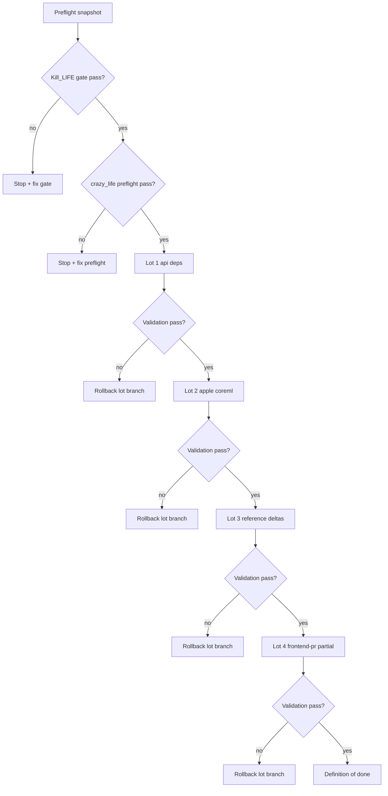

# Merge Execution Playbook (2026-03-15)

## Purpose

This playbook defines the execution order and validation gates for the branch consolidation program.
It is designed for low-risk incremental integration with explicit rollback points.

## Scope

- reference trunk: mascarade-main
- variants to absorb: mascarade-api-deps, mascarade-apple-coreml, mascarade-frontend-pr
- related repos with active worktrees: crazy_life, Kill_LIFE

## Merge control flow (Mermaid)



## Required tooling

- git
- python 3.11+
- node 22+
- docker + docker compose

## Step 0: Preflight snapshot

Run before any merge lot:

```bash
cd /Users/electron/mascarade-main
bash scripts/merge_preflight.sh all
```

Strict cleanliness check when needed:

```bash
bash scripts/merge_preflight.sh baseline --strict-clean
```

Expected result:
- baseline ok
- report generated under docs/audit/

## Step 1: Worktree cleanup order

Use this order and keep one active lot at a time:

1. mascarade-main
2. mascarade
3. crazy_life
4. Kill_LIFE

Rules:
- split changes by theme: docs, runtime, tests, infra
- avoid cross-theme commits
- validate before moving to next theme

## Step 2: Merge lot sequence (cherry-pick thematic)

### Lot 1: api deps integration

Goal:
- absorb dependency and API hardening deltas from mascarade-api-deps

Execution skeleton:

```bash
cd /Users/electron/mascarade-main
git checkout -b integrate/api-deps-lot-1
# cherry-pick selected commits from mascarade-api-deps
```

Validation gate:

```bash
cd /Users/electron/mascarade-main
bash scripts/test_python.sh -- -q
npm --prefix api run build
```

### Lot 2: apple coreml integration

Goal:
- absorb Apple runtime deltas from mascarade-apple-coreml without regressing default flow

Execution skeleton:

```bash
cd /Users/electron/mascarade-main
git checkout -b integrate/apple-coreml-lot-2
# cherry-pick selected commits from mascarade-apple-coreml
```

Validation gate:

```bash
cd /Users/electron/mascarade-main
bash scripts/ensure_apple_models.sh --verify || true
bash scripts/smoke_openai_compat_ane.sh || true
bash scripts/test_python.sh -- -q
```

### Lot 3: reference delta alignment

Goal:
- finish integrating missing reference deltas that remain outside trunk conventions

Execution skeleton:

```bash
cd /Users/electron/mascarade-main
git checkout -b integrate/reference-delta-lot-3
# cherry-pick selected thematic commits
```

Validation gate:

```bash
cd /Users/electron/mascarade-main
bash scripts/test_python.sh -- -q
npm --prefix api run build
```

### Lot 4: frontend-pr full merge

Goal:
- perform complete merge from mascarade-frontend-pr

Execution skeleton:

```bash
cd /Users/electron/mascarade-main
git checkout -b integrate/frontend-pr-full-lot-4
git merge --no-ff feat/frontend-pr1-stability
```

High-risk areas to resolve explicitly:
- core orchestrator/router modules
- legacy notion integration vs modern kb/cad surfaces
- docker compose service defaults

Validation gate:

```bash
cd /Users/electron/mascarade-main
bash scripts/test_python.sh -- -q
npm --prefix api run build
docker compose config >/dev/null
```

## Step 3: Cross-repo verification

After each lot, run quick status checks:

```bash
for repo in /Users/electron/mascarade-main /Users/electron/mascarade /Users/electron/crazy_life /Users/electron/Kill_LIFE; do
  echo "--- ${repo}"
  git -C "${repo}" status --short | wc -l
  git -C "${repo}" rev-parse --abbrev-ref HEAD
done
```

## Rollback policy

- rollback unit: one lot branch
- if gate fails, reset only lot branch, do not mutate trunk
- keep report file from preflight for audit trail

## Definition of done

- all lots merged with green gates
- no unresolved conflict markers
- updated publication matrix available
- preflight snapshot available for start and end states
