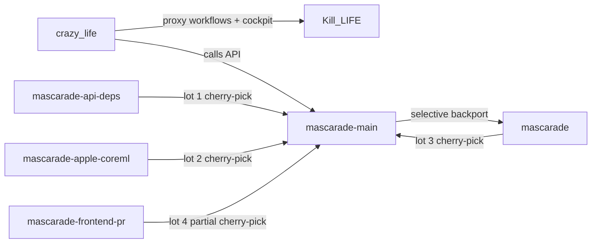
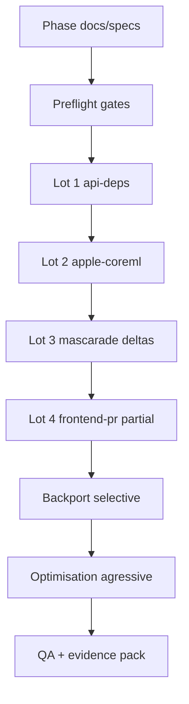

# Status de sync multi-repo (9 mars 2026)

## Update implementation (15 mars 2026)

Demarrage de l'implementation avec baseline git capturee sur l'ensemble du workspace.

### Baseline git

| Repo | Branch | HEAD | Dirty files | Worktrees |
| --- | --- | --- | ---: | ---: |
| agent-factory-cockpit | n/a (not git repo) | n/a | n/a | n/a |
| crazy_life | main | 82afb0f549da67da73a7e32558a1ab162e148461 | 23 | 1 |
| Kill_LIFE | main | 225f2f856eb11da28ea1aad4cea1d35244388fca | 16 | 1 |
| mascarade | feat/apple-coreml-runtime-lot | 28c477f548e11aa91dda587e6d5d9cd6ea894607 | 24 | 20 |
| mascarade-api-deps | chore/api-deps-pristine | 0107c5fade5ad46bf9d9dbe2ff1ba6be1179e1f0 | 0 | 20 |
| mascarade-apple-coreml | feat/apple-coreml-runtime-pristine | 64b87276d34305136d2160498d73896b6816c82d | 1 | 20 |
| mascarade-frontend-pr | feat/frontend-pr1-stability | 6b33289a919fc57dea3f40115de186405f1eb7ad | 1 | 20 |
| mascarade-main | main | 41515c6823d6e0625ecec1ae8b83af9ff7674179 | 5 | 20 |

### Decisions d'execution active

- Mode: analyse/docs d'abord, merge ensuite.
- Lot frontend-pr: merge partiel par cherry-pick.
- Apple CoreML: fallback + alerte forte.
- Dedup docs mascarade: mode mixte (source centrale + runbooks locaux).
- Optimisation post-merge: agressive.

### Immediate next steps

1. Mettre a jour les TODO/plan cross-repo avec priorites et dependances.
2. Produire les diagrams mermaid prioritaires manquants.
3. Lancer la phase merge preflight avec preuves de gate.
4. Executer les lots 1-3, puis lot frontend-pr partiel.
5. Enchainer sur optimisation et evidence pack.

### Mermaid - Dependances multi-repos

### Mermaid - Sequence execution

## Requête
- Vérifier la cohérence locale/distante suite aux merges et pulls récents.
- Référentiel de travail : `/ai/saisail`.

## Réalisé
- `crazy_life`
  - Merge résolu et commit `a50c164` créé.
  - `git status` => `## main...origin/main [ahead 2]` (pas de conflit).
  - Merge intégré en respectant la version MCP/proxy enrichie sur `OpsHub`.
  - Build vérifié `npm run -s build` ✅
- `Kill_LIFE`
  - `git status` => `## main...origin/main` (up-to-date clean).
- `llmfit`
  - Pull fast-forward vers `origin/main` terminé.
  - `a91feec` == `origin/main`.
- `mascarade`
  - branche courante `codex/stabilize-setup-gpu-audio-ollama`.
  - `codex/stabilize-setup-gpu-audio-ollama` reste `ahead 41` vs `origin/codex/stabilize-setup-gpu-audio-ollama` (non modifié ici).

## Lot utile (auto-chain)
- Commande exécutée: `./scripts/auto_chain_next_lots.sh --plan-only`
- Sortie: `Watch candidates: JetBrains/Mellum-4b-sft-all`
- Artefacts écrits: `finetune/runs/next-lots_*` (via wrapper), `candidates.txt`, `manifest.json`, `run_manifest.json`.

## Contrat de suite
1. Reporter ces états dans `docs/EXECUTION_PLAN_2026-03-07.md`.
2. Garder `R-010` ouvert tant que la règle contractuelle multi-repo n’est pas encore formalisée.
3. Avant nouveau lot, fermer la divergence locale `mascarade` quand le flux de sync global est stabilisé.
