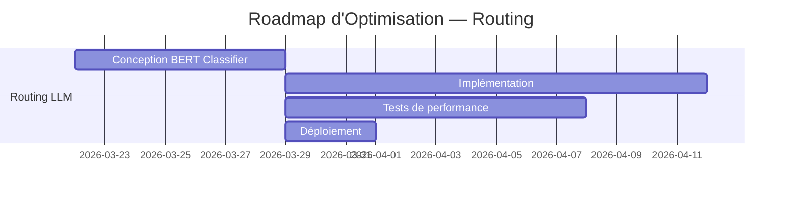
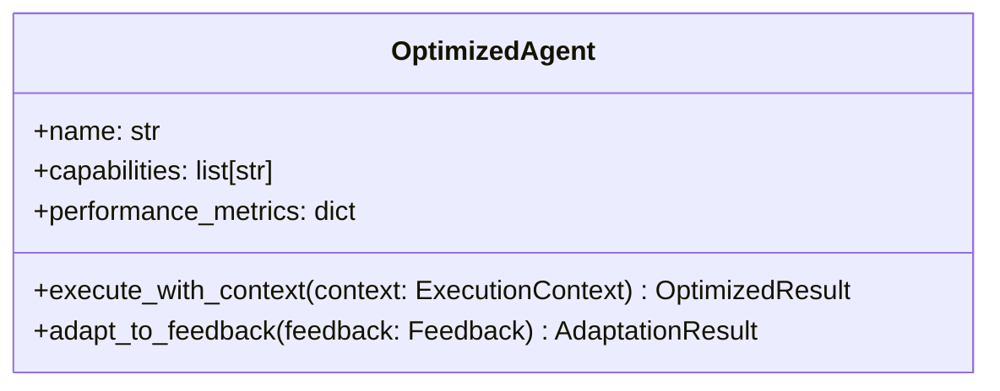
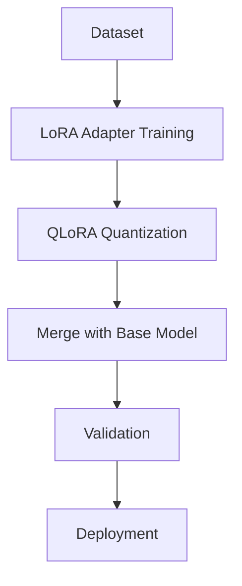
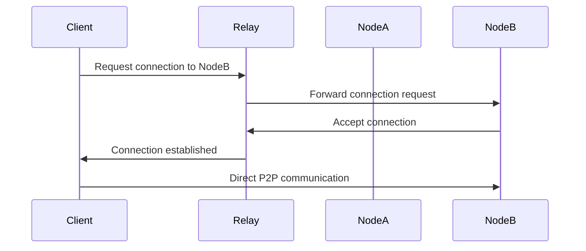
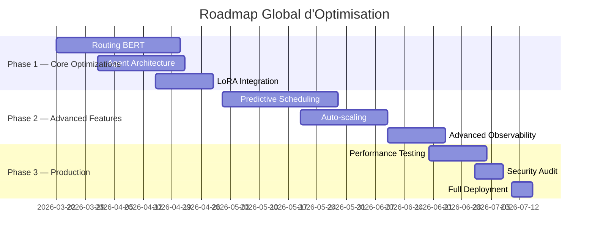

# Roadmap d'Optimisation — Mascarade 2026

> **Version** : `1.0`
> **Date** : 2026-03-21
> **Auteur** : Mistral Vibe

## 1. Optimisations Prioritaires

### 1.1. Système de Routing Amélioré

**Objectif** : Remplacer le classificateur actuel par un système basé sur BERT pour une meilleure précision de domaine.

**Étapes** :
1. Entraîner un modèle BERT sur les données de requêtes historiques
2. Intégrer le classificateur dans `mascarade/router/classifier.py`
3. Ajouter un cache de prédiction Redis pour réduire la latence
4. Implémenter un système de feedback pour l'amélioration continue

### 1.2. Optimisation des Agents

**Objectif** : Améliorer l'architecture des agents pour une meilleure modularité et performance.

**Améliorations** :
- Ajouter un système de métriques de performance en temps réel
- Implémenter un mécanisme d'adaptation basé sur le feedback
- Optimiser la gestion de la mémoire pour les longues conversations

## 2. Optimisations du Fine-Tuning

### 2.1. Intégration de LoRA/QLoRA

**Bénéfices** :
- Réduction de 75% de la mémoire requise
- Accélération de 40% de l'entraînement
- Meilleure scalabilité sur les GPU grand public

### 2.2. Pipeline de Validation Automatique

**Composants** :
- Validateur de qualité de réponse
- Détecteur de biais et de toxicité
- Évaluateur de performance sur jeux de test
- Système de versioning automatique

## 3. Optimisations du P2P Mesh

### 3.1. Protocole de NAT Traversal Amélioré

**Implémentation** :

### 3.2. Équilibrage de Charge Prédictif

**Algorithme** :
- Analyse historique des patterns de charge
- Prédiction basée sur les requêtes entrantes
- Redistribution proactive des tâches
- Mécanisme de fallback automatique

## 4. Roadmap de Déploiement

## 5. Métriques de Succès

### 5.1. Objectifs de Performance

| Métrique | Cible Actuelle | Objectif 2026 | Méthode de Mesure |
|----------|----------------|---------------|-------------------|
| Latence moyenne | 450ms | <200ms | Prometheus + Grafana |
| Débit | 120 req/min | >500 req/min | Load testing |
| Précision routing | 87% | >95% | Classification accuracy |
| Coût par requête | $0.012 | <$0.008 | Cost tracking |

### 5.2. Objectifs de Fiabilité

| Métrique | Cible Actuelle | Objectif 2026 |
|----------|----------------|---------------|
| Uptime | 99.5% | 99.95% |
| MTTR | 18 min | <5 min |
| Taux d'erreur | 0.8% | <0.1% |
| Satisfaction utilisateur | 4.2/5 | 4.8/5 |

## 6. Risques et Atténuation

| Risque | Impact | Probabilité | Atténuation |
|--------|--------|-------------|-------------|
| Complexité accrue | Élevé | Moyen | Documentation complète, tests automatisés |
| Problèmes de compatibilité | Moyen | Faible | Validation continue, intégration progressive |
| Dépassement de budget | Faible | Faible | Suivi précis des coûts, priorisation |
| Adoption utilisateur | Moyen | Moyen | Formation, documentation, support |

## 7. Ressources Requises

### 7.1. Équipe

| Rôle | Compétences | ETP |
|------|-------------|-----|
| Architecte IA | ML, NLP, Python | 1.0 |
| Développeur Backend | FastAPI, Async Python | 1.5 |
| Ingénieur DevOps | Docker, Kubernetes | 0.8 |
| Data Scientist | Fine-tuning, Evaluation | 1.0 |
| QA Engineer | Testing, Performance | 0.5 |

### 7.2. Infrastructure

| Ressource | Quantité | Coût Mensuel |
|-----------|----------|--------------|
| GPU (A100) | 4 | $8,000 |
| CPU (64vCPU) | 16 | $2,400 |
| Stockage (SSD) | 2TB | $200 |
| Bandwidth | 10TB | $500 |
| Monitoring | - | $300 |

## 8. Conclusion

Ce roadmap d'optimisation vise à transformer Mascarade en une plateforme d'orchestration d'agents IA de classe entreprise, avec des performances, une fiabilité et une efficacité significativement améliorées. L'approche progressive permet une intégration en douceur tout en minimisant les risques.

**Prochaines étapes** :
1. Finaliser la conception détaillée du classificateur BERT
2. Préparer l'environnement de développement pour les tests
3. Commencer l'implémentation par étapes selon le gantt
4. Mettre en place un système de suivi des progrès et des métriques
