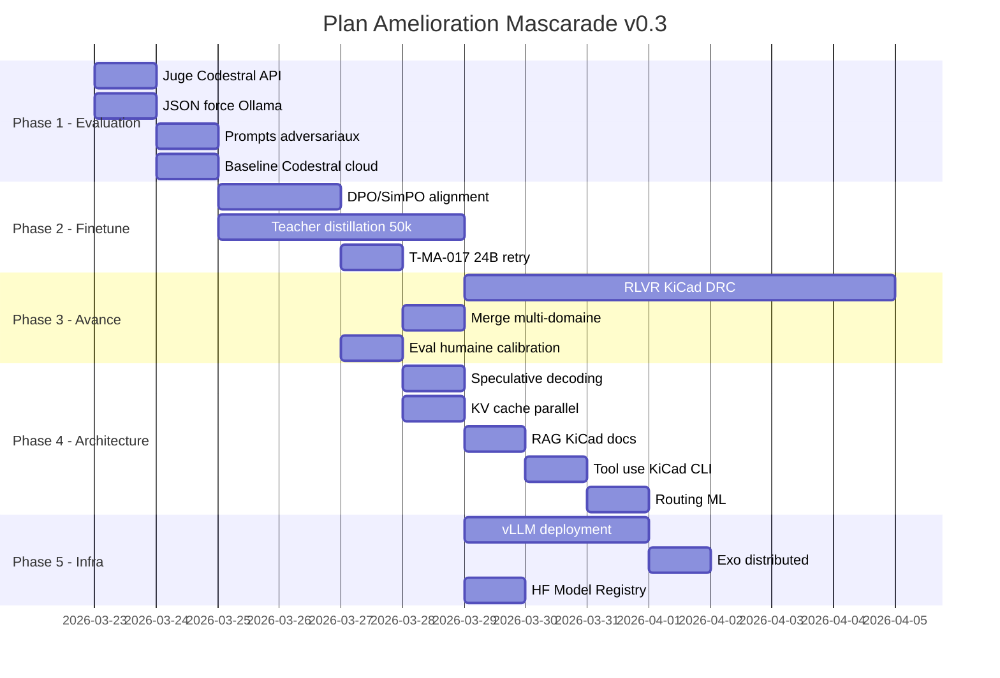

# Plan d'amelioration Mascarade v0.3

**Date** : 2026-03-22
**Auteur** : Claude Opus 4.6 + Clems
**Base** : v0.2.0, 57 commits, T-MA-016/017/021 termines

---

## Phase 1 — Evaluation (Semaine 1)

### 1.1 Juge Codestral API (J1)
- **Quoi** : Remplacer Qwen3 local par Codestral via API comme juge
- **Pourquoi** : Pas de thinking mode, JSON fiable, plus rapide
- **Comment** :
  - Script `run-benchmark-judge-codestral.py`
  - Appel `POST https://codestral.mistral.ai/v1/chat/completions` avec `response_format: {"type": "json_object"}`
  - Prompt juge structure avec grille de notation 1-10
  - Cout estime : ~0.50 EUR pour 500 inferences (5 modeles x 100 prompts)
- **Machine** : grosmac ou photon (API cloud, pas besoin GPU)
- **Livrable** : `finetune/eval/judge-codestral-results/JUDGE_REPORT.md`

### 1.2 Format JSON force Ollama (J1)
- **Quoi** : Utiliser `"format": "json"` dans les appels Ollama pour le juge local
- **Comment** :
  - Modifier `run-benchmark-judge.py` : ajouter `"format": "json"` dans le payload Ollama
  - Schema attendu : `{"score": N, "justification": "..."}`
  - Fallback : regex parsing si JSON invalide
- **Machine** : KXKM-AI
- **Livrable** : Script mis a jour + resultats compares

### 1.3 Prompts adversariaux (J2)
- **Quoi** : 30 prompts avec erreurs volontaires dans des schemas KiCad/SPICE
- **Pourquoi** : Tester si le modele detecte les erreurs (pas juste generer)
- **Exemples** :
  - Schema KiCad avec composant mal connecte (pin non reliee)
  - Netlist SPICE avec valeur de composant aberrante (resistance 0 ohm en serie)
  - Footprint avec pad overlap
  - Code PlatformIO avec mauvais pinout pour le MCU
- **Comment** :
  - Generer via Codestral API (prompt : "genere un schema KiCad avec une erreur subtile")
  - Valider manuellement les 30 prompts
  - Ajouter a `finetune/eval/adversarial_prompts.jsonl`
- **Livrable** : 30 prompts + benchmark adversarial

### 1.4 Baseline Codestral cloud (J2)
- **Quoi** : Benchmarker Codestral API comme 6eme modele de reference
- **Comment** :
  - Ajouter Codestral API dans le script benchmark (httpx vers codestral.mistral.ai)
  - Memes 100 prompts + 30 adversariaux
  - Comparer latence cloud vs local, score cloud vs finetune
- **Machine** : grosmac
- **Livrable** : Tableau comparatif dans le rapport benchmark

---

## Phase 2 — Finetune avance (Semaine 2-3)

### 2.1 DPO/SimPO sur resultats benchmark (J3-J4)
- **Quoi** : Alignment post-training avec les donnees du benchmark
- **Pourquoi** : Le benchmark genere des paires naturelles (bonne reponse vs mauvaise)
- **Comment** :
  1. Pour chaque prompt, prendre la meilleure reponse (score juge max) = chosen
  2. Prendre la pire reponse = rejected
  3. Construire dataset DPO : `{"prompt": ..., "chosen": ..., "rejected": ...}`
  4. Lancer SimPO (reference-free) sur le meilleur modele base
  - Script : `scripts/build-dpo-dataset.py` + `scripts/run-simpo-finetune.py`
  - Config SimPO : beta=2.0, gamma=0.5, 1 epoch
- **Machine** : KXKM-AI (GPU, Ollama arrete)
- **Prerequis** : Phase 1 terminee (scores du juge necessaires)
- **Livrable** : LoRA SimPO + benchmark du modele aligne

### 2.2 Data augmentation teacher distillation (J4-J7)
- **Quoi** : Generer 50k examples supplementaires via Codestral API
- **Pourquoi** : 2644 examples KiCad c'est peu, 15-20k serait ideal
- **Comment** :
  1. Definir 500 templates de questions par domaine
  2. Codestral genere les reponses (teacher)
  3. Filtrage qualite : score juge > 7/10, longueur > 100 tokens
  4. Deduplication par embedding similarity (Qdrant)
  5. Export en JSONL conversations format
  - Script : `scripts/teacher-distill.py`
  - Budget API : ~5-10 EUR pour 50k generations
- **Machine** : grosmac (API calls) + KXKM-AI (filtrage GPU)
- **Livrable** : `finetune/datasets/kicad_augmented_50k.jsonl`

### 2.3 Refaire T-MA-017 avec 24B (J5)
- **Quoi** : Relancer le finetune SPICE+embedded avec Mistral Small 24B
- **Pourquoi** : Qwen2.5-7B a donne loss=0.69 mais le 24B sera meilleur
- **Prerequis** : `sudo systemctl stop ollama` sur KXKM-AI
- **Config** :
  - Modele : unsloth/Mistral-Small-3.1-24B-Instruct-2503-unsloth-bnb-4bit
  - seq_length=2048, batch=1, grad_accum=16
  - 2 epochs sur 19k examples
  - Temps estime : ~10h
- **Machine** : KXKM-AI (24 GB VRAM libre)
- **Livrable** : LoRA 24B SPICE + GGUF Q4_K_M

---

## Phase 3 — Finetune avance moyen terme (Semaine 4-6)

### 3.1 RLVR avec KiCad DRC (J8-J14)
- **Quoi** : RL avec rewards verifiables via KiCad DRC
- **Pourquoi** : Le modele apprend a generer des schemas *corrects* (pas juste plausibles)
- **Architecture** :
  ```
  Prompt → Modele genere .kicad_sch → KiBot DRC → Score reward
  Score = 1.0 (0 erreurs), 0.5 (warnings only), 0.0 (erreurs), -0.5 (invalide)
  ```
- **Comment** :
  1. Installer KiBot + KiCad headless sur KXKM-AI
  2. Creer `finetune/rlvr/kicad_verifier.py` (parse schema → run DRC → score)
  3. Creer 200 prompts de generation de schemas
  4. GRPO training avec `trl.GRPOTrainer` (loss_type="dapo")
  5. 16 generations par prompt, group-relative advantage
- **Deps** : `kibot>=1.8`, `kiauto>=2.3`, KiCad 9 headless
- **Machine** : KXKM-AI
- **Livrable** : LoRA RLVR + rapport avant/apres DRC pass rate

### 3.2 Merge multi-domaine (J10)
- **Quoi** : Fusionner les LoRA KiCad + SPICE + embedded en un seul adaptateur
- **Comment** :
  - `peft.merge_adapter()` avec ponderation (0.4 kicad, 0.3 spice, 0.3 embedded)
  - Ou re-entrainer sur le dataset concatene avec les 3 LoRA comme initialisation
  - Benchmark sur les 130 prompts (100 + 30 adversariaux)
- **Machine** : KXKM-AI
- **Livrable** : `mascarade-electronics-v1` (modele unifie)

### 3.3 Evaluation humaine calibration (J7)
- **Quoi** : 20 prompts notes manuellement par Clems
- **Pourquoi** : Calibrer le juge automatique (verifier correlation humain/LLM)
- **Comment** :
  1. Selectionner 20 prompts representatifs (5 par domaine)
  2. Generer les reponses de chaque modele
  3. Presenter dans un Google Form ou TUI
  4. Comparer scores humains vs scores juge
  5. Ajuster les poids du prompt juge si ecart > 2 points
- **Livrable** : `finetune/eval/human_calibration.json`

---

## Phase 4 — Architecture mascarade (Semaine 3-5)

### 4.1 Speculative decoding (J8)
- **Quoi** : Draft model (4B) + verification model (24B) pour 2-3x speedup
- **Comment** :
  - Ollama supporte `--draft-model` en experimental
  - Ou implementer dans mascarade : 4B genere N tokens, 24B valide en batch
  - Mesurer le speedup reel vs single-model
- **Config** :
  ```
  Draft: mascarade-kicad:latest (2.5 GB, 216 tps)
  Verify: kicadv2:latest (14 GB, 53 tps)
  Target: ~150 tps avec qualite du 24B
  ```
- **Machine** : KXKM-AI
- **Livrable** : Provider `speculative` dans mascarade router

### 4.2 KV cache + parallel serving (J6)
- **Quoi** : Servir 4 requetes en parallele sur le meme modele
- **Comment** :
  - `OLLAMA_NUM_PARALLEL=4` dans le service systemd
  - Prefix caching pour les system prompts agents (cache le KV du system prompt)
  - Mesurer throughput avant/apres
- **Machine** : KXKM-AI
- **Livrable** : Config Ollama + benchmark throughput

### 4.3 RAG KiCad docs (J9)
- **Quoi** : Indexer la doc officielle KiCad + IPC standards dans Qdrant
- **Comment** :
  1. Scraper `docs.kicad.org` (HTML → markdown → chunks)
  2. Telecharger les PDFs IPC standards disponibles
  3. Embed avec mistral-embed ou nomic-embed-text
  4. Upsert dans Qdrant collection `kicad-docs`
  5. Connecter au RAG pipeline existant
- **Machine** : grosmac (scraping) + photon (Qdrant)
- **Livrable** : Collection Qdrant `kicad-docs` (~5000 chunks)

### 4.4 Tool use KiCad CLI (J10)
- **Quoi** : Donner au modele l'acces a `kicad-cli` comme outil MCP
- **Comment** :
  - Le MCP server KiCad existe deja dans mascarade (`mcp/client.py`)
  - Ajouter des outils : `validate_schematic`, `run_drc`, `export_netlist`
  - Le modele peut verifier ses propres reponses avant de les retourner
- **Machine** : KXKM-AI (KiCad installe)
- **Livrable** : 3 nouveaux outils MCP KiCad

### 4.5 Routing ML (J11)
- **Quoi** : Entrainer le classifier sur les donnees de benchmark
- **Comment** :
  1. Collecter les features de chaque prompt (via `PromptFeatureExtractor`)
  2. Label = meilleur modele (celui qui a le meilleur score juge)
  3. Entrainer le `RoutingClassifier` avec `train()`
  4. Sauvegarder le modele dans `data/routing_classifier.json`
  5. Activer dans le router : `routellm_enabled=true`
- **Donnees** : 100 prompts x 5 modeles = 500 observations
- **Machine** : grosmac
- **Livrable** : Classifier entraine + A/B test vs routing statique

---

## Phase 5 — Infrastructure (Semaine 4-6)

### 5.1 vLLM au lieu d'Ollama (J12-J14)
- **Quoi** : Deployer vLLM pour continuous batching et PagedAttention
- **Pourquoi** : 2-3x plus de throughput, meilleur GPU utilization
- **Comment** :
  1. Installer vLLM sur KXKM-AI : `pip install vllm`
  2. Servir le modele : `vllm serve mascarade-kicad-v2 --port 8081`
  3. Connecter via le provider `vllm_provider.py` deja cree
  4. Benchmark throughput : Ollama vs vLLM (concurrent requests)
  5. Si gain confirme : migrer progressivement
- **Machine** : KXKM-AI
- **Livrable** : vLLM deploye + benchmark comparatif

### 5.2 Exo distributed inference (J13)
- **Quoi** : Distribuer l'inference du 24B entre KXKM-AI + grosmac
- **Pourquoi** : Le 24B ne rentre que sur KXKM-AI, Exo permet de le splitter
- **Comment** :
  1. Installer Exo sur les deux machines
  2. Configurer le cluster : `exo --discovery-module local`
  3. Charger le modele 24B (Exo partitionne automatiquement)
  4. Connecter via le provider `exo.py` deja cree
- **Prerequis** : Exo supporte macOS Tahoe 26.2+
- **Machine** : KXKM-AI + grosmac
- **Livrable** : Cluster Exo 2 nodes + benchmark latence

### 5.3 HuggingFace Model Registry (J10)
- **Quoi** : Publier les LoRA sur HuggingFace Hub (org electron-rare)
- **Comment** :
  1. `huggingface-cli login` avec le token HF
  2. Upload T-MA-016 LoRA : `electron-rare/mascarade-kicad-v2-lora`
  3. Upload T-MA-017 LoRA : `electron-rare/mascarade-spice-v1-lora`
  4. Upload GGUF : `electron-rare/mascarade-kicad-v2-GGUF`
  5. README avec benchmark results, model card, usage
- **Machine** : KXKM-AI
- **Livrable** : 3 repos HuggingFace publics

---

## Timeline



## Budget estime

| Poste | Cout |
|-------|------|
| Codestral API (juge + baseline) | ~2 EUR |
| Teacher distillation 50k | ~10 EUR |
| HuggingFace Hub (storage) | Gratuit (public) |
| Electricite GPU (KXKM-AI, ~50h) | ~5 EUR |
| **Total** | **~17 EUR** |

## Metriques de succes

| Metrique | Actuel (v0.2) | Cible (v0.3) |
|----------|--------------|-------------|
| Score juge moyen (meilleur modele) | 0.52 (keyword) | 7.0/10 (LLM juge) |
| Score KiCad finetune vs base | +0% | +25% |
| Score SPICE finetune vs base | +3.7% | +20% |
| DRC pass rate (RLVR) | N/A | >60% |
| Throughput (tokens/s) | 216 | 500+ (vLLM) |
| Prompts de benchmark | 100 | 130 (+ adversariaux) |
| Modeles publies HF | 0 | 3 |
