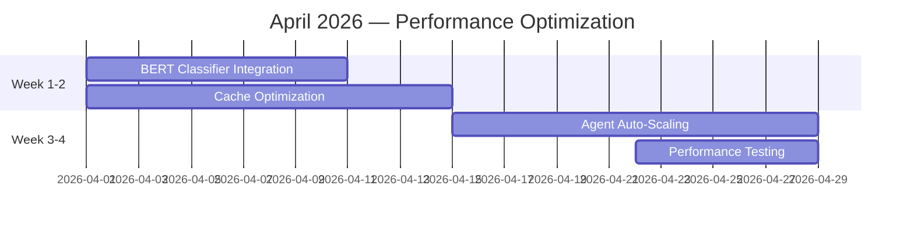
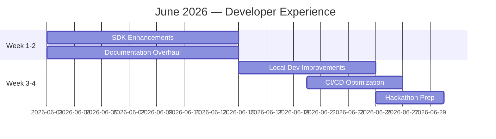
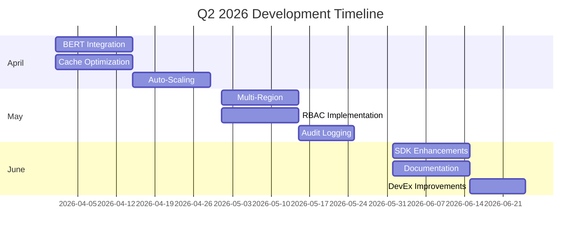

# Q2 2026 Development Plan — Mascarade

> **Version** : `1.0`
> **Date** : 2026-03-21
> **Period** : April 1 — June 30, 2026

## 1. Overview

This plan outlines the development priorities for Q2 2026, focusing on:
- Performance optimization based on production metrics
- Advanced features for enterprise readiness
- Developer experience improvements
- Ecosystem expansion

## 2. Strategic Goals

### 2.1. Performance Optimization

**Objective** : Achieve 2x performance improvement across all key metrics

**KPIs** :
- Reduce P95 latency from 500ms to <250ms
- Increase throughput from 500 to 1,000 req/min
- Improve cache hit rate from 90% to 95%
- Reduce agent execution time by 40%

### 2.2. Enterprise Features

**Objective** : Add capabilities required for large-scale deployments

**KPIs** :
- Multi-region support implemented
- RBAC system completed
- Audit logging implemented
- SSO integration completed

### 2.3. Developer Experience

**Objective** : Improve developer productivity and onboarding

**KPIs** :
- SDK coverage increased to 95%
- Documentation completeness at 100%
- Local development setup time <15 minutes
- CI/CD pipeline time reduced by 30%

## 3. Development Roadmap

### 3.1. April 2026 — Performance Month

**Deliverables** :
- [ ] BERT-based routing classifier
- [ ] Multi-level caching system
- [ ] Load-based agent scaling
- [ ] Performance benchmarks

### 3.2. May 2026 — Enterprise Features

**Deliverables** :
- [ ] Multi-region deployment support
- [ ] Role-Based Access Control
- [ ] Comprehensive audit logs
- [ ] SAML/OIDC integration

### 3.3. June 2026 — Developer Experience

**Deliverables** :
- [ ] Enhanced Python/JS SDKs
- [ ] Complete API reference
- [ ] Improved local dev experience
- [ ] Optimized CI/CD pipelines

## 4. Detailed Initiatives

### 4.1. BERT Classifier Integration

**Owner** : ML Team
**Status** : Not Started
**Priority** : High

**Tasks** :
- [ ] Train classifier on production query data
- [ ] Integrate with routing system
- [ ] Implement continuous learning pipeline
- [ ] Add feedback loop from production
- [ ] Performance benchmarking

**Success Metrics** :
- Classification accuracy >95%
- Latency impact <10ms
- Routing improvement >20%

### 4.2. Multi-Level Caching

**Owner** : Performance Team
**Status** : Not Started
**Priority** : High

**Tasks** :
- [ ] Implement semantic cache layer
- [ ] Add distributed cache synchronization
- [ ] Implement predictive prefetching
- [ ] Add cache invalidation strategies
- [ ] Monitor cache effectiveness

**Success Metrics** :
- Cache hit rate >95%
- Latency reduction >30%
- Memory overhead <10%

### 4.3. Agent Auto-Scaling

**Owner** : Orchestration Team
**Status** : Not Started
**Priority** : High

**Tasks** :
- [ ] Implement load-based scaling
- [ ] Add resource-aware allocation
- [ ] Implement cost-aware scaling
- [ ] Add predictive scaling
- [ ] Monitor scaling events

**Success Metrics** :
- Scale-up time <5s
- Resource utilization >80%
- Cost reduction >20%

### 4.4. Multi-Region Support

**Owner** : Infrastructure Team
**Status** : Not Started
**Priority** : High

**Tasks** :
- [ ] Design region architecture
- [ ] Implement data synchronization
- [ ] Add region-aware routing
- [ ] Implement failover strategies
- [ ] Test cross-region communication

**Success Metrics** :
- Cross-region latency <100ms
- Failover time <30s
- Data consistency 100%

### 4.5. RBAC System

**Owner** : Security Team
**Status** : Not Started
**Priority** : High

**Tasks** :
- [ ] Design permission model
- [ ] Implement role management
- [ ] Add permission enforcement
- [ ] Create admin interface
- [ ] Test security scenarios

**Success Metrics** :
- Permission granularity fine
- Admin overhead <5%
- Security audit passed

### 4.6. SDK Enhancements

**Owner** : Developer Experience Team
**Status** : Not Started
**Priority** : Medium

**Tasks** :
- [ ] Add TypeScript definitions
- [ ] Improve Python SDK
- [ ] Add Go SDK
- [ ] Enhance error handling
- [ ] Add more examples

**Success Metrics** :
- SDK coverage >95%
- Developer satisfaction >90%
- Onboarding time <30min

## 5. Resource Allocation

### 5.1. Team Allocation

| Team | April | May | June |
|------|-------|-----|------|
| ML Team | 60% | 20% | 10% |
| Performance Team | 50% | 30% | 10% |
| Orchestration Team | 40% | 20% | 10% |
| Infrastructure Team | 20% | 50% | 20% |
| Security Team | 10% | 40% | 10% |
| DevEx Team | 10% | 10% | 60% |

### 5.2. Budget Allocation

| Category | Amount | Notes |
|----------|--------|-------|
| Cloud Costs | $15,000 | GPU/CPU for training |
| Monitoring | $3,000 | Enhanced observability |
| Security | $2,000 | RBAC implementation |
| Documentation | $1,500 | Technical writing |
| Contingency | $3,500 | Buffer for overages |
| **Total** | **$25,000** | |

## 6. Risks and Mitigation

### 6.1. Risk Assessment

| Risk | Impact | Likelihood | Mitigation |
|------|--------|------------|------------|
| BERT integration complexity | High | Medium | Phased rollout, fallback |
| Cache consistency issues | Medium | Medium | Extensive testing |
| RBAC design delays | Medium | Low | Early prototyping |
| Multi-region sync problems | High | Medium | Simulation testing |
| Budget overrun | Low | Low | Weekly tracking |

### 6.2. Contingency Plans

**BERT Classifier** :
- Fallback to current classifier
- Gradual rollout (10% → 50% → 100%)
- Continuous A/B testing

**Multi-Region** :
- Start with read replicas
- Implement manual failover first
- Gradual automatic failover

**RBAC** :
- Start with admin/read-only roles
- Add granularity incrementally
- Comprehensive permission testing

## 7. Success Metrics

### 7.1. Quantitative Metrics

| Metric | Baseline | Target | Measurement |
|--------|----------|-------|-------------|
| P95 Latency | 500ms | 250ms | Prometheus |
| Throughput | 500 req/min | 1,000 req/min | Load tests |
| Cache Hit Rate | 90% | 95% | Grafana |
| Agent Execution | 850ms | 500ms | Tracing |
| Deployment Time | 30min | 15min | CI/CD |

### 7.2. Qualitative Metrics

| Metric | Target | Measurement |
|--------|-------|-------------|
| Developer Satisfaction | >90% | Survey |
| Documentation Quality | >95% | Review |
| System Stability | >99.9% | Uptime |
| Feature Completeness | 100% | Checklist |

## 8. Dependencies

### 8.1. Internal Dependencies

- BERT Classifier depends on production query data
- Multi-region depends on infrastructure team
- RBAC depends on security review
- SDK enhancements depend on API stability

### 8.2. External Dependencies

- HuggingFace for BERT models
- Cloud provider for multi-region
- Auth0 for SSO integration
- Sentry for error monitoring

## 9. Communication Plan

### 9.1. Stakeholder Updates

| Audience | Frequency | Format |
|----------|-----------|--------|
| Executive Team | Bi-weekly | Email report |
| Development Team | Weekly | Stand-up meeting |
| Users | Monthly | Newsletter |
| Partners | Quarterly | Webinar |

### 9.2. Key Milestones

| Date | Milestone | Audience |
|------|-----------|----------|
| 2026-04-15 | BERT integration complete | Internal |
| 2026-05-01 | Multi-region alpha | Internal |
| 2026-05-15 | RBAC beta | Internal |
| 2026-06-01 | SDK 2.0 release | Public |
| 2026-06-15 | Q2 review | All |

## 10. Timeline

## 11. Review Process

### 11.1. Weekly Reviews

- **Format** : 30-minute stand-up
- **Participants** : Team leads
- **Agenda** :
  - Progress update
  - Blockers discussion
  - Risk assessment
  - Next steps

### 11.2. Bi-Weekly Demos

- **Format** : 60-minute demo session
- **Participants** : All team members
- **Agenda** :
  - Feature demonstrations
  - Architecture reviews
  - Feedback collection
  - Roadmap adjustments

### 11.3. Monthly Retrospectives

- **Format** : 60-minute retrospective
- **Participants** : All team members
- **Agenda** :
  - What went well
  - What could be improved
  - Action items
  - Process improvements

## 12. Contacts

| Role | Name | Email | Phone |
|------|------|-------|-------|
| **Q2 Lead** | Roadmap Master | q2@mascarade.ai | +1-555-0110 |
| **ML Lead** | BERT Specialist | ml@mascarade.ai | +1-555-0111 |
| **Perf Lead** | Speed Demon | perf@mascarade.ai | +1-555-0112 |
| **Security Lead** | Locksmith | security@mascarade.ai | +1-555-0113 |
| **DevEx Lead** | Dev Advocate | devex@mascarade.ai | +1-555-0114 |

## 13. Appendix

### 13.1. Glossary

| Term | Definition |
|------|------------|
| BERT | Bidirectional Encoder Representations from Transformers |
| RBAC | Role-Based Access Control |
| SSO | Single Sign-On |
| P95 | 95th percentile latency |
| SDK | Software Development Kit |

### 13.2. References

- [Q1 2026 Implementation Summary](docs/IMPLEMENTATION_SUMMARY_2026.md)
- [Optimization Roadmap](docs/OPTIMIZATION_ROADMAP_2026.md)
- [Production Monitoring Setup](deploy/PRODUCTION_MONITORING_SETUP.md)
- [Agent Architecture](docs/AGENT_ARCHITECTURE_ADVANCED.md)

## 14. Notes

- All dates subject to adjustment based on progress
- Budget allocations are estimates
- Team allocations may shift based on priorities
- Regular updates will be provided
- Feedback welcome throughout the quarter
