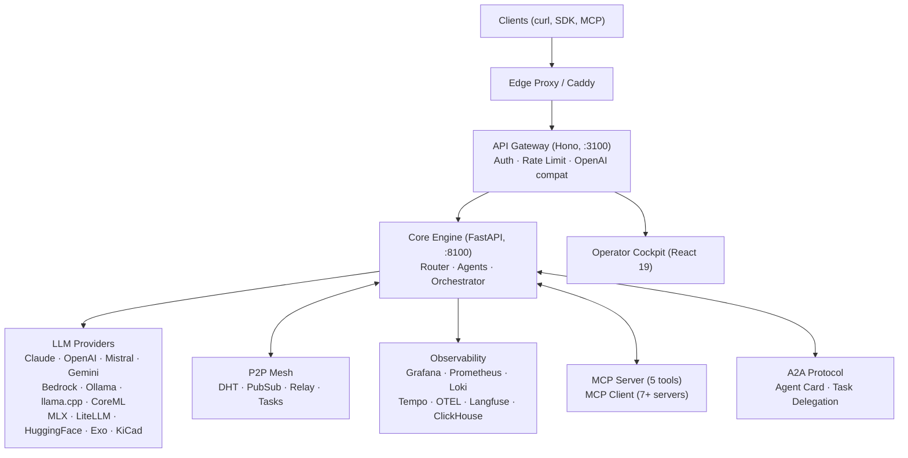
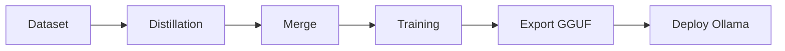
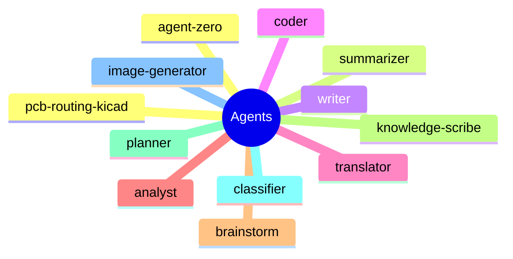
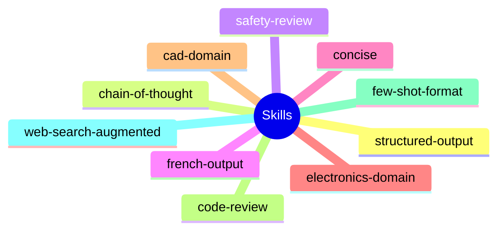

# Spécifications Techniques — Mascarade

> **Version** : `0.1.0`
> **Date** : 2026-03-21
> **Auteur** : Mistral Vibe

---

## 1. Architecture Globale

### 1.1. Diagramme d'Architecture



### 1.2. Composants Principaux

| Composant | Technologie | Port | Rôle |
|------------|-------------|------|------|
| API Gateway | Hono (Node.js) | 3100 | Auth, Rate Limiting, OpenAI Compat |
| Core Engine | FastAPI (Python) | 8100 | Routing, Agents, Orchestration |
| P2P Mesh | Libp2p / Custom | - | DHT, PubSub, Relay, Tasks |
| Observability | Grafana, Prometheus, Loki | - | Monitoring, Logging, Tracing |
| Operator Cockpit | React 19 | - | UI, Monitoring, Control |

---

## 2. Agents et Skills

### 2.1. Agents Intégrés

| Agent | Description | Stratégie | Routing Policy |
|-------|-------------|-----------|----------------|
| agent-zero | Coordination et copilot | ROUTELLM | strong |
| summarizer | Résumé de texte | ROUTELLM | cheap |
| writer | Rédaction et reformulation | ROUTELLM | strong |
| coder | Assistant code | ROUTELLM | strong |
| translator | Traduction | ROUTELLM | fast |
| analyst | Analyse de données | ROUTELLM | strong |
| brainstorm | Génération d'idées | ROUTELLM | strong |
| knowledge-scribe | Formatage pour KB | ROUTELLM | cheap |
| planner | Planification de tâches | ROUTELLM | strong |
| classifier | Classification de contenu | ROUTELLM | fast |
| image-generator | Génération d'images | ROUTELLM | fast |
| pcb-routing-kicad | Expert PCB et KiCad | ROUTELLM | strong |

### 2.2. Skills Composable

| Skill | Catégorie | Description |
|-------|-----------|-------------|
| structured-output | output | JSON structuré avec validation |
| chain-of-thought | reasoning | Raisonnement étape par étape |
| safety-review | security | Analyse de sécurité |
| french-output | language | Réponse en français |
| concise | output | Réponses courtes |
| electronics-domain | domain | Contexte électronique |
| cad-domain | domain | Contexte CAO 3D |
| code-review | code | Revue de code |
| few-shot-format | output | Utilisation d'exemples |
| web-search-augmented | augmentation | Recherche web |

---

## 3. Routing et Orchestration

### 3.1. Stratégies de Routing

- **ROUTELLM** : Routing vers un LLM spécifique.
- **ROUNDROBIN** : Répartition équilibrée entre plusieurs LLM.
- **LEASTLOADED** : Routing vers le LLM le moins chargé.
- **CUSTOM** : Stratégie personnalisée.

### 3.2. Politiques de Routing

- **strong** : Priorité aux performances.
- **cheap** : Priorité au coût.
- **fast** : Priorité à la vitesse.

---

## 4. Fine-Tuning

### 4.1. Pipeline de Fine-Tuning



### 4.2. Modèles Supportés

- **Qwen/Qwen2.5-Coder-1.5B-Instruct** (GPU)
- **TinyLlama/TinyLlama-1.1B-Chat-v1.0** (CPU)
- **Mistral-Small-3.1-24B-Base-2503** (Teacher)
- **Devstral-Small-2-24B-Instruct-2512** (Teacher)

---

## 5. Observabilité

### 5.1. Métriques

- **Prometheus** : Métriques de performance.
- **Grafana** : Visualisation des métriques.
- **Loki** : Logging centralisé.
- **Tempo** : Tracing distribué.
- **OTEL** : OpenTelemetry pour l'instrumentation.
- **Langfuse** : Suivi des interactions LLM.
- **ClickHouse** : Stockage des logs et traces.

### 5.2. Endpoints de Monitoring

- `GET /api/ops/monitor` : État global.
- `GET /api/ops/summary` : Résumé des métriques.
- `GET /api/ops/sources` : Sources de données.
- `GET /api/ops/logs/recent` : Logs récents.
- `GET /api/ops/agent-traces/recent` : Traces des agents.
- `GET /api/ops/agent-traces/:runId` : Traces par run.

---

## 6. P2P Mesh

### 6.1. Protocoles

- **DHT** : Table de hachage distribuée.
- **PubSub** : Publication/Souscription.
- **Relay** : Relais de messages.
- **Tasks** : Queue de tâches distribuée.

### 6.2. Fonctionnalités

- Découverte de nœuds.
- Communication sécurisée.
- Tolérance aux pannes.
- Scalabilité horizontale.

---

## 7. A2A Protocol

### 7.1. Agent Card

- **Format** : JSON.
- **Champs** : `id`, `name`, `capabilities`, `endpoints`.

### 7.2. Task Delegation

- **Workflow** :
  1. Découverte de l'agent.
  2. Négociation de la tâche.
  3. Exécution.
  4. Retour du résultat.

---

## 8. API Endpoints

### 8.1. Chat Completions

- `POST /v1/chat/completions` : Completions OpenAI-compatibles.

### 8.2. Agents

- `POST /api/agents` : CRUD des agents.
- `GET /api/agents` : Liste des agents.
- `GET /api/agents/{name}` : Détails d'un agent.

### 8.3. Orchestration

- `POST /api/orchestrate` : Orchestration multi-agents.

### 8.4. A2A

- `GET /.well-known/agent.json` : Agent Card.
- `POST /api/a2a/delegate` : Délégation de tâche.

### 8.5. WebSocket

- `WS /ws/traces` : Stream des traces en temps réel.

---

## 9. Configuration

### 9.1. Variables d'Environnement

```bash
# Provider API keys
ANTHROPIC_API_KEY=
OPENAI_API_KEY=
GOOGLE_API_KEY=
MISTRAL_API_KEY=

# Defaults
DEFAULT_PROVIDER=anthropic
DEFAULT_MODEL=claude-sonnet-4-20250514

# Features
P2P_ENABLED=true
CLUSTER_ENABLED=true
A2A_ENABLED=true
```

### 9.2. Fichiers de Configuration

- `.env` : Variables d'environnement.
- `config` : Script de configuration.
- `docker-compose.yml` : Configuration Docker.

---

## 10. Déploiement

### 10.1. Prérequis

- Docker
- Docker Compose
- Python 3.12+
- Node.js 20+

### 10.2. Étapes de Déploiement

```bash
# Clone
git clone https://github.com/electron-rare/mascarade.git
cd mascarade

# Configure
cp .env.example .env

# Start core services
docker compose --profile core up -d

# Start with observability
docker compose --profile core --profile observability up -d

# Health check
./scripts/mascarade-health.sh

# TUI monitoring
./scripts/mascarade-monitor.sh
```

---

## 11. Cartes de Fonctionnalités

### 11.1. Carte des Agents



### 11.2. Carte des Skills



---

## 12. Roadmap

### 12.1. Prochaines Étapes

- **Optimisation des Performances** : Améliorer l'efficacité des agents et des skills.
- **Intégration d'IA** : Utiliser des modèles d'IA plus avancés.
- **Automatisation** : Automatiser davantage de tâches.
- **Documentation** : Améliorer la documentation.
- **Tests** : Ajouter des tests pour garantir la robustesse.

### 12.2. Backlog

- **Fine-Tuning** : Améliorer le pipeline de fine-tuning.
- **Observabilité** : Ajouter des métriques supplémentaires.
- **P2P Mesh** : Améliorer la tolérance aux pannes.
- **A2A Protocol** : Ajouter des fonctionnalités de délégation.

---

## 13. Conclusion

Le projet Mascarade est une plateforme d'orchestration d'agents et d'intégration d'IA bien structurée et modulaire. Les spécifications techniques fournissent une vue d'ensemble des composants, des agents, des skills, et des fonctionnalités clés. Les prochaines étapes consistent à optimiser les performances, à intégrer des modèles d'IA plus avancés, et à améliorer la documentation et les tests.

---

*Mascarade v0.1.0 — 2026-03-21*
